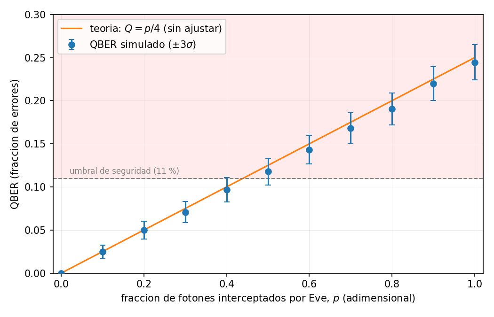
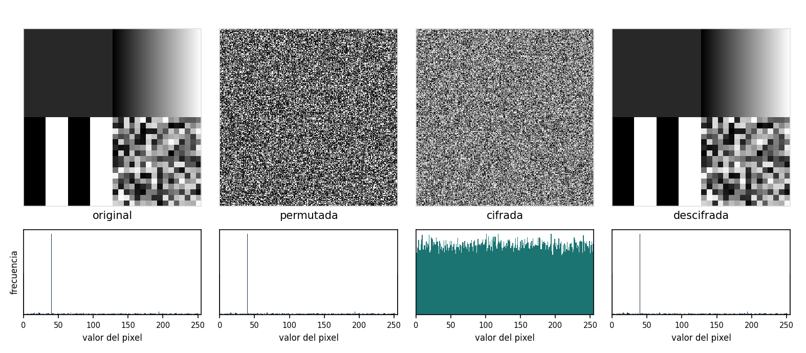

# QPCS — Quantum & Physics Cryptography Suite

Cuatro módulos de criptografía —cuántica, post-cuántica, caótica y entropía física— implementados, medidos y verificados.

[](https://github.com/cmartinezmeco/qpcs/actions/workflows/ci.yml)
[](https://www.python.org/)
[](https://www.ibm.com/quantum/qiskit)
[](https://openquantumsafe.org/)
[](tests/)
[](.github/workflows/ci.yml)



*El QBER medido contra la fracción de fotones que intercepta un espía. La recta no es un
ajuste: es la predicción teórica Q = p/4 dibujada encima de los datos (R² = 0,998). En p = 1
el error llega al 25 %, muy por encima del umbral del 11 % que el protocolo tolera, y por eso
BB84 detecta al espía en vez de confiar en que no exista.*

---

## Qué demuestra

| Módulo | Afirmación, con su verificación |
|---|---|
| **1 · QKD** | BB84 completo hasta la clave destilada, no hasta el *sifting*. Con Eve al 100 % el QBER converge al 25 % y el protocolo aborta; el umbral del 11 % **emerge** de la teoría y el código lo respeta. De 100 000 fotones salen 34 622 bits de clave secreta. |
| **2 · PQC + Shor** | ML-KEM-768 y ML-DSA-65 **reales** sobre `liboqs` —no simulados— cifrando y firmando un mensaje de verdad, medidos contra RSA-3072 y las curvas. Y Shor factorizando 15 con estimación de fase sobre un circuito de 12 qubits. |
| **3 · Caos** | Una imagen que se cifra y se descifra sin perder un bit, con el exponente de Lyapunov **calculado** y no citado. Y la demostración de que las métricas del campo no prueban seguridad: un contador trivial las aprueba igual. |
| **4 · Detector** | Entropía extraída de ruido de detector real del CERN, con la min-entropía estimada según NIST SP 800-90B y destilada con el mismo extractor de Toeplitz del Módulo 1. |

Los números están en [`docs/resultados.md`](docs/resultados.md), con la tabla completa del
benchmark, las métricas de las tres columnas y el comentario de cada figura.

---

## Qué NO hace

Esto va arriba y no al final, porque es lo que separa una demostración honesta de una promesa.

- **No está auditado.** Es un proyecto académico. Nada de esto ha pasado por una revisión
  criptográfica independiente y no debe proteger nada real.
- **El QRNG del Módulo 1 es pseudoaleatorio.** Corre sobre `AerSimulator`, que por debajo usa
  un PRNG sembrado. Se simula el proceso cuántico; no se ejecuta.
- **Shor factoriza 15, no claves.** El oráculo está compilado a mano para cada base. Romper
  RSA-2048 exigiría miles de qubits lógicos con corrección de errores, que no existen.
- **El cifrado caótico no tiene prueba de seguridad, ni autenticación, ni nonce.** Tiene
  métricas excelentes, y eso no es lo mismo. No sustituye a AES.
- **El Módulo 4 no es un generador certificado.** Es un análisis *offline* sobre datos
  grabados por otros, y la señal analizada es un *proxy* del ruido, no una lectura de ADC.

Las 28 limitaciones de los cuatro módulos, cada una con su porqué y con qué haría falta para
levantarla, están sin recortar en [`docs/limitaciones.md`](docs/limitaciones.md).

---

## Arranque rápido

**Requisito único:** [Docker](https://docs.docker.com/get-docker/) 20.10 o posterior
(en Windows, Docker Desktop con la integración de WSL2 activada). No hace falta Python, ni
compilar `liboqs`, ni instalar nada más.

```bash
git clone https://github.com/cmartinezmeco/qpcs.git
cd qpcs
docker build -t qpcs .
docker run --rm -it -p 8501:8501 qpcs
```

> La tercera orden **tarda entre 10 y 17 minutos la primera vez**: compila `liboqs` desde
> código fuente, que es una biblioteca en C sin *wheel*. No se ha colgado. Las siguientes
> reconstrucciones reutilizan las capas y tardan segundos.

Cuando Streamlit imprima la línea `URL: http://0.0.0.0:8501`, abre
[http://localhost:8501](http://localhost:8501). El panel tiene una pestaña por módulo.

Con Docker Compose, tres servicios sobre la misma imagen:

```bash
docker compose up                # el panel en :8501
docker compose run --rm test     # la suite rápida y sale
docker compose run --rm figuras  # regenera las 17 figuras en docs/img/
```

Para trabajar en el código con un entorno local (autocompletado, tipos, tests rápidos), la
instalación paso a paso y su guía de problemas están en [`docs/INSTALL.md`](docs/INSTALL.md).

---

## Los cuatro módulos

### 1 · Distribución cuántica de claves (BB84)

Alice codifica bits en dos bases mutuamente insesgadas, Bob mide en una base que elige al azar
y ambos se quedan solo con las posiciones donde coincidieron. Un espía no puede copiar los
fotones —el teorema de no-clonación lo prohíbe—, así que se ve obligado a medir, y medir
colapsa el estado. Esa huella es el QBER.

La cadena llega hasta el final, que es donde casi ninguna implementación llega: estimación del
QBER sobre una muestra que después se descarta, reconciliación con Cascade contando cada bit
publicado, y amplificación de privacidad con matrices de Toeplitz. El balance de una ejecución
real, con ruido del 2 %:

| Etapa | Bits |
|---|---:|
| Fotones enviados | 100 000 |
| Tras el *sifting* | 49 761 |
| Tras sacrificar la muestra del QBER (Q = 1,81 %) | 48 766 |
| Tras Cascade (`leak_ec` = 7 716 bits, f_EC = 1,21) | 48 766 |
| **Clave final** | **34 622** |

Teoría: [`docs/theory/qkd.md`](docs/theory/qkd.md).

### 2 · Criptografía post-cuántica y algoritmo de Shor

La mitad de la amenaza y la mitad de la defensa, en el mismo módulo. Shor factoriza 15 mediante
estimación de fase: las fases medidas caen exactamente sobre los cuatro múltiplos de 1/r con
r = 4, el orden real de 7 módulo 15.

La defensa no es una simulación. ML-KEM-768 y ML-DSA-65 corren sobre `liboqs`, la misma
implementación que se usa en producción, y cifran un mensaje real con el patrón híbrido
KEM → HKDF-SHA256 → AES-256-GCM. El resumen de la migración en dos cifras:

- ML-KEM-768 genera un par de claves unas **11 000 veces más rápido** que RSA-3072
  (0,019 ms contra 212 ms) y desencapsula unas **120 veces más rápido** de lo que RSA descifra.
- Su firma ocupa **3 309 bytes** contra los **64** de Ed25519. La migración se paga en ancho de
  banda y almacenamiento, no en CPU.

Teoría: [`docs/theory/pqc.md`](docs/theory/pqc.md) · Medidas crudas:
[`docs/benchmark_pqc.json`](docs/benchmark_pqc.json).

### 3 · Cifrado de imágenes por caos determinista

Esquema de permutación y difusión gobernado por el mapa logístico o por Lorenz, medido contra
AES-256-GCM y contra un cifrador deliberadamente ingenuo, con el mismo rasero.



El interés está en la segunda columna: la imagen permutada parece ruido y **su histograma es
idéntico al del original**, porque permutar mueve píxeles sin cambiar sus valores. Solo la
difusión aplana el histograma. Ninguna de las dos etapas bastaría por separado.

La conclusión del módulo es incómoda a propósito. El esquema caótico, AES-256-GCM y
`SHA256(clave ‖ contador)` puntúan **igual de bien** en todas las métricas del campo (entropía,
correlación, χ², NPCR, UACI). Nadie defendería la tercera como cifrador serio. Luego esas
métricas son condiciones necesarias y no suficientes: detectan defectos gruesos y nada más.

Teoría: [`docs/theory/chaos.md`](docs/theory/chaos.md).

### 4 · Ruido de detector como fuente de entropía

Datos reales de CERN Open Data (CMS ZeroBias, registro 31316). Se caracteriza el ruido por su
densidad espectral, se filtran las interferencias, se estima la min-entropía con los tres
estimadores de NIST SP 800-90B y se destila con el extractor de Toeplitz del Módulo 1.

De 495 562 muestras salen 1 809 946 bits extraídos. El estimador que gana es el de colisión
(h = 3,6524 bits por muestra), no el de Markov, que es el que la literatura sugiere para este
tipo de señal. Se documenta así, tal cual, en vez de forzar la narrativa.

Teoría: [`docs/theory/detector.md`](docs/theory/detector.md) · Procedencia de los datos:
[`data/FUENTE.md`](data/FUENTE.md).

---

## Estructura

```
qpcs/
├── src/
│   ├── qkd/            Módulo 1 · BB84, QRNG, Eve, Cascade, Toeplitz
│   ├── pqc/            Módulo 2 · ML-KEM, ML-DSA, híbrido, Shor, benchmark
│   ├── chaos/          Módulo 3 · mapas, keystream, permutación, difusión, métricas
│   └── detector/       Módulo 4 · carga, espectro, filtrado, entropía, extracción
├── tests/              378 tests · uno por módulo, más los de integración
├── scripts/            Generadores de figuras, benchmark del caos, comprobaciones de CI
├── dashboard/          Panel de Streamlit, una pestaña por módulo
├── docs/
│   ├── theory/         Los cuatro documentos de teoría
│   ├── img/            Las 17 figuras publicadas
│   ├── limitaciones.md Las 28 limitaciones, con su porqué
│   ├── decisiones.md   Lo que sigue abierto, con opciones y estado
│   └── benchmark_pqc.json
├── data/               La muestra del detector y su procedencia
├── vectors/            keystream_v1.json · el vector de determinismo del Módulo 3
├── Dockerfile          El entorno reproducible (compila liboqs)
└── docker-compose.yml  app · test · figuras
```

---

## Verificación

Nada de lo que se afirma aquí se sostiene sobre una promesa; todo cuelga de un test, de una
figura reproducible o de un JSON versionado.

- **378 tests**, 374 en la suite rápida y 4 marcados como lentos, que corren al mergear a
  `main`. Reparto por módulo: 57 · 108 · 143 · 70.
- **Cobertura ≥ 85 %** exigida en CI sobre `src/pqc`, `src/chaos` y `src/detector`.
- **`ruff`, `black` y `mypy --strict`** en cada *pull request*, dentro del contenedor.
- **Figuras reproducibles bit a bit**: la CI las regenera dentro de la imagen y compara su MD5
  con las versionadas. Un PNG que cambie de huella no es un detalle de dibujo.
- **Determinismo del Módulo 3**: el keystream se contrasta contra un vector generado fuera del
  contenedor y versionado. Es la única defensa contra el fallo silencioso de que una órbita en
  coma flotante salga distinta en otra máquina.
- **La regla de oro**: cada nombre de test citado en los documentos de teoría se comprueba
  contra los `def test_` reales. Renombrar un test citado pone la CI en rojo.
- **Construcción semanal sin caché**, porque una caché puede esconder que una dependencia ha
  desaparecido de su índice. Ya pasó una vez en este proyecto.

Las tolerancias estadísticas se derivan, nunca se inventan: un umbral escrito como `4 * sigma`
lleva su σ calculada en el propio test.

---

## Documentación

| Documento | Qué contiene |
|---|---|
| [`docs/theory/qkd.md`](docs/theory/qkd.md) | BB84, no-clonación, la derivación del 25 % y el umbral del 11 % |
| [`docs/theory/pqc.md`](docs/theory/pqc.md) | Retículos, ML-KEM, ML-DSA, el patrón híbrido y Shor |
| [`docs/theory/chaos.md`](docs/theory/chaos.md) | Lyapunov, permutación–difusión y por qué las métricas no bastan |
| [`docs/theory/detector.md`](docs/theory/detector.md) | Tipos de ruido, PSD, min-entropía y extracción |
| [`docs/limitaciones.md`](docs/limitaciones.md) | Las 28 limitaciones de los cuatro módulos |
| [`docs/decisiones.md`](docs/decisiones.md) | Lo que sigue abierto, con opciones y recomendación |
| [`docs/resultados.md`](docs/resultados.md) | Benchmark completo, métricas y comentario de las figuras |
| [`docs/INSTALL.md`](docs/INSTALL.md) | Entorno local paso a paso y guía de problemas |

Cada documento de teoría enlaza sus fórmulas a un test o a una figura del repositorio. Esa es
la regla que la CI comprueba en cada *pull request*.

---

## Reparto y licencia

Tres personas, medido sobre `main` con `git shortlog -sn --no-merges`, consolidando las dos
identidades de git que usa cada uno:

| | Commits | Responsabilidad |
|---|---:|---|
| **Carlos Martínez-Meco López** ([@cmartinezmeco](https://github.com/cmartinezmeco)) | 31 | Infraestructura, CI, contenedores, datos, benchmarking, visualización e integración |
| **Marco** ([@Marcociber](https://github.com/Marcociber)) | 16 | Reconciliación de claves, criptografía post-cuántica, análisis de entropía y seguridad |
| **Gonzalo** ([@gonzaloz-hub](https://github.com/gonzaloz-hub)) | 10 | Física y modelado teórico: BB84, Shor, sistemas caóticos, ruido de detector |

Un commit no es una unidad de trabajo y `git log` no mide autoría de líneas. La medida completa,
con sus advertencias, está en [`docs/decisiones.md`](docs/decisiones.md).

**Licencia: pendiente.** Sin fichero `LICENSE`, por defecto nadie puede usar, copiar ni
distribuir este código. La elección está abierta y documentada; se cierra en la tarea 4.17.

---

## Contribuir

Nunca se trabaja directamente sobre `main`. Una rama por tarea, un *pull request* por rama, y
al menos una aprobación de otra persona antes de mergear. La CI tiene que estar en verde: no
vale «me funciona en mi venv». Las versiones se fijan con `==`, nunca con `>=`.

El entorno de desarrollo local, los requisitos y los problemas conocidos están en
[`docs/INSTALL.md`](docs/INSTALL.md).
