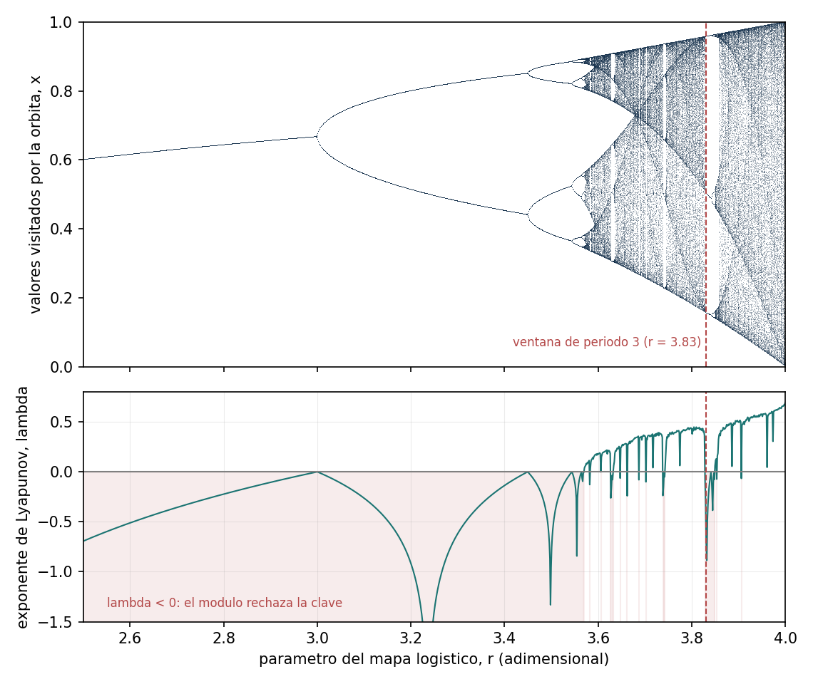
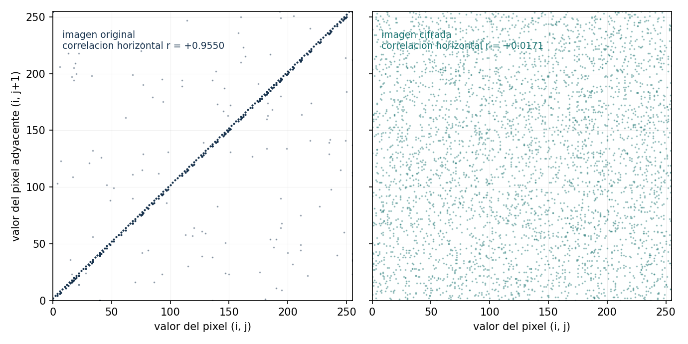
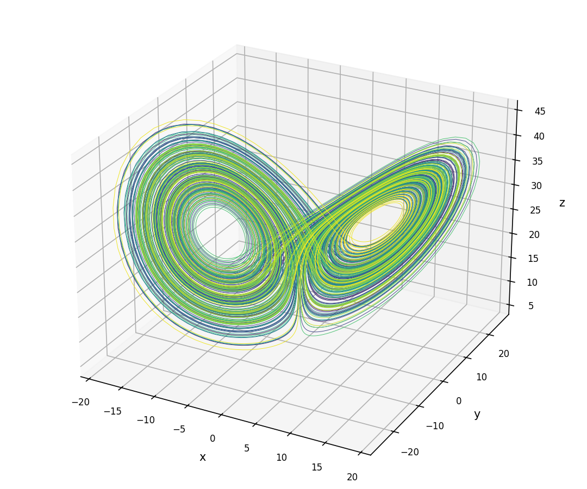
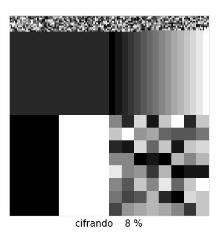

<div align="center">

# 🔐 QPCS — Quantum & Physics Cryptography Suite

**An interdisciplinary cryptography suite bridging quantum physics, post-quantum security and deterministic chaos.**

[](https://www.python.org/)
[](https://www.ibm.com/quantum/qiskit)
[](https://openquantumsafe.org/)
[](https://www.docker.com/)
[](https://docs.pytest.org/)

</div>

---

## 📑 Table of contents

- [Overview](#-overview)
- [Quick start](#-quick-start-docker--recommended)
- [Full installation](#️-full-installation-local-development)
- [Verify your setup](#-verify-your-setup)
- [Troubleshooting](#-troubleshooting)
- [Repository structure](#-repository-structure)
- [Project modules](#-project-modules)
- [Tech stack](#-tech-stack)
- [Contributing & Git workflow](#-contributing--git-workflow)
- [Team](#-team)

---

## 🔎 Overview

QPCS is a modular suite combining **quantum key distribution**, **post-quantum cryptography** and **chaos-based encryption**, built by a team spanning Physics, Cybersecurity and Data Engineering.

| | |
|---|---|
| 🧪 **Module 1** | BB84 quantum key distribution + QRNG + eavesdropper simulation |
| 🛡️ **Module 2** | Post-quantum cryptography benchmarks + Shor's algorithm demo |
| 🌀 **Module 3** | Image encryption via chaotic attractors |
| ⚛️ **Module 4** | *(optional)* Particle detector noise as an entropy source |

---

## ⚡ Quick start (Docker — recommended)

> **The container is the source of truth.** It works identically on Windows (WSL2), Linux and macOS, and requires no manual `liboqs` build.

**1.** Clone the repository:

```bash
git clone https://github.com/cmartinezmeco/qpcs.git
```

**2.** Enter the project folder:

```bash
cd qpcs
```

**3.** Build the image (first build takes ~5–10 min — it compiles `liboqs` from source):

```bash
docker build -t qpcs .
```

**4.** Run it:

```bash
docker run --rm -it -p 8501:8501 qpcs
```

✅ If Streamlit starts and prints a `URL: http://0.0.0.0:8501` line, open [http://localhost:8501](http://localhost:8501) — you're done.

**Alternative: Docker Compose.** Three services share the same image:

```bash
docker compose up                # dashboard on :8501 (Ctrl+C to stop)
docker compose run --rm test     # fast test suite, then exits
docker compose run --rm figuras  # regenerates all published plots in docs/img/
```

---

## 🛠️ Full installation (local development)

The local virtual environment is **only** for comfortable editor work — autocomplete, linting, quick tests. Official execution always goes through Docker.

### Prerequisites

| Requirement | Notes |
|---|---|
| **WSL2 + Ubuntu 22.04/24.04** | Windows users only. Native Linux/macOS works too. |
| **Docker** | Docker Desktop with WSL2 integration enabled, or Docker Engine. |
| **Python 3.11** | Not 3.12+ — see [Troubleshooting](#-troubleshooting). |
| **Git + GitHub CLI** | `gh` for authentication against this private repo. |
| **VS Code + WSL extension** | Recommended editor setup. |

<br/>

### Step 1 — Authenticate with GitHub

> ⚠️ This repo is **private**. Accept your invitation at [`/invitations`](https://github.com/cmartinezmeco/qpcs/invitations) first, then authenticate with **your own** account:

```bash
gh auth login
```

<details>
<summary>📖 What to select in the prompts</summary>

<br/>

| Prompt | Choose |
|---|---|
| What account do you want to log into? | **GitHub.com** |
| Preferred protocol for Git operations? | **HTTPS** |
| Authenticate Git with your GitHub credentials? | **Yes** |
| How would you like to authenticate? | **Login with a web browser** |

</details>

<br/>

### Step 2 — Clone the repository

```bash
git clone https://github.com/cmartinezmeco/qpcs.git
```

```bash
cd qpcs
```

<br/>

### Step 3 — Install Python 3.11

<details>
<summary>💡 Skip this if <code>python3.11 --version</code> already works</summary>

<br/>

Ubuntu 24.04 ships Python 3.12 by default, so 3.11 comes from the deadsnakes PPA.

</details>

<br/>

```bash
sudo add-apt-repository ppa:deadsnakes/ppa -y
```

```bash
sudo apt update
```

```bash
sudo apt install -y python3.11 python3.11-venv python3.11-dev
```

Check it:

```bash
python3.11 --version
```

<br/>

### Step 4 — Install system build dependencies

Needed to compile `liboqs` (written in C):

```bash
sudo apt install -y build-essential cmake gcc g++ git libssl-dev ninja-build
```

<br/>

### Step 5 — Create the virtual environment

```bash
python3.11 -m venv .venv
```

```bash
source .venv/bin/activate
```

> ✅ Your prompt should now start with `(.venv)`.

```bash
pip install --upgrade pip
```

```bash
pip install -r requirements.txt
```

<br/>

### Step 6 — Build `liboqs` manually

> 🔴 **Required for the local venv only.** The Dockerfile does this automatically — skip this step if you only use Docker.
>
> **Why:** `liboqs-python` is only the Python binding; the actual cryptography lives in `liboqs`, a C library with **no wheel**. Without it you get `No oqs shared libraries found` on `import oqs`.
>
> **The C library and the binding must be the same version.** `requirements.txt` pins `liboqs-python==0.16.0`, so build `liboqs` **0.16.0** — the same tag the [Dockerfile](Dockerfile) compiles. A venv left over from an earlier phase may still have 0.14.x; check with the command in [Verify your setup](#-verify-your-setup) and rebuild if it disagrees.

```bash
cd ~
```

```bash
git clone --branch 0.16.0 --depth=1 https://github.com/open-quantum-safe/liboqs
```

```bash
cd liboqs && mkdir build && cd build
```

```bash
cmake -DBUILD_SHARED_LIBS=ON -DCMAKE_INSTALL_PREFIX=$HOME/_oqs ..
```

```bash
make -j$(nproc)
```

```bash
make install
```

Make the library path permanent:

```bash
echo 'export OQS_INSTALL_PATH=$HOME/_oqs' >> ~/.bashrc
```

```bash
source ~/.bashrc
```

<br/>

### Step 7 — Configure VS Code

Open the project from WSL:

```bash
code .
```

Install these extensions:

| Extension | Publisher | Purpose |
|---|---|---|
| **Python** | Microsoft | Language support |
| **Pylance** | Microsoft | Type checking & autocomplete |
| **Docker** | Microsoft | Container management |
| **Jupyter** | Microsoft | Notebook prototyping |
| **GitLens** | GitKraken | Commit history & peer review |

> 📌 `.vscode/settings.json` is committed to the repo and auto-configures **Black** and the `.venv` interpreter for the whole team.

---

## ✅ Verify your setup

**In your local venv:**

```bash
python -c "import qiskit, oqs, numpy, scipy, matplotlib, cryptography, streamlit; print('Qiskit:', qiskit.__version__); print('liboqs C:', oqs.oqs_version()); print('liboqs-python:', oqs.oqs_python_version()); print('All OK')"
```

**Inside the container:**

```bash
docker run --rm qpcs python -c "import qiskit, oqs; print('Qiskit:', qiskit.__version__); print('liboqs C:', oqs.oqs_version()); print('liboqs-python:', oqs.oqs_python_version()); print('All OK')"
```

**Run the test suite:**

```bash
pytest tests/ -m "not slow"
```

Expected output:

```
Qiskit: 1.0.2
liboqs C: 0.16.0
liboqs-python: 0.16.0
All OK
```

> Both `liboqs` lines must read **0.16.0**. If the C one says `0.14.x`, your venv predates the version bump — redo [Step 6](#step-6--build-liboqs-manually) against the `0.16.0` tag. The container is always right by construction; only local venvs drift.

---

## 🩺 Troubleshooting

<details>
<summary><b>❌ <code>RuntimeError: No oqs shared libraries found</code></b></summary>

<br/>

`liboqs-python` failed to auto-install its C dependency. Two causes:

**1.** You skipped **Step 6** → build `liboqs` manually.

**2.** `OQS_INSTALL_PATH` isn't set in your current shell. Check it:

```bash
echo $OQS_INSTALL_PATH
```

If empty:

```bash
export OQS_INSTALL_PATH=$HOME/_oqs
```

If a broken half-installed folder exists, remove it and retry:

```bash
rm -rf ~/_oqs
```

</details>

<details>
<summary><b>❌ <code>oqs.oqs_version()</code> and <code>oqs.oqs_python_version()</code> disagree</b></summary>

<br/>

The C library and the Python binding are versioned together and must match. `requirements.txt` pins `liboqs-python==0.16.0`, so the C library has to be the `0.16.0` tag.

The usual cause is a venv built during Phase 1, when the project still compiled `0.14.0`: `pip install -r requirements.txt` upgrades the binding but **cannot** touch the C library you built by hand in Step 6. Rebuild it:

```bash
rm -rf ~/_oqs ~/liboqs
```

Then redo **Step 6** with `--branch 0.16.0`.

> Historical note, in case you find it in an old branch: `liboqs-python==0.14.1` tried to auto-clone a `liboqs` tag `0.14.1` that never existed upstream, which is why Step 6 exists at all. The `0.16.0` tag does exist, but the manual build is still needed — there is no wheel.

</details>

<details>
<summary><b>❌ Dependencies fail to install in my venv</b></summary>

<br/>

Check you're on Python 3.11, not 3.12+:

```bash
python --version
```

Qiskit-Aer, Numba and liboqs-python have wheel/compilation issues on newer Python versions. If it says 3.12, delete the venv and recreate it:

```bash
rm -rf .venv && python3.11 -m venv .venv && source .venv/bin/activate
```

</details>

<details>
<summary><b>❌ <code>git clone</code> asks for a password / permission denied</b></summary>

<br/>

The repo is **private**. Make sure you have:

**1.** Accepted the collaborator invitation.

**2.** Authenticated with **your own** GitHub account:

```bash
gh auth status
```

Never use someone else's token.

</details>

<details>
<summary><b>🐢 Docker build is very slow / transfers gigabytes</b></summary>

<br/>

Check `.dockerignore` exists and excludes `.venv/`. The build context should be **kilobytes**, not GB.

</details>

---

## 📁 Repository structure

```
qpcs/
│
├── 📂 .github/workflows/    # CI: lint, types, tests, coverage, figure MD5s
├── 📂 .vscode/              # Shared VS Code configuration (Black, interpreter)
│
├── 📂 src/                  # Source code
│   ├── 📂 qkd/              # Module 1 · QKD (BB84) + QRNG
│   ├── 📂 pqc/              # Module 2 · Post-Quantum Cryptography + Shor
│   └── 📂 chaos/            # Module 3 · Deterministic chaos image cipher
│
├── 📂 tests/                # Unit tests (pytest) — tests/qkd/, /pqc/, /chaos/
├── 📂 scripts/              # Figure generators, chaos benchmark & determinism harness
├── 📂 dashboard/            # Streamlit app (one tab per module)
├── 📂 docs/                 # benchmark_pqc.json, img/ (published figures), theory/
├── 📂 vectors/              # keystream_v1.json — the module 3 determinism vector
│
├── 🐳 Dockerfile            # Reproducible environment (builds liboqs)
├── 🐳 docker-compose.yml    # `up` → dashboard :8501; `run test` → pytest; `run figuras` → regenerate all plots
├── 📄 requirements.txt      # Pinned runtime deps (==, never >=)
├── 📄 requirements-dev.txt  # Pinned dev deps (ruff, black, mypy, pytest)
├── 📄 .dockerignore
├── 📄 .gitignore
└── 📄 README.md
```

> Module 4 (particle-detector entropy) is not in the tree yet — it arrives with its own phase.

---

## 🧩 Project modules

### 🧪 Module 1 — QKD + QRNG

Simulation of the **BB84 protocol**, a quantum random number generator, and an interactive Streamlit dashboard showing the **QBER** in real time in the presence of an eavesdropper ("Eve").

> The QBER rises from 0% to ~25% when Eve intercepts — a direct consequence of the no-cloning theorem and wavefunction collapse.

### 🛡️ Module 2 — Post-Quantum Cryptography

Performance comparison between classical cryptography (**RSA/ECC**) and post-quantum cryptography (**ML-KEM/ML-DSA**, the NIST-standardized successors of Kyber/Dilithium), plus a **Shor's algorithm** demo using Qiskit.

> This half is **not a simulation**: ML-KEM and ML-DSA run for real on `liboqs`, the same code that protects production systems today.

A real message encrypted with **ML-KEM-768** (KEM → HKDF-SHA256 → AES-256-GCM) and signed with **ML-DSA-65** — sample run, keys are freshly generated on every call and never seeded:

```text
message         : La criptografia post-cuantica protege esto en 2035.
kem_ciphertext  : 1088 B -> 52f550b7a56f6ad45b22db1627db6711 ...
nonce           :   12 B -> e0e6580fe247bbe131e509fb          (fresh per message)
aead_ciphertext :   67 B -> 0f949829636ec755bcd6293ecb65d5d9 ...
decrypted       : La criptografia post-cuantica protege esto en 2035.   ✅

signed          : comunicado oficial QPCS
public key      : 1952 B
signature       : 3309 B -> c644797e421aacfc8cd89cfc6be513a6 ...
verifies        : True    ✅  (flip one bit of the message → False)
```

The honest trade-off in one line: an **Ed25519** signature takes 64 bytes, an **ML-DSA-65** one takes 3309 — about 50× more. That cost in bytes, not in CPU, is what migrating actually buys you. Round-trips, tamper detection and sizes are pinned by tests: `tests/pqc/test_hybrid.py`, `tests/pqc/test_sig.py`, `tests/pqc/test_classical.py`.

#### 📊 The benchmark — what migrating actually costs

Measured **inside the container** with `time.perf_counter` (never `time.time`: it jumps with NTP), **200 repetitions** per post-quantum operation and **50** per classical one — a single RSA-3072 keygen already costs ~0.2 s. Every row carries the **σ of its own sample**: a mean without an error bar is not a measurement, it's an anecdote. Raw numbers, plus the machine and the `liboqs` build they came from: [`docs/benchmark_pqc.json`](docs/benchmark_pqc.json).

| Operation | Mechanism | Mean (ms) | σ (ms) | p50 (ms) | Reps | + key load (ms) | Artifact |
|---|---|---:|---:|---:|---:|---:|---|
| `keygen` | RSA-3072 | 212.376 | 98.053 | 199.082 | 50 | 254.810 | pk 422 B |
| `keygen` | X25519 | 0.042 | 0.002 | 0.042 | 50 | 0.052 | pk 32 B |
| `keygen` | Ed25519 | 0.045 | 0.005 | 0.043 | 50 | 0.055 | pk 32 B |
| `keygen` | **ML-KEM-768** | 0.019 | 0.003 | 0.019 | 200 | 0.028 | pk 1184 B |
| `keygen` | **ML-DSA-65** | 0.063 | 0.013 | 0.057 | 200 | — | pk 1952 B |
| `encrypt` | RSA-3072 | 0.071 | 0.015 | 0.066 | 50 | 0.090 | ct 384 B |
| `encaps` | **ML-KEM-768** | 0.025 | 0.014 | 0.021 | 200 | 0.033 | ct 1088 B |
| `decrypt` | RSA-3072 | 2.728 | 0.409 | 2.709 | 50 | 154.748 | — |
| `decaps` | X25519 | 0.047 | 0.005 | 0.045 | 50 | 0.104 | — |
| `decaps` | **ML-KEM-768** | 0.023 | 0.004 | 0.022 | 200 | 0.034 | — |
| `sign` | RSA-3072 | 2.396 | 0.212 | 2.304 | 50 | 155.016 | sig 384 B |
| `sign` | Ed25519 | 0.043 | 0.003 | 0.042 | 50 | 0.110 | sig 64 B |
| `sign` | **ML-DSA-65** | 0.211 | 0.139 | 0.170 | 200 | — | sig 3309 B |
| `verify` | RSA-3072 | 0.097 | 0.049 | 0.071 | 50 | 0.090 | — |
| `verify` | Ed25519 | 0.143 | 0.057 | 0.128 | 50 | 0.169 | — |
| `verify` | **ML-DSA-65** | 0.059 | 0.008 | 0.055 | 200 | 0.090 | — |

> An X25519 exchange is reported as `decaps`: it is the row that compares with ML-KEM's, since in both cases one party derives the shared secret with its private key. ML-DSA has no `+ key load` figure for `keygen` because `sig.firmar` generates the keypair and signs in the same call on purpose — the private key never leaves the function — so there is no public function that only generates a pair.

> **Two rows were added after this table was measured** and will appear the next time the benchmark is re-run in the container. `ML-KEM-768 hibrido` (`encrypt`/`decrypt`) times the **whole envelope** — KEM + HKDF-SHA256 + AES-256-GCM, i.e. `hybrid.cifrar_mensaje` — which is the only post-quantum row genuinely comparable with RSA's `encrypt`: the `encaps`/`decaps` rows time the bare KEM, which ships a 32-byte secret and encrypts no message at all. `ML-DSA-65 +keygen +carga` (`sign`) times signing through the public API, keypair generation included; it is not comparable with a plain `sign` and says so in its own name.

**Why two time columns.** `Mean` times the algorithm with the key already in memory. `+ key load` times the module's public API instead, which takes keys as PEM (RSA) or raw bytes (curves) and deserializes them on **every** call — and OpenSSL 3 *validates* an RSA private key when it loads it, at ~152 ms per call. That is 57× the decryption itself and 65× the signature. On `keygen`, though, the two columns differ by less than RSA's own σ: exporting a fresh key to PEM costs microseconds, so that 42 ms gap is prime-search variance, not serialization. Folding it into the RSA rows would have advertised ML-KEM decapsulation as *thousands* of times faster than RSA decryption instead of the honest ~120×, so both layers are measured and both are published.

**The trade-off in one line: post-quantum wins on CPU and loses on bytes.** ML-KEM-768 generates a keypair ~11 000× faster than RSA-3072 (0.019 ms against 212 ms — RSA hunts for 1536-bit primes, ML-KEM samples a lattice) and decapsulates ~120× faster than RSA decrypts; ML-DSA-65 even verifies 2.4× faster than Ed25519. But its public key is 1184 B against X25519's 32 B, and its signature is 3309 B against Ed25519's 64 B. You pay for the migration in bandwidth and storage, not in CPU — and RSA's σ of 98 ms on keygen (46 % of the mean) is why every figure carries error bars.

#### 📈 Figures


**Figure 1 — time per operation** (log scale, error bars = measured σ). Panel **A** is the algorithm comparison with keys already loaded: post-quantum (hatched) is orders of magnitude below RSA and lands in the same tens-of-microseconds band as the elliptic curves — except signing, where ML-DSA-65 is ~5× slower than Ed25519 (and still ~11× faster than RSA-3072). Panel **B** is what key (de)serialization adds on top of each operation, which is where RSA's private-key operations lose two orders of magnitude.


**Figure 2 — artifact sizes in bytes** (log scale). The honest counterpart to figure 1: this is the one post-quantum loses. No error bars here on purpose — sizes are deterministic, fixed by FIPS 203/204 and the RSA modulus. X25519's "ciphertext" is its 32-byte ephemeral public key, the analogue of ML-KEM's 1088-byte encapsulation.


**Figure 3 — Shor on N = 15.** Panel **A** is the phase-estimation circuit (8 counting qubits + 4 work qubits, with the hand-compiled `a^k mod 15` oracle). Panel **B** is the measured phase over 4096 shots: the peaks land exactly on the four multiples of 1/r with r = 4, the real order of 7 mod 15 — which continued fractions turn into r, and `gcd(7² ± 1, 15)` into {3, 5}. The dashed lines are the prediction, not a fit.

#### 🔁 Regenerating the benchmark and the figures

```bash
docker run --rm -v "$PWD":/app --user "$(id -u):$(id -g)" -e MPLCONFIGDIR=/tmp/mpl \
  qpcs python scripts/make_pqc_plots.py --medir
```

Re-measures everything (~50 s), rewrites `docs/benchmark_pqc.json` and regenerates the three PNGs. Without `--medir` the script only redraws from the committed JSON, so touching a colour never changes a published number — and CI checks exactly that, by regenerating the three figures inside the image and comparing their MD5 against the committed ones.

**Always re-measure inside the container.** The JSON carries the environment it was measured in, and the container is the only one that is reproducible: a local venv can easily still have `liboqs` 0.14.x, which would silently downgrade the published environment block.

The heavy benchmark also has a test of its own, kept out of the fast suite (CI runs it on pushes to `main`):

```bash
docker run --rm qpcs pytest tests/ -m "slow"        # ~45 s
docker run --rm qpcs pytest tests/ -m "not slow"    # the fast suite
```

> The image is tagged `qpcs` here, matching the [Quick start](#-quick-start-docker--recommended). CI builds the same `Dockerfile` as `qpcs:ci`; either tag works as long as it is the one you built.

#### ⚠️ What these numbers do *not* say

- **They are not a constant-time analysis.** The benchmark measures mean performance to compare cost; nothing here rules out timing side channels.
- **They are machine-specific.** Every JSON carries the platform, CPU, Python and `liboqs` versions it was measured on. Comparing across machines without checking that block is meaningless.
- **The means above are noisier than the medians.** Every headline ratio here is computed from the mean, and on the fastest rows the mean sits 20–37 % above its own p50 — scheduler and GC noise lands on the mean, not the median. It shows: RSA-3072 `verify` reads *faster* in the `+ key load` column (0.090 ms) than in the plain one (0.097 ms), which cannot be true, and the p50 pair (0.071 vs 0.084) restores the order. Recompute any factor from the `p50_ms` column and the orders of magnitude hold. The table above predates a fix that now disables the cyclic GC during each sample, so the next re-measure should narrow that gap.
- **Shor factors toys, not keys.** N = 15 with an oracle compiled by hand for each (a, N). N = 21 needs its own `c_amod21` (5 work qubits) and is not implemented — the dashboard says so when you pick it. Breaking RSA-2048 would need thousands of logical qubits with error correction, which do not exist.

### 🌀 Module 3 — Deterministic chaos

Image encryption with a **permutation–diffusion** scheme driven by deterministic chaos (**logistic map** and **Lorenz**), measured against **AES-256-GCM** and against a deliberately naive stream cipher on exactly the same yardstick.

> **The notice that governs the whole module.** This is a permutation–diffusion scheme based on deterministic chaos. It has excellent metrics and **no security proof**. It does not replace AES.

The chain has a single source of randomness — the key — and no `np.random` anywhere on the encryption path:

`key → orbit → keystream → permutation (index sorting) + two-pass chained XOR diffusion → ciphertext`

The permutation is built by **index sorting** (`np.argsort(..., kind="stable")`) rather than by Arnold's cat map: sorting accepts non-square images and its period is the orbit's, not 192 for N = 256. The diffusion runs **forward and backward** so that a change in the *last* pixel also propagates. Encryption is sequential by nature; undoing it is a single vectorized NumPy line — **but that asymmetry is invisible end to end, and the measurement says so** (see [the benchmark](#-cost-where-the-time-actually-goes)): the diffusion stage is ~600× cheaper to undo than to apply, and decrypting a whole image is still only ~15 % cheaper than encrypting it, because both directions regenerate the same keystream and that is where 66 % of the time goes.

#### 📊 The three columns — the point of the module

Same 256×256 generated test image, same metric functions, one real run inside the container. Expected values are **derived** (`entropia_esperada`, `npcr_esperado` and `uaci_esperado` carry the derivation in their docstrings), never copied from a paper.

| Metric | Plain image | Chaotic scheme | AES-256-GCM | Trivial counter | Expected |
|---|---:|---:|---:|---:|---:|
| Entropy (bits/px) | 5.4525 | 7.99706 | 7.99697 | 7.99663 | 7.99719 |
| Correlation H | +0.9550 | +0.0171 | −0.0183 | +0.0183 | 0 |
| Correlation V | +0.9789 | −0.0041 | −0.0264 | +0.0045 | 0 |
| Correlation D | +0.9359 | −0.0038 | −0.0035 | −0.0080 | 0 |
| χ² (255 dof) | 1 581 568 | 267.1 | 274.1 | 306.2 | 255 ± 22.6 |
| NPCR (%) | — | 99.6353 | 99.6155 | 99.5712 | 99.6094 |
| UACI (%) | — | 33.5266 | 33.4348 | 33.5624 | 33.4635 |
| **Security proof** | — | **none** | **yes** | **none** | |
| **Authentication** | — | **no** | **yes (GCM tag)** | **no** | |

Every tolerance is derived, never invented: entropy against the **Miller–Madow** bias-corrected expectation (8.0 exactly is unreachable — for 65 536 pixels the ceiling is 7.99719) with σ = √((K−1)/2)/(N·ln 2); correlation with σ = 1/√n over 5 000 non-overlapping pairs; NPCR with the binomial σ = √(p(1−p)/M); UACI with σ = √(Var|X−Y|/M)/255. The arithmetic is written out in [`tests/chaos/tolerancias.py`](tests/chaos/tolerancias.py). NPCR and UACI are measured between **two independent ciphertexts** (two keys one bit apart for the chaotic scheme, two nonces for AES, two keys for the counter), which is the only reading under which the three schemes are comparable — see the limitation on plaintext differentials below. The AES row is the only one that changes between runs, because its nonce is fresh by design.

**What follows from the three columns being identical — and it is the lesson of the module.** The standard metrics of chaotic image encryption are **necessary conditions, not sufficient ones**. They detect gross defects — a skewed histogram, a permutation that does not permute, a diffusion that does not propagate — and nothing else. That a scheme passes them means it has no obvious errors, **not that it is secure**. The third column is what makes the argument airtight: `SHA256(key || counter)` used as a stream is a construction nobody would defend as a serious cipher, and it scores just as well. AES-256-GCM's security does not come from passing these tests; it comes from twenty-five years of public cryptanalysis, an open standardization process and resistance arguments against known families of attack. Our scheme has none of that, so **it is not secure**, however good the table looks.

#### 📈 Figures



**Figure 1 — bifurcation and Lyapunov, sharing the *r* axis.** The top panel is the classic cascade: a fixed point, the first doubling at r = 3, period 4, 8, 16… and then chaos. The bottom panel is **λ(r) computed, not cited**, and the two curves line up: λ crosses zero exactly where chaos begins and dives back below it inside every periodic window. The dashed line marks r = 3.83, the period-3 window — it sits *inside* the nominal chaotic range (3.57, 4] and yet gives λ = −0.37, so the module refuses that key instead of encrypting with a three-byte keystream. This figure is why task 3.3 exists.


**Figure 2 — the chain, with histograms.** Original → permuted → encrypted → decrypted, and underneath each one its 256-bin histogram. The point is the second column: the permuted image looks like noise **and its histogram is byte-for-byte identical to the original's** (entropy 5.4525 in both) — permutation moves pixels, it does not change their values. Only diffusion flattens the histogram (7.9971 bits/px). Neither stage would be enough on its own, which is the whole argument of Shannon's confusion/diffusion split.



**Figure 3 — adjacent-pixel correlation.** Scatter of (x_i, x_{i+1}). In the original the points collapse onto the diagonal — a pixel looks enormously like its neighbour, r = +0.9550. In the ciphertext they fill the square, r = +0.0171, against a derived 4σ threshold of 0.0566 (σ = 1/√5000). The most convincing figure of the module, and the one that shows what "breaking the spatial correlation" actually means.



**Figure 4 — the Lorenz attractor**, 30 000 RK4 steps at h = 0.01, coloured by time. It adds nothing to the cryptography and it is the one most people will look at, so it may as well be right: fixed-step RK4, the declared ranges of `LORENZ_RANGOS` respected, and the trajectory jumping between the two wings with no pattern — which is, visually, the sensitivity to initial conditions the module uses as a generator.



**The GIF** — the image dissolving into noise and coming back **intact**. First half encrypts, second half decrypts; the round trip is exact byte-for-byte, and the script asserts it before writing a single frame.

#### ⏱️ Cost: where the time actually goes

Measured **inside the container**, `time.perf_counter`, 9 repetitions after 2 warm-ups, cyclic GC disabled during each sample — the same conventions as the module 2 benchmark. Every figure carries the σ of its own sample.

| Stage of one 256×256 encryption | Mean (ms) | σ (ms) | Share |
|---|---:|---:|---:|
| Keystream, 2M+2 bytes (Python loop over the map) | 38.46 | 1.44 | 49.3 % |
| Orbit for the permutation (same recipe, float64 kept) | 13.32 | 0.30 | 17.1 % |
| Stable `argsort` | 6.28 | 0.25 | 8.0 % |
| **Diffusion, forward — sequential loop** | **6.03** | **0.31** | 7.7 % |
| **Undoing diffusion — one vectorized line** | **0.01** | **0.00** | 0.0 % |

| Whole image | Encrypt (ms) | Decrypt (ms) | Ratio |
|---|---:|---:|---:|
| 128×128 · logistic | 26.25 | 23.35 | 1.12× |
| 256×256 · logistic | 75.61 | 66.28 | 1.14× |
| 512×512 · logistic | 296.30 | 252.54 | 1.17× |
| 64×64 · Lorenz | 257.79 | 254.88 | 1.01× |

**Two honest corrections to what the design predicted.** First, the guide expects decryption to come out one or two orders of magnitude faster than encryption. At **stage** level that is exactly right — 6.03 ms against 0.01 ms, ~600× — but end to end it collapses to ~1.15×, because both directions regenerate the same keystream and that dominates. Publishing the stage ratio as if it were the end-to-end one would have been a nice number and a false one. Second, the bottleneck is **not** the sequential diffusion loop the guide points at: it is orbit generation — **66 %** of one encryption, and the whole of the keystream path. (Both percentages here are shares of the same thing, one complete encryption; the stages listed above do not add up to 100 % because the XOR, the reshapes, the SHA-256 and the λ validation are not stages of their own.)

**The Numba decision, taken after measuring and not before.** `numba` has been declared in `requirements.txt` since phase 1 with **zero** imports anywhere in the repo. The rule for this module was "NumPy first, Numba only after measuring", so: the diffusion loop — the only place the guide suggests compiling — is **15 %** of one encryption (both passes), so compiling it away perfectly would buy at most that. The 66 % that would actually pay is the orbit, which is precisely the keystream path, and that is where `fastmath` reassociation or a fused multiply-add changes the last bit of the mantissa and destroys the orbit within ~50 iterations. **Verdict: the pipeline stays in NumPy and `numba` is not used.** It has since been removed from `requirements.txt` (phase 4, task 4.11): `numpy==1.26.4` was already pinned explicitly, so dependency resolution does not change — only the extra constraint numba placed on the numpy range is gone.

```bash
docker run --rm -v "$PWD":/app qpcs python scripts/bench_chaos.py           # stages + chain
docker run --rm -v "$PWD":/app qpcs python scripts/bench_chaos.py --ciclos  # + cycle length
```

#### 🔁 Determinism, cycle length and regenerating the figures

**The determinism harness.** The module's one catastrophic failure mode is silent: if an orbit comes out different in another environment, decryption returns noise — which is exactly what a *correct* decryption of someone else's ciphertext also returns. There is no exception to catch. So it is checked, in CI, on every PR:

```bash
python scripts/check_chaos_determinism.py            # contrast against the committed vector
python scripts/check_chaos_determinism.py --json     # digests only, for diffing environments
```

It regenerates the keystream from `vectors/keystream_v1.json`, checks the **contract constants** inside the vector still match `types.py`, and fingerprints the **whole cipher chain** for both dynamical systems — which the vector alone does not cover, since the keystream can be untouched while the diffusion order or the keystream slicing changes underneath. Verified local venv vs container, byte-identical:

| Fingerprint | SHA-256 | |
|---|---|---|
| keystream, 10⁶ bytes | `e631fba8b44617b1…` | identical |
| chaotic ciphertext, 128×97 | `26a75b6524740575…` (iv 253) | identical |
| Lorenz ciphertext, 32×32 | `2128c4024d3d201c…` (iv 31) | identical |

**Cycle length, measured and published rather than ignored.** Any float64 orbit is eventually periodic — the state space is finite — and if it cycles before the image is exhausted the keystream repeats and the scheme falls to key reuse against itself. Practically no paper in this field measures it. Nine keys (x₀ from 0.1 to 0.9, r = 3.99), four million orbit steps each: **none of them cycles**. All four million states are distinct in every run, so the published result is a *lower bound* — no cycle shorter than 4 × 10⁶ steps, i.e. 1.33 × 10⁶ keystream bytes, enough for any image up to ≈ 666 000 pixels (816×816) — and not an invented distribution. The detection is exact and cheap: two identical float64 states have identical futures, so the orbit cycles within a stretch **iff** that stretch repeats a value. And the module does not just measure it offline — `keystream_logistico`/`keystream_lorenz` emit a `logging.WARNING` when the orbit they just generated cycles, pinned by `test_el_modulo_avisa_si_la_orbita_cicla`.

**The figures.** All four PNGs and the GIF regenerate with one command, and CI verifies their MD5 inside the image on every PR, exactly like the figures of modules 1 and 2:

```bash
docker run --rm -v "$PWD":/app --user "$(id -u):$(id -g)" -e MPLCONFIGDIR=/tmp/mpl \
  qpcs python scripts/make_chaos_plots.py
```

Here that check is stronger than for the other two modules: these figures come out of a cipher that is deterministic *by contract*, so a PNG whose MD5 moves is not a drawing detail — it is a symptom that the chain stopped producing the same bytes.

#### 🖥️ The dashboard tab

`docker compose up` → third tab, **Módulo 3 · Caos determinista**. Pick the system (logistic or Lorenz), move x₀ and r, encrypt the generated test image or one of your own, and flip *"descifrar con la clave equivocada"* to see what a 10⁻¹⁵ change in x₀ does. The λ traffic light is computed live from your key: set r = 3.83 and the module refuses to encrypt, with the exponent and the reason in the message. The three-column table is measured on whatever image you are looking at.

#### ⚠️ Known limitations

Written in full, not trimmed:

- **No provable security.** No reduction to a hard problem, no random-oracle proof, nothing.
- **No authentication.** The scheme encrypts but does not authenticate: no MAC, no tag. Decrypting with the wrong key returns noise, never an error — exactly the difference the table's last row makes visible.
- **Deterministic, no nonce.** Encrypting the same image twice with the same key gives byte-identical output. Reusing a key across two images is as catastrophic as reusing a one-time pad: XOR-ing the two ciphertexts cancels the keystream entirely and leaves a function of the two plaintexts alone. Both facts are pinned by tests rather than merely described (`test_dos_cifrados_de_lo_mismo_son_IGUALES`, `test_la_reutilizacion_de_clave_filtra_la_estructura`).
- **NPCR/UACI against a *plaintext* change do not reach their ideal values, and cannot.** Measured and derived, not glossed over: with the specified XOR-chained diffusion the whole scheme is affine over GF(2), so a one-bit change in the plaintext propagates as a *constant* XOR delta. Every intensity difference is then exactly 1, which caps UACI at 0.392 % — against the 33.4635 % of the closing criterion — and leaves NPCR dependent on where the touched pixel lands in the permuted order (anywhere from 0 % to 100 %, ≈50 % on average) instead of pinned at 99.6 %. Reaching the ideal figures requires the diffusion to mix **two different group operations** (modular addition and XOR); that is a change of scheme and a team decision, not a tolerance tweak. The exact prediction is asserted against the implementation in `test_avalancha_ante_un_cambio_en_el_plano`, and the cap in `test_uaci_diferencial_esta_acotada_por_la_linealidad_del_XOR`.
- **`hash_plano` leaks.** The container ships the SHA-256 of the *plaintext* so that round-trip tests and the dashboard can verify a decryption. It also lets an attacker confirm a guess about the image without decrypting it. Kept for its pedagogical value, documented here.
- **Finite-precision cycles.** Any float64 orbit is eventually periodic; if it cycles before the image is exhausted, the keystream repeats. Measured over nine keys and published above — none cycles within 4 × 10⁶ steps — and the module emits a `logging.WARNING` when the orbit it just generated does cycle, instead of encrypting quietly with a repeating stream.
- **Four known attacks against this family**, documented and not implemented: *chosen plaintext* (the keystream does not depend on the plaintext, so encrypting an all-zero image reveals it — this is the one that sinks the family), *key reuse*, *state recovery* from enough observed output (a low-dimensional smooth map is not designed to resist it, unlike a real stream cipher), and *degradation by finite precision*.
- **Scope.** 8-bit greyscale only. No colour, video or audio; no key management; no compression; no GPU.

Verified by [`tests/chaos/`](tests/chaos/) — 141 tests in the fast suite, plus two heavy physics checks that run on pushes to `main` (the full Lorenz Lyapunov spectrum and Floyd's cycle search over two million steps). The round trip is exact byte-for-byte across six shapes including 1×50, 50×1, 100×37 and 3×3; the ciphertext is identical bit-for-bit in the local venv and inside the container for both dynamical systems; and two rules that the guide left as "PR review criteria" — no transcendental functions anywhere on the keystream path, no `np.random` in the encryption path — are now checked by walking the AST of every file in that path rather than by remembering to look.

### ⚛️ Module 4 *(optional)* — Particle detector noise

Using thermal/quantum noise from silicon sensors (CERN Open Data) as a **true random number generator** entropy source.

---

## 🧰 Tech stack

| Area | Technologies |
|---|---|
| ⚛️ **Quantum computing** | `Qiskit` · `Qiskit-Aer` |
| 🔢 **Numerical computation** | `NumPy` · `SciPy` · `Numba` |
| 🔒 **Classical cryptography** | `cryptography` |
| 🛡️ **Post-quantum cryptography** | `liboqs-python` |
| 📊 **Visualization / dashboard** | `Matplotlib` · `Streamlit` |
| 🧪 **Testing** | `Pytest` |
| 🐳 **Containers** | `Docker` |

---

## 🤝 Contributing & Git workflow

> 🚫 **Never work directly on `main`.**

**1.** Create a descriptive branch:

```bash
git checkout -b feature/module1-qkd-physics
```

<details>
<summary>📖 Branch naming convention</summary>

<br/>

| Pattern | Example |
|---|---|
| `feature/<module>-<what>` | `feature/module1-qkd-physics` |
| `feature/<what>` | `feature/benchmarking-pqc` |
| `fix/<what>` | `fix/chaos-rk4-precision` |
| `docs/<what>` | `docs/qkd-theory` |

</details>

<br/>

**2.** Stage and commit your work:

```bash
git add .
```

```bash
git commit -m "feat: implement BB84 basis sifting"
```

**3.** Push the branch:

```bash
git push -u origin feature/module1-qkd-physics
```

**4.** Open a Pull Request:

```bash
gh pr create --fill
```

### Review rules

| Rule | Detail |
|---|---|
| ✅ **1 PR = 1 task** | Small, reviewable changes. |
| 👀 **1 approval required** | Reviewed by at least one other team member before merge. |
| 🧪 **Tests are mandatory** | New logic without a test doesn't get merged. |
| 🐳 **Docker is the truth** | "Works in my venv" isn't good enough. |
| 📌 **Pinned versions only** | `==` in `requirements.txt`, never `>=`. |

---

## 👥 Team

| Role | Responsibilities |
|---|---|
| ⚛️ **Physics** | Theoretical & physical modeling — BB84, Shor's algorithm, chaotic systems. |
| 🛡️ **Cybersecurity** | Key reconciliation, PQC integration, entropy analysis. |
| 📊 **Data Engineering** | Interfaces, optimization, benchmarking, Docker & CI. |

---

<div align="center">

**QPCS** · Built with Qiskit, liboqs and a healthy respect for the no-cloning theorem.

</div>

