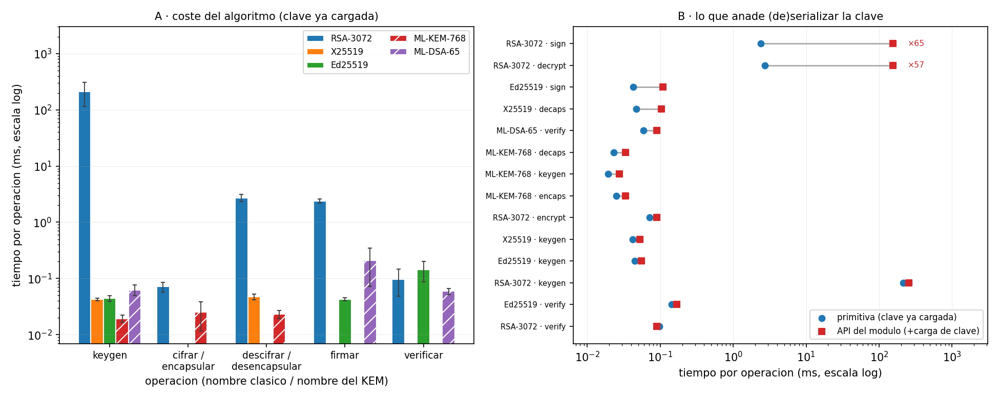
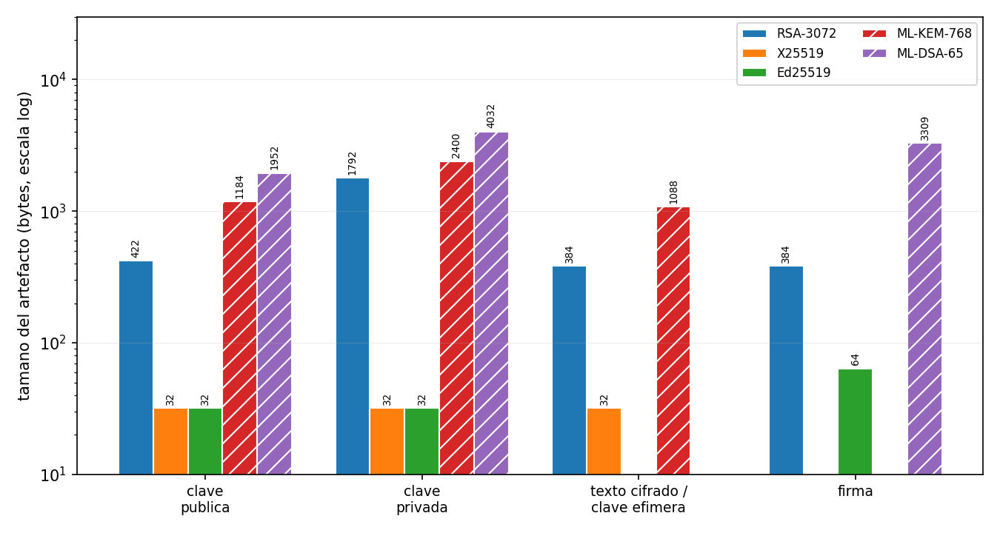
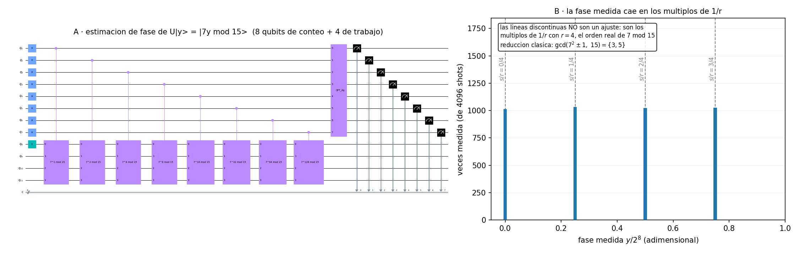

<div align="center">

# 🔐 QPCS — Quantum & Physics Cryptography Suite

**An interdisciplinary cryptography suite bridging quantum physics, post-quantum security and deterministic chaos.**

[](https://www.python.org/)
[](https://www.ibm.com/quantum/qiskit)
[](https://openquantumsafe.org/)
[](https://www.docker.com/)
[](https://docs.pytest.org/)

</div>

---

## 📑 Table of contents

- [Overview](#-overview)
- [Quick start](#-quick-start-docker--recommended)
- [Full installation](#️-full-installation-local-development)
- [Verify your setup](#-verify-your-setup)
- [Troubleshooting](#-troubleshooting)
- [Repository structure](#-repository-structure)
- [Project modules](#-project-modules)
- [Tech stack](#-tech-stack)
- [Contributing & Git workflow](#-contributing--git-workflow)
- [Team](#-team)

---

## 🔎 Overview

QPCS is a modular suite combining **quantum key distribution**, **post-quantum cryptography** and **chaos-based encryption**, built by a team spanning Physics, Cybersecurity and Data Engineering.

| | |
|---|---|
| 🧪 **Module 1** | BB84 quantum key distribution + QRNG + eavesdropper simulation |
| 🛡️ **Module 2** | Post-quantum cryptography benchmarks + Shor's algorithm demo |
| 🌀 **Module 3** | Image encryption via chaotic attractors |
| ⚛️ **Module 4** | *(optional)* Particle detector noise as an entropy source |

---

## ⚡ Quick start (Docker — recommended)

> **The container is the source of truth.** It works identically on Windows (WSL2), Linux and macOS, and requires no manual `liboqs` build.

**1.** Clone the repository:

```bash
git clone https://github.com/cmartinezmeco/qpcs.git
```

**2.** Enter the project folder:

```bash
cd qpcs
```

**3.** Build the image (first build takes ~5–10 min — it compiles `liboqs` from source):

```bash
docker build -t qpcs .
```

**4.** Run it:

```bash
docker run --rm -it -p 8501:8501 qpcs
```

✅ If you see `QPCS - proyecto inicializado correctamente`, you're done.

---

## 🛠️ Full installation (local development)

The local virtual environment is **only** for comfortable editor work — autocomplete, linting, quick tests. Official execution always goes through Docker.

### Prerequisites

| Requirement | Notes |
|---|---|
| **WSL2 + Ubuntu 22.04/24.04** | Windows users only. Native Linux/macOS works too. |
| **Docker** | Docker Desktop with WSL2 integration enabled, or Docker Engine. |
| **Python 3.11** | Not 3.12+ — see [Troubleshooting](#-troubleshooting). |
| **Git + GitHub CLI** | `gh` for authentication against this private repo. |
| **VS Code + WSL extension** | Recommended editor setup. |

<br/>

### Step 1 — Authenticate with GitHub

> ⚠️ This repo is **private**. Accept your invitation at [`/invitations`](https://github.com/cmartinezmeco/qpcs/invitations) first, then authenticate with **your own** account:

```bash
gh auth login
```

<details>
<summary>📖 What to select in the prompts</summary>

<br/>

| Prompt | Choose |
|---|---|
| What account do you want to log into? | **GitHub.com** |
| Preferred protocol for Git operations? | **HTTPS** |
| Authenticate Git with your GitHub credentials? | **Yes** |
| How would you like to authenticate? | **Login with a web browser** |

</details>

<br/>

### Step 2 — Clone the repository

```bash
git clone https://github.com/cmartinezmeco/qpcs.git
```

```bash
cd qpcs
```

<br/>

### Step 3 — Install Python 3.11

<details>
<summary>💡 Skip this if <code>python3.11 --version</code> already works</summary>

<br/>

Ubuntu 24.04 ships Python 3.12 by default, so 3.11 comes from the deadsnakes PPA.

</details>

<br/>

```bash
sudo add-apt-repository ppa:deadsnakes/ppa -y
```

```bash
sudo apt update
```

```bash
sudo apt install -y python3.11 python3.11-venv python3.11-dev
```

Check it:

```bash
python3.11 --version
```

<br/>

### Step 4 — Install system build dependencies

Needed to compile `liboqs` (written in C):

```bash
sudo apt install -y build-essential cmake gcc g++ git libssl-dev ninja-build
```

<br/>

### Step 5 — Create the virtual environment

```bash
python3.11 -m venv .venv
```

```bash
source .venv/bin/activate
```

> ✅ Your prompt should now start with `(.venv)`.

```bash
pip install --upgrade pip
```

```bash
pip install -r requirements.txt
```

<br/>

### Step 6 — Build `liboqs` manually

> 🔴 **Required for the local venv only.** The Dockerfile does this automatically — skip this step if you only use Docker.
>
> **Why:** `liboqs-python==0.14.1` tries to auto-clone a `liboqs` git tag named `0.14.1`, which **does not exist upstream** (only `0.14.0` does). The auto-install therefore fails with `No oqs shared libraries found`. We build `0.14.0` manually instead.

```bash
cd ~
```

```bash
git clone --branch 0.14.0 --depth=1 https://github.com/open-quantum-safe/liboqs
```

```bash
cd liboqs && mkdir build && cd build
```

```bash
cmake -DBUILD_SHARED_LIBS=ON -DCMAKE_INSTALL_PREFIX=$HOME/_oqs ..
```

```bash
make -j$(nproc)
```

```bash
make install
```

Make the library path permanent:

```bash
echo 'export OQS_INSTALL_PATH=$HOME/_oqs' >> ~/.bashrc
```

```bash
source ~/.bashrc
```

<br/>

### Step 7 — Configure VS Code

Open the project from WSL:

```bash
code .
```

Install these extensions:

| Extension | Publisher | Purpose |
|---|---|---|
| **Python** | Microsoft | Language support |
| **Pylance** | Microsoft | Type checking & autocomplete |
| **Docker** | Microsoft | Container management |
| **Jupyter** | Microsoft | Notebook prototyping |
| **GitLens** | GitKraken | Commit history & peer review |

> 📌 `.vscode/settings.json` is committed to the repo and auto-configures **Black** and the `.venv` interpreter for the whole team.

---

## ✅ Verify your setup

**In your local venv:**

```bash
python -c "import qiskit, oqs, numpy, scipy, matplotlib, cryptography, streamlit, numba; print('Qiskit:', qiskit.__version__); print('liboqs:', oqs.oqs_python_version()); print('All OK')"
```

**Inside the container:**

```bash
docker run --rm qpcs python -c "import qiskit, oqs; print('Qiskit:', qiskit.__version__); print('liboqs:', oqs.oqs_python_version()); print('All OK')"
```

**Run the test suite:**

```bash
pytest tests/
```

Expected output:

```
Qiskit: 1.0.2
liboqs: 0.14.1
All OK
```

---

## 🩺 Troubleshooting

<details>
<summary><b>❌ <code>RuntimeError: No oqs shared libraries found</code></b></summary>

<br/>

`liboqs-python` failed to auto-install its C dependency. Two causes:

**1.** You skipped **Step 6** → build `liboqs` manually.

**2.** `OQS_INSTALL_PATH` isn't set in your current shell. Check it:

```bash
echo $OQS_INSTALL_PATH
```

If empty:

```bash
export OQS_INSTALL_PATH=$HOME/_oqs
```

If a broken half-installed folder exists, remove it and retry:

```bash
rm -rf ~/_oqs
```

</details>

<details>
<summary><b>❌ <code>fatal: Remote branch 0.14.1 not found in upstream origin</code></b></summary>

<br/>

Expected — that tag doesn't exist upstream. Don't fight it: follow **Step 6** and build `0.14.0` manually.

</details>

<details>
<summary><b>❌ Dependencies fail to install in my venv</b></summary>

<br/>

Check you're on Python 3.11, not 3.12+:

```bash
python --version
```

Qiskit-Aer, Numba and liboqs-python have wheel/compilation issues on newer Python versions. If it says 3.12, delete the venv and recreate it:

```bash
rm -rf .venv && python3.11 -m venv .venv && source .venv/bin/activate
```

</details>

<details>
<summary><b>❌ <code>git clone</code> asks for a password / permission denied</b></summary>

<br/>

The repo is **private**. Make sure you have:

**1.** Accepted the collaborator invitation.

**2.** Authenticated with **your own** GitHub account:

```bash
gh auth status
```

Never use someone else's token.

</details>

<details>
<summary><b>🐢 Docker build is very slow / transfers gigabytes</b></summary>

<br/>

Check `.dockerignore` exists and excludes `.venv/`. The build context should be **kilobytes**, not GB.

</details>

---

## 📁 Repository structure

```
qpcs/
│
├── 📂 .vscode/              # Shared VS Code configuration (Black, interpreter)
├── 📂 docker/               # Container configurations
│
├── 📂 src/                  # Source code
│   ├── 📂 qkd/              # Module 1 · QKD (BB84) + QRNG
│   ├── 📂 pqc/              # Module 2 · Post-Quantum Cryptography + Shor
│   ├── 📂 chaos/            # Module 3 · Deterministic chaos encryption
│   └── 📂 utils/            # Shared visualization helpers (Matplotlib)
│
├── 📂 tests/                # Unit tests (pytest)
├── 📂 notebooks/            # Jupyter prototyping (equations, quick maths)
│
├── 🐳 Dockerfile            # Reproducible environment (builds liboqs)
├── 📄 requirements.txt      # Pinned dependencies (==, never >=)
├── 📄 .dockerignore
├── 📄 .gitignore
└── 📄 README.md
```

---

## 🧩 Project modules

### 🧪 Module 1 — QKD + QRNG

Simulation of the **BB84 protocol**, a quantum random number generator, and an interactive Streamlit dashboard showing the **QBER** in real time in the presence of an eavesdropper ("Eve").

> The QBER rises from 0% to ~25% when Eve intercepts — a direct consequence of the no-cloning theorem and wavefunction collapse.

### 🛡️ Module 2 — Post-Quantum Cryptography

Performance comparison between classical cryptography (**RSA/ECC**) and post-quantum cryptography (**ML-KEM/ML-DSA**, the NIST-standardized successors of Kyber/Dilithium), plus a **Shor's algorithm** demo using Qiskit.

> This half is **not a simulation**: ML-KEM and ML-DSA run for real on `liboqs`, the same code that protects production systems today.

A real message encrypted with **ML-KEM-768** (KEM → HKDF-SHA256 → AES-256-GCM) and signed with **ML-DSA-65** — sample run, keys are freshly generated on every call and never seeded:

```text
message         : La criptografia post-cuantica protege esto en 2035.
kem_ciphertext  : 1088 B -> 52f550b7a56f6ad45b22db1627db6711 ...
nonce           :   12 B -> e0e6580fe247bbe131e509fb          (fresh per message)
aead_ciphertext :   67 B -> 0f949829636ec755bcd6293ecb65d5d9 ...
decrypted       : La criptografia post-cuantica protege esto en 2035.   ✅

signed          : comunicado oficial QPCS
public key      : 1952 B
signature       : 3309 B -> c644797e421aacfc8cd89cfc6be513a6 ...
verifies        : True    ✅  (flip one bit of the message → False)
```

The honest trade-off in one line: an **Ed25519** signature takes 64 bytes, an **ML-DSA-65** one takes 3309 — about 50× more. That cost in bytes, not in CPU, is what migrating actually buys you. Round-trips, tamper detection and sizes are pinned by tests: `tests/pqc/test_hybrid.py`, `tests/pqc/test_sig.py`, `tests/pqc/test_classical.py`.

#### 📊 The benchmark — what migrating actually costs

Measured **inside the container** with `time.perf_counter` (never `time.time`: it jumps with NTP), **200 repetitions** per post-quantum operation and **50** per classical one — a single RSA-3072 keygen already costs ~0.2 s. Every row carries the **σ of its own sample**: a mean without an error bar is not a measurement, it's an anecdote. Raw numbers, plus the machine and the `liboqs` build they came from: [`docs/benchmark_pqc.json`](docs/benchmark_pqc.json).

| Operation | Mechanism | Mean (ms) | σ (ms) | p50 (ms) | Reps | + key load (ms) | Artifact |
|---|---|---:|---:|---:|---:|---:|---|
| `keygen` | RSA-3072 | 212.376 | 98.053 | 199.082 | 50 | 254.810 | pk 422 B |
| `keygen` | X25519 | 0.042 | 0.002 | 0.042 | 50 | 0.052 | pk 32 B |
| `keygen` | Ed25519 | 0.045 | 0.005 | 0.043 | 50 | 0.055 | pk 32 B |
| `keygen` | **ML-KEM-768** | 0.019 | 0.003 | 0.019 | 200 | 0.028 | pk 1184 B |
| `keygen` | **ML-DSA-65** | 0.063 | 0.013 | 0.057 | 200 | — | pk 1952 B |
| `encrypt` | RSA-3072 | 0.071 | 0.015 | 0.066 | 50 | 0.090 | ct 384 B |
| `encaps` | **ML-KEM-768** | 0.025 | 0.014 | 0.021 | 200 | 0.033 | ct 1088 B |
| `decrypt` | RSA-3072 | 2.728 | 0.409 | 2.709 | 50 | 154.748 | — |
| `decaps` | X25519 | 0.047 | 0.005 | 0.045 | 50 | 0.104 | — |
| `decaps` | **ML-KEM-768** | 0.023 | 0.004 | 0.022 | 200 | 0.034 | — |
| `sign` | RSA-3072 | 2.396 | 0.212 | 2.304 | 50 | 155.016 | sig 384 B |
| `sign` | Ed25519 | 0.043 | 0.003 | 0.042 | 50 | 0.110 | sig 64 B |
| `sign` | **ML-DSA-65** | 0.211 | 0.139 | 0.170 | 200 | — | sig 3309 B |
| `verify` | RSA-3072 | 0.097 | 0.049 | 0.071 | 50 | 0.090 | — |
| `verify` | Ed25519 | 0.143 | 0.057 | 0.128 | 50 | 0.169 | — |
| `verify` | **ML-DSA-65** | 0.059 | 0.008 | 0.055 | 200 | 0.090 | — |

> An X25519 exchange is reported as `decaps`: it is the row that compares with ML-KEM's, since in both cases one party derives the shared secret with its private key. ML-DSA has no `+ key load` figure for `keygen`/`sign` because `sig.firmar` generates the keypair and signs in the same call on purpose — the private key never leaves the function — so timing it as `sign` would charge signing for the keygen.

**Why two time columns.** `Mean` times the algorithm with the key already in memory. `+ key load` times the module's public API instead, which takes keys as PEM (RSA) or raw bytes (curves) and deserializes them on **every** call — and OpenSSL 3 *validates* an RSA private key when it loads it, at ~152 ms per call. That is 57× the decryption itself and 65× the signature. On `keygen`, though, the two columns differ by less than RSA's own σ: exporting a fresh key to PEM costs microseconds, so that 42 ms gap is prime-search variance, not serialization. Folding it into the RSA rows would have advertised ML-KEM decapsulation as *thousands* of times faster than RSA decryption instead of the honest ~120×, so both layers are measured and both are published.

**The trade-off in one line: post-quantum wins on CPU and loses on bytes.** ML-KEM-768 generates a keypair ~11 000× faster than RSA-3072 (0.019 ms against 212 ms — RSA hunts for 1536-bit primes, ML-KEM samples a lattice) and decapsulates ~120× faster than RSA decrypts; ML-DSA-65 even verifies 2.4× faster than Ed25519. But its public key is 1184 B against X25519's 32 B, and its signature is 3309 B against Ed25519's 64 B. You pay for the migration in bandwidth and storage, not in CPU — and RSA's σ of 98 ms on keygen (46 % of the mean) is why every figure carries error bars.

#### 📈 Figures



**Figure 1 — time per operation** (log scale, error bars = measured σ). Panel **A** is the algorithm comparison with keys already loaded: post-quantum (hatched) is orders of magnitude below RSA and lands in the same tens-of-microseconds band as the elliptic curves — except signing, where ML-DSA-65 is ~5× slower than Ed25519 (and still ~11× faster than RSA-3072). Panel **B** is what key (de)serialization adds on top of each operation, which is where RSA's private-key operations lose two orders of magnitude.



**Figure 2 — artifact sizes in bytes** (log scale). The honest counterpart to figure 1: this is the one post-quantum loses. No error bars here on purpose — sizes are deterministic, fixed by FIPS 203/204 and the RSA modulus. X25519's "ciphertext" is its 32-byte ephemeral public key, the analogue of ML-KEM's 1088-byte encapsulation.



**Figure 3 — Shor on N = 15.** Panel **A** is the phase-estimation circuit (8 counting qubits + 4 work qubits, with the hand-compiled `a^k mod 15` oracle). Panel **B** is the measured phase over 4096 shots: the peaks land exactly on the four multiples of 1/r with r = 4, the real order of 7 mod 15 — which continued fractions turn into r, and `gcd(7² ± 1, 15)` into {3, 5}. The dashed lines are the prediction, not a fit.

#### 🔁 Regenerating the benchmark and the figures

```bash
docker run --rm -v "$PWD":/app --user "$(id -u):$(id -g)" -e MPLCONFIGDIR=/tmp/mpl \
  qpcs:ci python scripts/make_pqc_plots.py --medir
```

Re-measures everything (~50 s), rewrites `docs/benchmark_pqc.json` and regenerates the three PNGs. Without `--medir` the script only redraws from the committed JSON, so touching a colour never changes a published number. The heavy benchmark also has a test of its own, kept out of the fast suite:

```bash
docker run --rm qpcs:ci pytest tests/ -m "slow"        # ~44 s
docker run --rm qpcs:ci pytest tests/ -m "not slow"    # the 122 fast tests
```

#### ⚠️ What these numbers do *not* say

- **They are not a constant-time analysis.** The benchmark measures mean performance to compare cost; nothing here rules out timing side channels.
- **They are machine-specific.** Every JSON carries the platform, CPU, Python and `liboqs` versions it was measured on. Comparing across machines without checking that block is meaningless.
- **Shor factors toys, not keys.** N = 15 with an oracle compiled by hand for each (a, N). N = 21 needs its own `c_amod21` (5 work qubits) and is not implemented — the dashboard says so when you pick it. Breaking RSA-2048 would need thousands of logical qubits with error correction, which do not exist.

### 🌀 Module 3 — Deterministic chaos

Image encryption using **chaotic attractors** (Lorenz / Logistic Map), with entropy and pixel-correlation tests proving no statistical information leaks.

### ⚛️ Module 4 *(optional)* — Particle detector noise

Using thermal/quantum noise from silicon sensors (CERN Open Data) as a **true random number generator** entropy source.

---

## 🧰 Tech stack

| Area | Technologies |
|---|---|
| ⚛️ **Quantum computing** | `Qiskit` · `Qiskit-Aer` |
| 🔢 **Numerical computation** | `NumPy` · `SciPy` · `Numba` |
| 🔒 **Classical cryptography** | `cryptography` |
| 🛡️ **Post-quantum cryptography** | `liboqs-python` |
| 📊 **Visualization / dashboard** | `Matplotlib` · `Seaborn` · `Streamlit` |
| 🧪 **Testing** | `Pytest` |
| 🐳 **Containers** | `Docker` |

---

## 🤝 Contributing & Git workflow

> 🚫 **Never work directly on `main`.**

**1.** Create a descriptive branch:

```bash
git checkout -b feature/module1-qkd-physics
```

<details>
<summary>📖 Branch naming convention</summary>

<br/>

| Pattern | Example |
|---|---|
| `feature/<module>-<what>` | `feature/module1-qkd-physics` |
| `feature/<what>` | `feature/benchmarking-pqc` |
| `fix/<what>` | `fix/chaos-rk4-precision` |
| `docs/<what>` | `docs/qkd-theory` |

</details>

<br/>

**2.** Stage and commit your work:

```bash
git add .
```

```bash
git commit -m "feat: implement BB84 basis sifting"
```

**3.** Push the branch:

```bash
git push -u origin feature/module1-qkd-physics
```

**4.** Open a Pull Request:

```bash
gh pr create --fill
```

### Review rules

| Rule | Detail |
|---|---|
| ✅ **1 PR = 1 task** | Small, reviewable changes. |
| 👀 **1 approval required** | Reviewed by at least one other team member before merge. |
| 🧪 **Tests are mandatory** | New logic without a test doesn't get merged. |
| 🐳 **Docker is the truth** | "Works in my venv" isn't good enough. |
| 📌 **Pinned versions only** | `==` in `requirements.txt`, never `>=`. |

---

## 👥 Team

| Role | Responsibilities |
|---|---|
| ⚛️ **Physics** | Theoretical & physical modeling — BB84, Shor's algorithm, chaotic systems. |
| 🛡️ **Cybersecurity** | Key reconciliation, PQC integration, entropy analysis. |
| 📊 **Data Engineering** | Interfaces, optimization, benchmarking, Docker & CI. |

---

<div align="center">

**QPCS** · Built with Qiskit, liboqs and a healthy respect for the no-cloning theorem.

</div>

