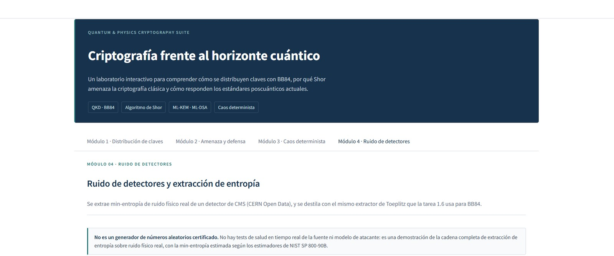

# Entorno de desarrollo local

El contenedor es la fuente de verdad del proyecto: si funciona en Docker, funciona. El entorno
local existe **solo** para trabajar cómodo en el editor —autocompletado, tipos, tests rápidos—
y nunca para publicar una cifra ni regenerar una figura.

Si solo quieres ver el proyecto funcionando, no necesitas nada de esto: el
[arranque rápido del README](../README.md) son cuatro órdenes con Docker.

---

## Requisitos

| Requisito | Notas |
|---|---|
| **WSL2 + Ubuntu 22.04 o 24.04** | Solo en Windows. Linux y macOS nativos valen igual. |
| **Docker** | Docker Desktop con la integración de WSL2 activada, o Docker Engine. |
| **Python 3.11** | No 3.12 ni posterior: ver la guía de problemas más abajo. |
| **Git y GitHub CLI** | `gh` para autenticarse contra este repositorio, que es privado. |
| **VS Code + extensión WSL** | Recomendado, no obligatorio. |

---

## Paso 1 — Autenticarse en GitHub

El repositorio es privado. Acepta primero la invitación de colaborador y después autentícate
con **tu propia** cuenta:

```bash
gh auth login
```

En las preguntas: **GitHub.com**, protocolo **HTTPS**, autenticar git con tus credenciales
**sí**, y **Login with a web browser**.

## Paso 2 — Clonar

```bash
git clone https://github.com/cmartinezmeco/qpcs.git
cd qpcs
```

## Paso 3 — Python 3.11

Sáltate este paso si `python3.11 --version` ya responde. Ubuntu 24.04 trae Python 3.12 de
serie, así que la 3.11 viene del PPA de deadsnakes:

```bash
sudo add-apt-repository ppa:deadsnakes/ppa -y
sudo apt update
sudo apt install -y python3.11 python3.11-venv python3.11-dev
python3.11 --version
```

## Paso 4 — Dependencias de compilación

Hacen falta para compilar `liboqs`, que está escrita en C:

```bash
sudo apt install -y build-essential cmake gcc g++ git libssl-dev ninja-build
```

## Paso 5 — Entorno virtual

```bash
python3.11 -m venv .venv
source .venv/bin/activate
pip install --upgrade pip
pip install -r requirements.txt
pip install -r requirements-dev.txt
```

El prompt debe empezar ahora por `(.venv)`.

## Paso 6 — Compilar `liboqs` a mano

**Solo para el entorno local.** El `Dockerfile` lo hace por su cuenta; sáltate este paso si vas
a trabajar únicamente con Docker.

`liboqs-python` es únicamente el enlace de Python: la criptografía vive en `liboqs`, una
biblioteca en C **sin wheel**. Sin ella, `import oqs` falla con
`No oqs shared libraries found`.

La biblioteca en C y su enlace de Python se versionan juntos y **tienen que coincidir**.
`requirements.txt` fija `liboqs-python==0.16.0`, así que hay que compilar la etiqueta `0.16.0`,
la misma que compila el [`Dockerfile`](../Dockerfile).

```bash
cd ~
git clone --branch 0.16.0 --depth=1 https://github.com/open-quantum-safe/liboqs
cd liboqs && mkdir build && cd build
cmake -DBUILD_SHARED_LIBS=ON -DCMAKE_INSTALL_PREFIX=$HOME/_oqs ..
make -j$(nproc)
make install
```

Y deja la ruta puesta de forma permanente:

```bash
echo 'export OQS_INSTALL_PATH=$HOME/_oqs' >> ~/.bashrc
source ~/.bashrc
```

## Paso 7 — VS Code

Abre el proyecto desde WSL con `code .` e instala **Python** y **Pylance** (Microsoft) como
mínimo; **Docker**, **Jupyter** y **GitLens** ayudan.

La configuración del editor no va versionada: cada uno usa el suyo y el
`.vscode/` está en el `.gitignore`. Lo único que conviene apuntar a mano es el intérprete
(**Python: Select Interpreter** → el `.venv` del proyecto) y el formateador (**Black**, con
formato al guardar). Las reglas de verdad —longitud de línea, versión de Python, qué revisa
cada herramienta— viven en `pyproject.toml`, que sí está versionado, así que son las mismas
para todos con editor o sin él.

---

## Comprobar que ha ido bien

En el entorno local:

Primero hay que situarse en la carpeta del proyecto:

```bash
cd ~/qpcs
```

```bash
python -c "import qiskit, oqs, numpy, scipy, matplotlib, cryptography, streamlit; print('Qiskit:', qiskit.__version__); print('liboqs C:', oqs.oqs_version()); print('liboqs-python:', oqs.oqs_python_version()); print('OK')"
```

Dentro del contenedor:

```bash
docker run --rm qpcs python -c "import qiskit, oqs; print('liboqs C:', oqs.oqs_version()); print('liboqs-python:', oqs.oqs_python_version())"
```

La salida esperada:

```
Qiskit: 1.0.2
liboqs C: 0.16.0
liboqs-python: 0.16.0
OK
```

**Las dos líneas de `liboqs` tienen que decir 0.16.0.** Si la de C dice `0.14.x`, tu entorno es
anterior al cambio de versión: rehaz el paso 6 contra la etiqueta `0.16.0`. El contenedor
siempre está bien por construcción; solo los entornos locales se desincronizan.

Y la suite de tests:

```bash
pytest tests/ -m "not slow"
```
---

## Arrancar el contenedor

```bash
docker compose up -d --build app
```

La primera vez tarda un rato porque compila `liboqs`; las siguientes son segundos. El `-d`
lo deja corriendo en segundo plano, así que la terminal vuelve enseguida y no hay nada más
que esperar en ella.

**Ahora abre [http://localhost:8501](http://localhost:8501) en el navegador.** Ahí está el
panel. Si en vez de `-d` lo arrancas en primer plano, Streamlit imprime una línea
`URL: http://0.0.0.0:8501`: es la dirección **desde dentro** del contenedor, y desde tu
navegador no funciona. La buena es siempre `localhost:8501`.

Esto es lo que tiene que salir:



Una pestaña por módulo, arriba. Si ves esto, el entorno está montado y funcionando.

Para pararlo:

```bash
docker compose down
```

Y si el navegador no carga nada, mira [«El puerto 8501 no responde»](#el-puerto-8501-no-responde)
más abajo.

---

## Problemas conocidos

### El puerto 8501 no responde

El contenedor arrancó pero el navegador no carga nada en `localhost:8501`. Por orden de
probabilidad:

1. **Todavía está construyendo.** La primera vez compila `liboqs` y son entre diez y
   diecisiete minutos. Míralo con `docker compose logs -f app`: hasta que no aparezca la
   línea de Streamlit, no hay nada escuchando.
2. **El contenedor se cayó.** `docker compose ps` te dice si sigue en pie. Si no está, el
   motivo estará en `docker compose logs app`.
3. **Ya tenías algo en el 8501.** Si `docker compose up` se quejó de que el puerto está
   ocupado, cambia el lado izquierdo del mapeo en `docker-compose.yml` (por ejemplo
   `"8502:8501"`) y entra por `localhost:8502`.
4. **Estás en Windows sin la integración de WSL2.** Docker Desktop tiene que tener activada
   la integración con tu distribución, o el puerto se publica en un sitio al que tu
   navegador no llega.

Lo que **no** es la causa: la línea `URL: http://0.0.0.0:8501` que imprime Streamlit. Esa
dirección es la de dentro del contenedor y no se escribe en el navegador. La buena siempre es
`localhost:8501`.

### `RuntimeError: No oqs shared libraries found`

`liboqs-python` no ha encontrado su dependencia en C. Dos causas:

1. Te saltaste el **paso 6**. Compila `liboqs` a mano.
2. `OQS_INSTALL_PATH` no está en tu shell actual. Compruébalo con `echo $OQS_INSTALL_PATH` y,
   si sale vacío, `export OQS_INSTALL_PATH=$HOME/_oqs`.

Si quedó una instalación a medias, bórrala con `rm -rf ~/_oqs` y repite el paso 6.

### `oqs.oqs_version()` y `oqs.oqs_python_version()` no coinciden

La causa habitual es un entorno creado durante la Fase 1, cuando el proyecto compilaba la
`0.14.0`: `pip install -r requirements.txt` actualiza el enlace de Python pero **no puede**
tocar la biblioteca en C que compilaste a mano.

```bash
rm -rf ~/_oqs ~/liboqs
```

Y rehaz el paso 6 con `--branch 0.16.0`.

> Nota histórica, por si aparece en una rama vieja: `liboqs-python==0.14.1` intentaba clonar
> por su cuenta una etiqueta `0.14.1` de `liboqs` que nunca existió, y por eso existe el paso 6.
> La `0.16.0` sí existe, pero la compilación manual sigue haciendo falta: no hay wheel.

### Las dependencias no se instalan

Comprueba que estás en Python 3.11 y no en 3.12 o posterior:

```bash
python --version
```

Qiskit-Aer y `liboqs-python` dan problemas de wheels y de compilación en versiones más nuevas.
Si dice 3.12, borra el entorno y créalo otra vez:

```bash
rm -rf .venv && python3.11 -m venv .venv && source .venv/bin/activate
```

### `git clone` pide contraseña o da permiso denegado

El repositorio es privado. Acepta la invitación de colaborador y autentícate con tu propia
cuenta: `gh auth status` te dice con cuál estás. Nunca uses el token de otra persona.

### La construcción de Docker es lentísima o transfiere gigabytes

Comprueba que `.dockerignore` existe y excluye `.venv/`. El contexto de construcción debe ser
de kilobytes, no de gigabytes.

### `git clone` de `liboqs` falla dentro del contenedor con un 401

Síntoma: `docker build` corta en el paso del `git clone` con
`could not read Username for 'https://github.com'`, mientras que el mismo clone funciona bien
fuera de Docker y `curl https://github.com` responde desde dentro del contenedor.

Es un problema de la red del propio Docker en esa máquina, no del repositorio ni de la CI.
Está documentado en la incidencia #41. Reintentar suele bastar; si persiste, la salida es
construir la imagen en otra máquina o esperar a que se publique en un registro.
