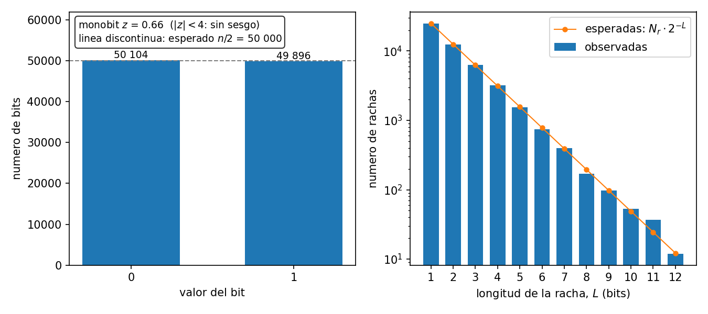
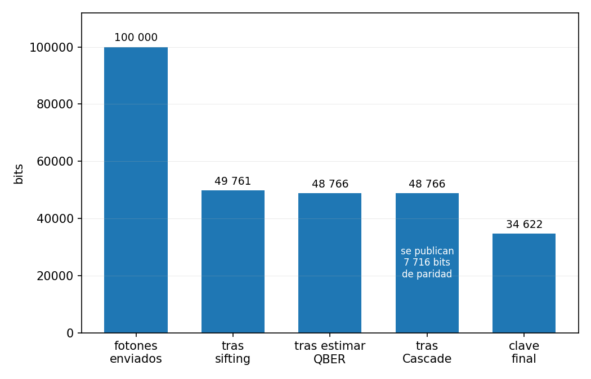
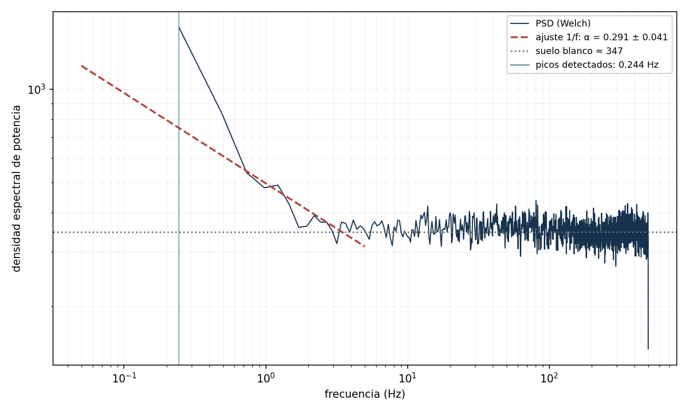
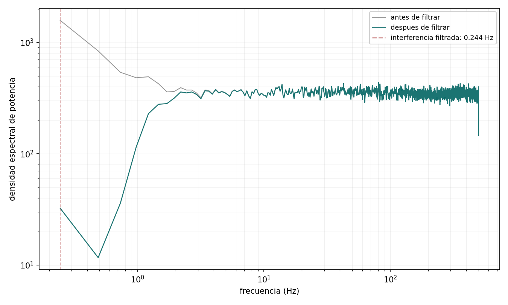
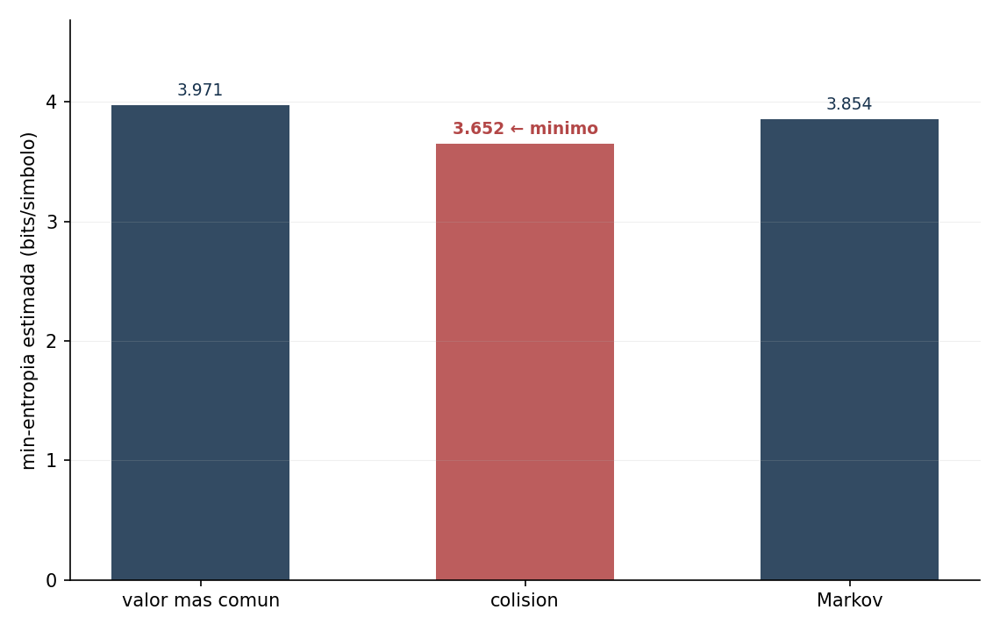
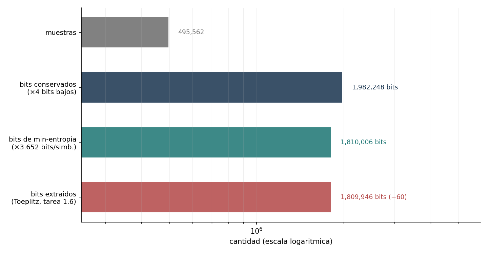

# Resultados medidos

Las cifras de los cuatro módulos, con la máquina y las condiciones en que se midieron. Todo lo
que aparece aquí sale de una ejecución real dentro del contenedor y se regenera con un comando:

```bash
docker compose run --rm figuras
```

Las limitaciones de cada módulo están en [`limitaciones.md`](limitaciones.md); la teoría, en
[`theory/`](theory/). Este documento es solo lo que se ha medido.

---

## Módulo 1 · Distribución cuántica de claves

### El QBER frente al espionaje


La recta **no es un ajuste**: es la predicción teórica Q = p/4 dibujada encima de los datos.
El R² del ajuste lineal sale 0,998. En p = 1 el QBER llega al 25 %, que es el número que
produce un ataque de interceptar y reenviar, y queda muy por encima de la línea del 11 % que
marca el umbral de seguridad de BB84 con post-procesado unidireccional.

Ese umbral no está programado en ninguna parte: sale de resolver 1 − 2·h(Q) > 0 con la entropía
binaria de Shannon. El test `test_barrido_de_eve` comprueba que el protocolo aborta exactamente
cuando debe, y la frontera cae en p ≈ 0,44 sin que nadie la haya escrito.

### El QRNG



100 000 bits generados midiendo el estado |+⟩ en la base Z: 50 104 ceros y 49 896 unos, con un
estadístico monobit z = 0,658. El umbral del test es 4σ, derivado de la binomial y no elegido a
ojo: da una probabilidad de fallo espurio de 6 × 10⁻⁵, suficientemente laxa para que la CI no
parpadee y suficientemente estricta para detectar un sesgo real.

### El embudo de bits



De 100 000 fotones enviados salen 34 622 bits de clave secreta, un rendimiento del 34,6 %.
Cada escalón tiene su causa:

| Etapa | Bits | Qué pasa |
|---|---:|---|
| Fotones enviados | 100 000 | Alice transmite |
| Tras el *sifting* | 49 761 | Se tira la mitad: las bases no coincidían |
| Tras estimar el QBER | 48 766 | La muestra comparada en público se descarta (Q = 1,81 %) |
| Tras Cascade | 48 766 | Misma longitud, pero se han publicado 7 716 bits de paridad |
| Clave final | 34 622 | ℓ = n·(1 − h(Q)) − `leak_ec` − 2·log₂(1/ε) |

La eficiencia de reconciliación es f_EC = 1,21, dentro del rango que reporta la literatura para
Cascade (1,1–1,2). Por debajo de 1 habría un error: se estaría violando el límite de
Slepian–Wolf, que es como anunciar un móvil perpetuo.

---

## Módulo 2 · Criptografía post-cuántica y Shor

### El benchmark

Medido **dentro del contenedor** con `time.perf_counter` —nunca `time.time`, que salta con
NTP—, 200 repeticiones por operación post-cuántica y 50 por operación clásica: un solo
`keygen` de RSA-3072 ya cuesta unos 0,2 s. Cada fila lleva la σ de su propia muestra, porque
una media sin barra de error es una anécdota. Las cifras crudas, con la máquina y la versión de
`liboqs` con que se midieron, están en [`benchmark_pqc.json`](benchmark_pqc.json).

| Operación | Mecanismo | Media (ms) | σ (ms) | p50 (ms) | Reps | + carga de clave (ms) | Artefacto |
|---|---|---:|---:|---:|---:|---:|---|
| `keygen` | RSA-3072 | 212,376 | 98,053 | 199,082 | 50 | 254,810 | pk 422 B |
| `keygen` | X25519 | 0,042 | 0,002 | 0,042 | 50 | 0,052 | pk 32 B |
| `keygen` | Ed25519 | 0,045 | 0,005 | 0,043 | 50 | 0,055 | pk 32 B |
| `keygen` | **ML-KEM-768** | 0,019 | 0,003 | 0,019 | 200 | 0,028 | pk 1184 B |
| `keygen` | **ML-DSA-65** | 0,063 | 0,013 | 0,057 | 200 | — | pk 1952 B |
| `encrypt` | RSA-3072 | 0,071 | 0,015 | 0,066 | 50 | 0,090 | ct 384 B |
| `encaps` | **ML-KEM-768** | 0,025 | 0,014 | 0,021 | 200 | 0,033 | ct 1088 B |
| `decrypt` | RSA-3072 | 2,728 | 0,409 | 2,709 | 50 | 154,748 | — |
| `decaps` | X25519 | 0,047 | 0,005 | 0,045 | 50 | 0,104 | — |
| `decaps` | **ML-KEM-768** | 0,023 | 0,004 | 0,022 | 200 | 0,034 | — |
| `sign` | RSA-3072 | 2,396 | 0,212 | 2,304 | 50 | 155,016 | sig 384 B |
| `sign` | Ed25519 | 0,043 | 0,003 | 0,042 | 50 | 0,110 | sig 64 B |
| `sign` | **ML-DSA-65** | 0,211 | 0,139 | 0,170 | 200 | — | sig 3309 B |
| `verify` | RSA-3072 | 0,097 | 0,049 | 0,071 | 50 | 0,090 | — |
| `verify` | Ed25519 | 0,143 | 0,057 | 0,128 | 50 | 0,169 | — |
| `verify` | **ML-DSA-65** | 0,059 | 0,008 | 0,055 | 200 | 0,090 | — |

Un intercambio X25519 aparece como `decaps` porque es la fila que compara con la de ML-KEM: en
los dos casos una de las partes deriva el secreto con su clave privada. ML-DSA no tiene columna
de carga en `keygen` porque `sig.firmar` genera el par y firma en la misma llamada, a
propósito: la clave privada no sale de la función.

### Por qué hay dos columnas de tiempo

`Media` cronometra el algoritmo con la clave ya en memoria. `+ carga de clave` cronometra la
API pública del módulo, que recibe las claves en PEM (RSA) o en bytes crudos (curvas) y las
deserializa en **cada** llamada. Y OpenSSL 3 *valida* una clave privada RSA al cargarla, a unos
152 ms por llamada: 57 veces el coste del descifrado y 65 veces el de la firma.

Meter esa carga dentro de las filas de RSA habría anunciado la desencapsulación de ML-KEM como
*miles* de veces más rápida que el descifrado RSA, en lugar del ~120× honesto. Por eso se miden
y se publican las dos capas.

### El compromiso, en una línea

Post-cuántico gana en CPU y pierde en bytes. ML-KEM-768 genera un par unas 11 000 veces más
rápido que RSA-3072 (RSA busca primos de 1536 bits; ML-KEM muestrea un retículo) y desencapsula
unas 120 veces más rápido de lo que RSA descifra; ML-DSA-65 incluso verifica 2,4 veces más
rápido que Ed25519. Pero su clave pública ocupa 1184 B contra los 32 B de X25519, y su firma
3309 B contra 64 B. La migración se paga en ancho de banda y almacenamiento.

### Las figuras


**Tiempo por operación**, escala logarítmica, barras de error = σ medida. El panel A compara
los algoritmos con las claves ya cargadas: lo post-cuántico (rayado) queda órdenes de magnitud
por debajo de RSA y en la misma banda de decenas de microsegundos que las curvas elípticas,
salvo al firmar, donde ML-DSA-65 es unas 5 veces más lento que Ed25519 y aun así unas 11 veces
más rápido que RSA-3072. El panel B es lo que añade la (de)serialización de claves, que es
donde las operaciones privadas de RSA pierden dos órdenes de magnitud.


**Tamaños en bytes**, escala logarítmica. Es la contrapartida honesta de la figura anterior:
aquí es donde lo post-cuántico pierde. Sin barras de error a propósito, porque los tamaños son
deterministas, fijados por FIPS 203 y 204 y por el módulo de RSA.


**Shor sobre N = 15.** El panel A es el circuito de estimación de fase: 8 qubits de conteo más
4 de trabajo, con el oráculo de `a^k mod 15` compilado a mano. El panel B es la fase medida
sobre 4096 disparos: los picos caen exactamente en los cuatro múltiplos de 1/r con r = 4, el
orden real de 7 módulo 15. Las líneas discontinuas son la predicción, no un ajuste.

Una ejecución del bucle completo, con semilla 42: **15 = 3 × 5**, con a = 2, r = 4, al primer
intento, fase medida 0,750.

### Lo que estas cifras no dicen

- **No son un análisis de tiempo constante.** El benchmark mide rendimiento medio para comparar
  coste. Nada de esto descarta canales laterales de temporización.
- **Dependen de la máquina.** Cada JSON lleva su plataforma, CPU, versión de Python y de
  `liboqs`. Comparar entre máquinas sin mirar ese bloque no significa nada.
- **Las medias son más ruidosas que las medianas.** En las filas más rápidas la media queda
  entre un 20 % y un 37 % por encima de su propia p50: el ruido del planificador y del
  recolector de basura cae sobre la media, no sobre la mediana. Se nota en que RSA-3072
  `verify` sale *más rápido* en la columna de carga (0,090 ms) que en la simple (0,097 ms), lo
  cual no puede ser cierto; con las p50 (0,071 frente a 0,084) el orden se restablece.

---

## Módulo 3 · Caos determinista

### Las tres columnas

Misma imagen de prueba de 256×256, mismas funciones de métrica, una ejecución real dentro del
contenedor. Los valores esperados están **derivados** en el código, nunca copiados de un
artículo.

| Métrica | Imagen plana | Esquema caótico | AES-256-GCM | Contador trivial | Esperado |
|---|---:|---:|---:|---:|---:|
| Entropía (bits/px) | 5,4525 | 7,99706 | 7,99697 | 7,99663 | 7,99719 |
| Correlación H | +0,9550 | +0,0171 | −0,0183 | +0,0183 | 0 |
| Correlación V | +0,9789 | −0,0041 | −0,0264 | +0,0045 | 0 |
| Correlación D | +0,9359 | −0,0038 | −0,0035 | −0,0080 | 0 |
| χ² (255 gl) | 1 581 568 | 267,1 | 274,1 | 306,2 | 255 ± 22,6 |
| NPCR (%) | — | 99,6353 | 99,6155 | 99,5712 | 99,6094 |
| UACI (%) | — | 33,5266 | 33,4348 | 33,5624 | 33,4635 |
| **Prueba de seguridad** | — | **ninguna** | **sí** | **ninguna** | |
| **Autenticación** | — | **no** | **sí (tag GCM)** | **no** | |

Cada tolerancia se deriva: la entropía contra la corrección de sesgo de Miller–Madow —8,0
exacto es inalcanzable; para 65 536 píxeles el techo es 7,99719— con σ = √((K−1)/2)/(N·ln 2);
la correlación con σ = 1/√n sobre 5 000 pares no solapados; NPCR con la σ binomial; UACI con
σ = √(Var|X−Y|/M)/255. La aritmética está escrita en
[`../tests/chaos/tolerancias.py`](../tests/chaos/tolerancias.py).

**Y esto es la lección del módulo.** Las tres columnas puntúan igual. `SHA256(clave ‖ contador)`
usado como flujo es una construcción que nadie defendería como cifrador serio, y saca las
mismas notas. Luego las métricas estándar del campo son condiciones **necesarias y no
suficientes**: detectan defectos gruesos —un histograma sesgado, una permutación que no
permuta, una difusión que no propaga— y nada más. La seguridad de AES-256-GCM no viene de pasar
estos tests; viene de veinticinco años de criptoanálisis público y de un proceso de
estandarización abierto. Este esquema no tiene nada de eso.

### Dónde se va el tiempo

Medido dentro del contenedor, `time.perf_counter`, 9 repeticiones tras 2 de calentamiento, con
el recolector cíclico desactivado durante cada muestra.

| Etapa de un cifrado de 256×256 | Media (ms) | σ (ms) | Peso |
|---|---:|---:|---:|
| Keystream, 2M+2 bytes (bucle Python sobre el mapa) | 38,46 | 1,44 | 49,3 % |
| Órbita para la permutación | 13,32 | 0,30 | 17,1 % |
| `argsort` estable | 6,28 | 0,25 | 8,0 % |
| Difusión hacia delante (bucle secuencial) | 6,03 | 0,31 | 7,7 % |
| Deshacer la difusión (una línea vectorizada) | 0,01 | 0,00 | 0,0 % |

| Imagen completa | Cifrar (ms) | Descifrar (ms) | Ratio |
|---|---:|---:|---:|
| 128×128 · logístico | 26,25 | 23,35 | 1,12× |
| 256×256 · logístico | 75,61 | 66,28 | 1,14× |
| 512×512 · logístico | 296,30 | 252,54 | 1,17× |
| 64×64 · Lorenz | 257,79 | 254,88 | 1,01× |

Dos correcciones honestas a lo que el diseño predecía. La primera: se esperaba que descifrar
saliera uno o dos órdenes de magnitud más rápido que cifrar. A nivel de **etapa** es exacto
—6,03 ms contra 0,01 ms, unas 600 veces—, pero de punta a punta se queda en ~1,15×, porque las
dos direcciones regeneran el mismo keystream y eso domina. Publicar el ratio de etapa como si
fuera el de punta a punta habría sido un número bonito y falso. La segunda: el cuello de
botella no es el bucle secuencial de difusión, sino la generación de la órbita, que es el 66 %
de un cifrado.

### Las figuras


**Bifurcación y Lyapunov**, compartiendo el eje r. Arriba la cascada clásica: punto fijo, primer
doblamiento en r = 3, periodo 4, 8, 16… y luego caos. Abajo, λ(r) **calculado, no citado**, y
las dos curvas encajan: λ cruza el cero justo donde empieza el caos y vuelve a hundirse dentro
de cada ventana periódica. La línea discontinua marca r = 3,83, la ventana de periodo 3: está
*dentro* del rango caótico nominal y sin embargo da λ = −0,3697, así que el módulo rechaza esa
clave en vez de cifrar con un keystream de tres bytes. Para r = 4 sale λ = 0,6935, contra el
valor exacto ln 2 = 0,6931.


**Correlación entre píxeles adyacentes.** En el original los puntos se apelotonan en la
diagonal: un píxel se parece muchísimo a su vecino, r = +0,9550. En el cifrado llenan el
cuadrado, r = +0,0171, contra un umbral derivado de 4σ = 0,0566. Es la figura que enseña qué
significa «romper la correlación espacial».


**El atractor de Lorenz**, 30 000 pasos de RK4 con h = 0,01, coloreado por tiempo. No aporta
nada a la criptografía y es lo que más gente va a mirar, así que al menos está bien hecho.


**El GIF**: la imagen disolviéndose en ruido y volviendo **intacta**. La primera mitad cifra, la
segunda descifra; el viaje de ida y vuelta es exacto byte a byte y el script lo comprueba antes
de escribir un solo fotograma.

### Determinismo

El único fallo catastrófico de este módulo es silencioso: si una órbita sale distinta en otro
entorno, el descifrado devuelve ruido, que es exactamente lo que devuelve también un descifrado
*correcto* del texto cifrado de otro. No hay excepción que capturar. Por eso se comprueba en
cada *pull request* contra un vector generado fuera del contenedor y versionado:

```bash
python scripts/check_chaos_determinism.py
```

Además se midió la longitud de ciclo, que casi ningún artículo del campo mide: nueve claves,
cuatro millones de pasos de órbita cada una, y **ninguna cicla**. El resultado se publica como
cota inferior —ningún ciclo por debajo de 4 × 10⁶ pasos, es decir 1,33 × 10⁶ bytes de
keystream— en vez de como una distribución inventada.

---

## Módulo 4 · Ruido de detector

Datos reales de CERN Open Data: CMS ZeroBias, registro 31316, licencia CC0. La señal analizada
es `nPFCands`, el número de candidatos reconstruidos por Particle Flow en cada evento. Es un
*proxy* razonado del ruido, no una lectura directa de un ADC, y la frecuencia de muestreo
`fs = 1000` es una convención para dar escala al eje, no una medida física. Ambas cosas están
documentadas en [`../data/FUENTE.md`](../data/FUENTE.md).



**El espectro.** 495 562 muestras, 240 tramos de Welch: exponente α = 0,2909 ± 0,0412, factor
de Fano 130,38, suelo blanco en 346,7 y un pico estrecho en 0,2441. Ese pico **no** es la red
eléctrica a 50 Hz: en las unidades de esta señal, una frecuencia se lee como «por cada mil
eventos».



**El filtro.** La potencia en el pico pasa de 1580 a 32,4, un factor de 48,8, y el resto del
espectro sobrevive. Un filtro con memoria introduce correlación, que es justo lo que hay que
evitar en una fuente de entropía, así que se usa uno de fase cero y orden bajo.



**Los tres estimadores de NIST SP 800-90B**: el de valor más común da 3,9712 bits por muestra,
el de colisión 3,6524 y el de Markov 3,8538. Se toma el mínimo, que es el de **colisión**. La
literatura sugiere que para este tipo de señal debería ganar el de Markov; aquí no gana, y se
documenta como salió en vez de forzar la narrativa.



**El embudo.** De 495 562 muestras salen 1 982 248 bits conservados, 1 810 006 bits de
min-entropía y **1 809 946 bits extraídos**. La diferencia de 60 bits es exactamente el peaje
del *leftover hash lemma*: 2·log₂(1/ε) con ε = 10⁻⁹.

Esta figura es la única del proyecto que **no** se compara por MD5 en la CI, y por una razón
declarada: la semilla de Toeplitz sale de `os.urandom` y no se siembra nunca, así que los bits
extraídos cambian en cada ejecución. Lo que se publica es su longitud, no su contenido.

### Los dos esquemas de la teoría


Cada eslabón de la cadena de lectura añade ruido de una naturaleza distinta, y esa diferencia
es justo lo que permite separarlos después: la forma del espectro distingue los picos estrechos
de la pendiente en f^(−α), y lo que queda plano se separa con el factor de Fano.
