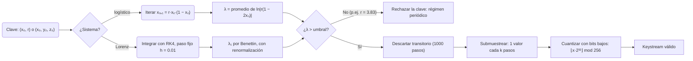

# Fundamentos teóricos del Módulo 3: Caos determinista. Cifrado de imágenes con Lorenz y mapa logístico

El **Módulo 3** de QPCS construye un cifrado de imágenes apoyado en **caos determinista**: sistemas dinámicos sin ninguna fuente de azar cuyo comportamiento es, sin embargo, impredecible a largo plazo. La palabra «caos» aquí no significa desorden, sino tres propiedades matemáticas precisas: **dependencia sensible de las condiciones iniciales**, **transitividad topológica** y **densidad de órbitas periódicas**. La primera es la que se mide, y la magnitud que la cuantifica es el **exponente de Lyapunov** λ, definido por la separación exponencial |δₙ| ≈ |δ₀|·e^(λn). Si λ > 0, hay caos; si λ < 0, la órbita converge a un ciclo o a un punto fijo.

El módulo usa dos dinámicas. La primera es el **mapa logístico**, xₙ₊₁ = r·xₙ·(1 − xₙ), el sistema caótico más simple que existe: unidimensional, en tiempo discreto, y con una cascada de duplicaciones de periodo cuyo punto de acumulación es r∞ = 3.5699456… y cuya razón universal es la **constante de Feigenbaum** δ = 4.6692… Para r = 4 el mapa es caótico sobre todo (0, 1) y su exponente vale **exactamente ln 2 = 0.693147…**, un resultado cerrado que sirve de test numérico. La segunda es el **sistema de Lorenz**, tres ecuaciones diferenciales acopladas con σ = 10, ρ = 28, β = 8/3, integradas con **Runge–Kutta de orden 4 y paso fijo** h = 0.01, cuyo atractor tiene dimensión fractal ≈ 2.06 y cuyo espectro de Lyapunov (λ₁ ≈ +0.906, λ₂ = 0, λ₃ ≈ −14.57) suma la divergencia del campo, −(σ + 1 + β) = −13.667, lo que proporciona una verificación numérica gratuita e independiente.

Dos advertencias gobiernan todo lo que sigue. La primera: dentro de la región caótica existen **ventanas periódicas** —la más ancha, de periodo 3, alrededor de r = 3.83— donde el sistema deja de ser caótico aunque el valor de r «parezca» válido; por eso el módulo calcula λ y rechaza claves, en lugar de confiar en un rango. La segunda: la **densidad invariante** del mapa logístico para r = 4 es ρ(x) = 1/(π·√(x(1−x))), que no es uniforme y diverge en los bordes; cuantizar los bytes con los bits de orden alto hereda ese sesgo y hunde la entropía del keystream.

A continuación se desarrollan, en detalle, la definición formal de caos, el mapa logístico con su diagrama de bifurcación y su densidad invariante, el sistema de Lorenz con su integración RK4, y el exponente de Lyapunov con sus dos algoritmos de cálculo (fórmula directa para mapas unidimensionales y método de Benettin con renormalización para sistemas continuos). Se incluye además un diagrama Mermaid del flujo de validación de una clave y una tabla de parámetros.

## Qué es exactamente el caos determinista

En el lenguaje común, «caos» significa desorden o aleatoriedad. En matemáticas significa algo mucho más preciso y bastante más raro: un sistema **completamente determinista** —sin ninguna fuente de azar, con una regla exacta que fija el futuro a partir del presente— cuyo comportamiento es sin embargo **impredecible a largo plazo**.

Un sistema dinámico se considera caótico si cumple las tres condiciones siguientes:

1. **Dependencia sensible de las condiciones iniciales.** Dos trayectorias que empiezan arbitrariamente cerca se separan exponencialmente con el tiempo. Es el llamado «efecto mariposa», y es exactamente lo que cuantifica el exponente de Lyapunov.
2. **Transitividad topológica.** La órbita visita, a lo largo del tiempo, cualquier región del espacio accesible. No queda atrapada en un rincón del espacio de fases.
3. **Densidad de órbitas periódicas.** Los puntos periódicos están por todas partes, pero son **inestables**: cualquier perturbación, por pequeña que sea, aleja de ellos.

### Traducción para ingenieros

Un sistema caótico es, a efectos prácticos, un generador de números pseudoaleatorios con dos diferencias respecto a un PRNG clásico.

La primera diferencia es **a favor**: su impredecibilidad procede de una propiedad estructural de la dinámica —la separación exponencial de trayectorias vecinas—, no de la complejidad de un diseño ingenieril. No hay rondas, ni cajas-S, ni constantes mágicas: hay una recurrencia de tres operaciones.

La segunda es **en contra**, y es más importante: un PRNG criptográfico como ChaCha20 está diseñado para que, viendo la salida, sea computacionalmente inviable reconstruir el estado interno. **Un sistema caótico no tiene esa propiedad por diseño**, y en varios esquemas publicados el estado se recupera con relativa facilidad, precisamente porque la dinámica es de baja dimensión y suave.

De ahí la frase que este módulo debe conservar en su README: *el sistema caótico se usa porque es física interesante y visualmente demostrable, no porque sea criptográficamente superior*.

## El mapa logístico

Es el sistema caótico más simple que existe, y por eso es el canónico del módulo. Se define por la recurrencia

> xₙ₊₁ = r·xₙ·(1 − xₙ),  con xₙ ∈ (0, 1) y r ∈ (0, 4]

Nació como modelo de dinámica de poblaciones: xₙ es la población normalizada, el término r·xₙ representa el crecimiento y el factor (1 − xₙ) la limitación por recursos. Su comportamiento depende **dramáticamente** del parámetro r:

| **Rango de r**        | **Comportamiento**                                   | **Para nosotros** |
|-----------------------|------------------------------------------------------|-------------------|
| 0 < r < 1             | la población se extingue, xₙ → 0                     | inservible        |
| 1 < r < 3             | converge a un punto fijo x\* = 1 − 1/r               | inservible        |
| 3 < r < 3.449         | ciclo de periodo 2                                   | inservible        |
| 3.449 < r < 3.544     | periodo 4, y luego 8, 16, 32…                        | inservible        |
| r > 3.5699…           | caos, **con ventanas periódicas dentro**             | utilizable        |
| r = 3.83              | ventana de periodo 3 dentro del caos                 | **trampa**        |
| r = 4                 | caos pleno sobre todo (0, 1)                         | el que usamos     |

El valor r∞ = 3.5699456… es el **punto de acumulación** de la cascada de duplicaciones de periodo. La razón entre las longitudes de intervalos sucesivos de esa cascada converge a la **constante de Feigenbaum**

> δ = 4.6692016…

que es **universal**: aparece en cualquier mapa unidimensional con un máximo cuadrático, independientemente de la forma concreta del mapa. Es uno de los resultados más bonitos de la física del siglo XX y merece un párrafo propio en la documentación teórica del repositorio.

### La trampa de las ventanas periódicas

Dentro de la región caótica hay intervalos de r donde el sistema **vuelve a ser periódico**. La más ancha es la ventana de periodo 3, alrededor de r = 3.83.

La consecuencia práctica es seria: si el código acepta cualquier r ∈ (3.57, 4] como «caótico», un usuario puede elegir r = 3.83 y el keystream tendrá periodo 3. La imagen «cifrada» sería un patrón de tres bytes repetidos y las métricas de calidad se hundirían. Peor todavía: **si nadie mira las métricas, el módulo cifraría alegremente con una clave inútil**.

Esta es la razón de que la validación por Lyapunov no sea opcional: el módulo tiene que **calcular λ para los parámetros que le den y rechazar los que no sean caóticos**, en lugar de fiarse de un rango nominal.

### La distribución invariante, y por qué importa

Para r = 4 el mapa logístico tiene una **densidad invariante** conocida en forma cerrada:

> ρ(x) = 1 / (π·√(x·(1 − x)))

Es decir: las órbitas **no visitan (0, 1) de manera uniforme**. Pasan mucho más tiempo cerca de los extremos 0 y 1 que en el centro, y la densidad diverge en ambos bordes.

**El error que arruina la entropía.** Si se generan bytes con `byte = int(x * 256)`, la distribución de bytes hereda ese sesgo: los valores 0 y 255 saldrán mucho más a menudo que el 128. La entropía de Shannon del keystream caerá visiblemente por debajo de 8 bits/byte, el contraste de χ² del histograma lo detectará, y el módulo suspenderá su propio criterio de cierre.

La solución consiste en **quedarse con bits de orden bajo** en lugar de los de orden alto:

> byte = ⌊x · 2³²⌋ mod 256

La intuición es sencilla: la densidad invariante es una función **suave** de x. Varía apreciablemente en escalas del orden de la unidad, pero es prácticamente constante en escalas de 2⁻³². Los bits de orden alto de x llevan el sesgo; los bits alrededor de la posición 32 son, a efectos prácticos, uniformes. Es un detalle de una línea que separa un módulo que funciona de uno que no, y prácticamente ningún tutorial de cifrado caótico lo menciona.

## El sistema de Lorenz

El mapa logístico es unidimensional y en tiempo discreto. **Lorenz es tridimensional y en tiempo continuo**: un sistema de tres ecuaciones diferenciales ordinarias acopladas, obtenido en 1963 como una simplificación brutal de la convección atmosférica.

> ẋ = σ·(y − x)
>
> ẏ = x·(ρ − z) − y
>
> ż = x·y − β·z

Con los parámetros clásicos σ = 10, ρ = 28, β = 8/3 el sistema es caótico y sus trayectorias convergen a un conjunto de medida nula y dimensión fractal ≈ 2.06: el **atractor de Lorenz**, la figura de dos alas que todo el mundo ha visto alguna vez.

Sus tres propiedades relevantes para este módulo son:

- **Es disipativo.** La divergencia del campo vectorial es constante y negativa:

  > ∇·F = −σ − 1 − β = −13.667

  Cualquier volumen del espacio de fases se contrae exponencialmente, y por eso existe un atractor.

- **Es acotado.** Las trayectorias no escapan al infinito, lo que significa que los valores de x, y, z se mueven en rangos conocidos (|x|, |y| ≲ 30 y 0 ≲ z ≲ 50). Eso hay que aprovecharlo al normalizar las coordenadas antes de cuantizarlas, usando **rangos declarados como constantes** y nunca medidos en tiempo de ejecución: medirlos haría que el keystream dependiera de la longitud de la órbita, y dos imágenes de tamaños distintos cifradas con la misma clave dejarían de ser compatibles.

- **Tiene tres exponentes de Lyapunov**, aproximadamente

  > λ₁ ≈ +0.906,  λ₂ = 0,  λ₃ ≈ −14.57

  El primero, positivo, es la firma del caos. El segundo, nulo, corresponde a la dirección del propio flujo. Y la suma de los tres es la divergencia del campo.

**Un test que sale gratis y vale mucho.** La identidad

> λ₁ + λ₂ + λ₃ = ∇·F = −(σ + 1 + β)

es una verificación **independiente** de que el integrador y el algoritmo de Lyapunov están bien implementados. No requiere ningún dato externo ni ninguna referencia bibliográfica: el sistema se comprueba a sí mismo.

### Integración numérica: Runge–Kutta de orden 4

Lorenz es de tiempo continuo, así que hay que integrarlo. El método estándar es Runge–Kutta clásico de cuarto orden. Para u̇ = F(u):

> k₁ = F(uₙ)
>
> k₂ = F(uₙ + (h/2)·k₁)
>
> k₃ = F(uₙ + (h/2)·k₂)
>
> k₄ = F(uₙ + h·k₃)
>
> uₙ₊₁ = uₙ + (h/6)·(k₁ + 2k₂ + 2k₃ + k₄)

El error local es O(h⁵) y el error global O(h⁴). Esa propiedad es, además, un test: al dividir el paso por dos, el error debe caer aproximadamente por 16.

**Por qué RK4 y no un integrador adaptativo.** La tentación es usar `scipy.integrate.solve_ivp`, que objetivamente es mejor integrador. Aquí sería un error grave: los métodos adaptativos eligen el tamaño de paso en función de una estimación del error, y esa elección puede depender de la versión de SciPy, del compilador y de detalles de redondeo. Dos ejecuciones que elijan pasos distintos producen **órbitas distintas**, y entonces el descifrado falla.

RK4 con paso fijo, escrito a mano en cuatro líneas, es completamente determinista: es una secuencia fija de sumas y multiplicaciones. **Peor integrador, mejor propiedad.**

Y hay un detalle adicional que es clave para todo el módulo: la fórmula de RK4 aplicada a Lorenz **solo usa sumas, restas y multiplicaciones**. Ninguna función trascendente. Lo mismo ocurre con el mapa logístico. Como la norma IEEE-754 garantiza que esas operaciones estén correctamente redondeadas —y no garantiza nada equivalente para `exp`, `log`, `sin` o `pow`—, ambas dinámicas caen íntegramente dentro de lo que sí es reproducible entre plataformas. Eso es lo que hace alcanzable el determinismo bit a bit.

El paso h es un **parámetro del contrato**, no una opción del usuario. Un valor de h = 0.01 es un buen compromiso: suficientemente pequeño para que RK4 siga la trayectoria con precisión, y suficientemente grande para que las muestras consecutivas estén decorreladas.

## El exponente de Lyapunov

Es la magnitud central de la validación del caos y la que convierte «el sistema es caótico» de una afirmación en una **medida**.

### Definición

Dadas dos trayectorias que empiezan separadas por una cantidad infinitesimal δ₀, su separación tras n pasos crece como

> |δₙ| ≈ |δ₀|·e^(λ·n)

y el exponente de Lyapunov se define como el límite

> λ = límₙ→∞ (1/n)·ln(|δₙ| / |δ₀|)

La interpretación es directa:

- Si **λ > 0**, las trayectorias divergen exponencialmente: hay caos.
- Si **λ < 0**, convergen: hay un atractor periódico o un punto fijo.
- Si **λ = 0**, el sistema está justo en el borde (bifurcación, o dirección del flujo).

### Cálculo para un mapa unidimensional

Para el mapa logístico existe una fórmula directa y barata. La derivada del mapa es f′(x) = r·(1 − 2x), y por la regla de la cadena la separación tras n pasos se multiplica por el producto de las derivadas evaluadas a lo largo de la órbita. Tomando logaritmos:

> λ = límₙ→∞ (1/N)·Σₙ₌₀^(N−1) ln|r·(1 − 2·xₙ)|

Es decir: se itera el mapa, se acumula el logaritmo del valor absoluto de la derivada en cada punto, y se promedia. Diez líneas de código.

**El valor exacto que sirve de test.** Para r = 4 el mapa logístico es conjugado con el mapa de la tienda mediante el cambio de variable x = sin²(πθ/2), y el mapa de la tienda tiene exponente ln 2 exactamente. Por tanto:

> λ(r = 4) = ln 2 = 0.6931471805…

Ese número **no es una referencia bibliográfica: es un resultado exacto**. El cálculo numérico debe reproducirlo, y el test correspondiente lo comprueba con una tolerancia derivada del error estándar de la media sobre el número de iteraciones, nunca con un umbral inventado.

Conviene una protección numérica: si la órbita cae exactamente en x = 0.5, la derivada es cero y el logaritmo es −∞. Es un suceso de medida nula en la teoría, pero con aritmética de coma flotante ocurre, y hay que acotar el argumento por abajo.

### Cálculo para un sistema continuo: el algoritmo de Benettin

Para Lorenz no hay fórmula cerrada. El método estándar (Benettin y colaboradores, 1980) calcula λ₁, el mayor exponente, así:

1. Se toma la trayectoria de referencia u(t) y una segunda trayectoria separada por un vector d₀ de norma pequeña (típicamente 10⁻⁸).
2. Se integran **las dos** durante un intervalo corto τ.
3. Se mide la nueva separación d₁ = |d₁| y se acumula ln(d₁/d₀).
4. Se **renormaliza**: se reposiciona la segunda trayectoria a distancia d₀ de la primera, en la misma dirección en la que se había separado.
5. Se repite N veces y se promedia:

   > λ₁ = (1/(N·τ))·Σₖ₌₁^N ln(dₖ / d₀)

**Por qué la renormalización no es opcional.** Sin el paso 4, las dos trayectorias se separan hasta que la distancia entre ellas es del tamaño del propio atractor. A partir de ahí ya no crece —el atractor es acotado— y el promedio de ln(d/d₀) tiende a cero. El resultado sería λ ≈ 0 para un sistema claramente caótico.

El síntoma es reconocible: λ empieza saliendo ≈ 0.9 y va bajando conforme se alarga la integración. Si se observa eso, no es que el sistema no sea caótico: es que **falta renormalizar**.

Un detalle de implementación que cuesta un par de días encontrar si se hace mal: la trayectoria de referencia y las perturbaciones deben integrarse **en paralelo, paso a paso dentro del mismo bucle interno**. Integrar la referencia por delante y las perturbaciones después, desfasadas un τ completo, produce exponentes catastróficamente equivocados. Y si se calcula el espectro completo mediante ortogonalización de Gram–Schmidt, la acumulación de las normas debe hacerse **después** de ortogonalizar, no antes: corresponde al término r_jj de la descomposición QR.

Existe una alternativa más precisa y no mucho más cara: integrar la **ecuación variacional**, es decir, la linealización del sistema en torno a la trayectoria. Evita tener que elegir d₀ y no sufre efectos de segundo orden. El método de las dos trayectorias es suficiente para el criterio de cierre del módulo; la ecuación variacional es la mejora natural si hay tiempo.

### El diagrama de bifurcación

Es la figura que resume todo lo anterior. Para cada valor de r en una malla fina del intervalo (2.5, 4]: se itera el mapa unos cientos de pasos para descartar el transitorio, y luego se dibujan los siguientes cientos de valores de xₙ como puntos sobre la vertical de ese r.

El resultado enseña de un vistazo el punto fijo, la primera duplicación en r = 3, la cascada completa, la transición al caos y las **ventanas periódicas blancas** dentro de la región negra —en particular la de periodo 3 en r ≈ 3.83—.

Superponiendo el exponente de Lyapunov en el mismo eje x se ve que **λ cruza a positivo exactamente donde empieza el caos y vuelve a negativo dentro de cada ventana**. Esa figura, con las dos curvas alineadas, es la mejor justificación visual de por qué la validación por Lyapunov existe como tarea propia.

## Flujo de validación de una clave

El siguiente diagrama resume cómo la teoría anterior se convierte en una decisión ejecutable: dada una clave, el módulo debe decidir si la dinámica que genera es realmente caótica **antes** de cifrar nada con ella.

Las dos ramas de la decisión central son las que dan sentido al capítulo: la de la izquierda impide cifrar con una secuencia de periodo 3, y la de la derecha encadena las tres operaciones (transitorio, submuestreo, cuantización) que convierten una órbita en un flujo de bytes estadísticamente limpio.

## Tabla de parámetros clave

| **Concepto**                     | **Valor / Definición**                                                                    |
|----------------------------------|-------------------------------------------------------------------------------------------|
| Caos determinista                | Sistema sin azar, impredecible a largo plazo por sensibilidad a condiciones iniciales      |
| Condiciones de caos              | Sensibilidad + transitividad topológica + densidad de órbitas periódicas                   |
| Mapa logístico                   | xₙ₊₁ = r·xₙ·(1 − xₙ), con xₙ ∈ (0, 1)                                                      |
| Punto fijo (1 < r < 3)           | x\* = 1 − 1/r                                                                              |
| Inicio del caos                  | r∞ = 3.5699456… (punto de acumulación de la cascada)                                       |
| Constante de Feigenbaum          | δ = 4.6692016…, **universal** para máximos cuadráticos                                     |
| Ventana periódica más ancha      | periodo 3 en r ≈ 3.83 — **dentro** del rango caótico nominal                               |
| Densidad invariante (r = 4)      | ρ(x) = 1/(π·√(x(1−x))), **no uniforme**, diverge en los bordes                             |
| Cuantización correcta            | ⌊x·2³²⌋ mod 256 (bits bajos); `int(x·256)` hereda el sesgo                                 |
| Sistema de Lorenz                | ẋ = σ(y−x); ẏ = x(ρ−z)−y; ż = xy − βz                                                      |
| Parámetros clásicos              | σ = 10, ρ = 28, β = 8/3                                                                    |
| Dimensión del atractor           | ≈ 2.06 (fractal)                                                                            |
| Divergencia del campo            | ∇·F = −(σ + 1 + β) = −13.667, constante y negativa ⇒ disipativo                            |
| Integrador                       | RK4 de **paso fijo** h = 0.01; error global O(h⁴); nunca adaptativo                         |
| Exponente de Lyapunov            | λ = límₙ (1/n)·ln(\|δₙ\|/\|δ₀\|); λ > 0 ⇔ caos                                              |
| λ del logístico con r = 4        | **ln 2 = 0.693147…** (exacto, por conjugación con el mapa de la tienda)                     |
| Espectro de Lorenz               | λ₁ ≈ +0.906, λ₂ = 0, λ₃ ≈ −14.57; la suma reproduce ∇·F                                     |
| Algoritmo para sistemas continuos| Benettin (1980), con **renormalización periódica** obligatoria                              |

## Conclusiones e implicaciones para la implementación

El desarrollo anterior deja tres ideas que condicionan todo el código del módulo.

**Primera: el caos se mide, no se supone.** El rango nominal (3.57, 4] contiene ventanas periódicas, y una clave que caiga en una de ellas produce un keystream de periodo 3 sin lanzar ninguna excepción. El módulo calcula λ y rechaza. Y como el valor exacto para r = 4 es ln 2, el cálculo se valida contra un resultado cerrado, con tolerancia derivada del error estándar y no de un umbral redondo.

**Segunda: la elección de dinámicas está condicionada por el determinismo, no por la elegancia.** Tanto el mapa logístico como RK4 sobre Lorenz usan exclusivamente sumas, restas y multiplicaciones, que son las operaciones que IEEE-754 garantiza correctamente redondeadas. Por eso se escribe RK4 a mano en lugar de usar un integrador adaptativo, y por eso ninguna función trascendente puede entrar en el camino del keystream. El logaritmo del cálculo de Lyapunov es la única excepción tolerada, y lo es porque λ es un **diagnóstico** que no alimenta el cifrado: puede diferir en el bit doce sin consecuencia alguna.

**Tercera: la física explica directamente una propiedad criptográfica.** El descarte de las mil iteraciones iniciales no es higiene numérica: es exactamente lo que produce la sensibilidad a la clave. Una diferencia de 10⁻¹⁵ en x₀ se amplifica como e^(λn), y con λ ≈ 0.7 bastan unas cincuenta iteraciones para que esa diferencia sea del orden de la unidad. Tras mil pasos, dos claves vecinas generan órbitas sin ninguna relación. Es el mismo mecanismo, visto desde el otro lado, que obliga a que el keystream sea idéntico bit a bit en todas las máquinas: la exponencial que garantiza la sensibilidad a la clave es la misma que convierte un error de redondeo en un fallo silencioso de descifrado.

**Referencias.** May (1976) para el mapa logístico; Lorenz (1963) para el sistema y el efecto mariposa; Feigenbaum (1978) para la universalidad de δ; Benettin, Galgani, Giorgilli y Strelcyn (1980) para el algoritmo de cálculo de exponentes en sistemas continuos; y Goldberg (1991) para la aritmética de coma flotante que sostiene la viabilidad del determinismo entre plataformas.
