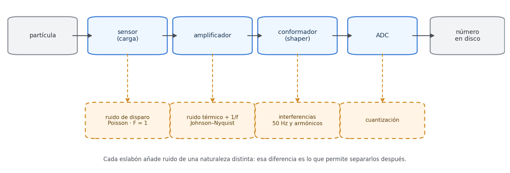
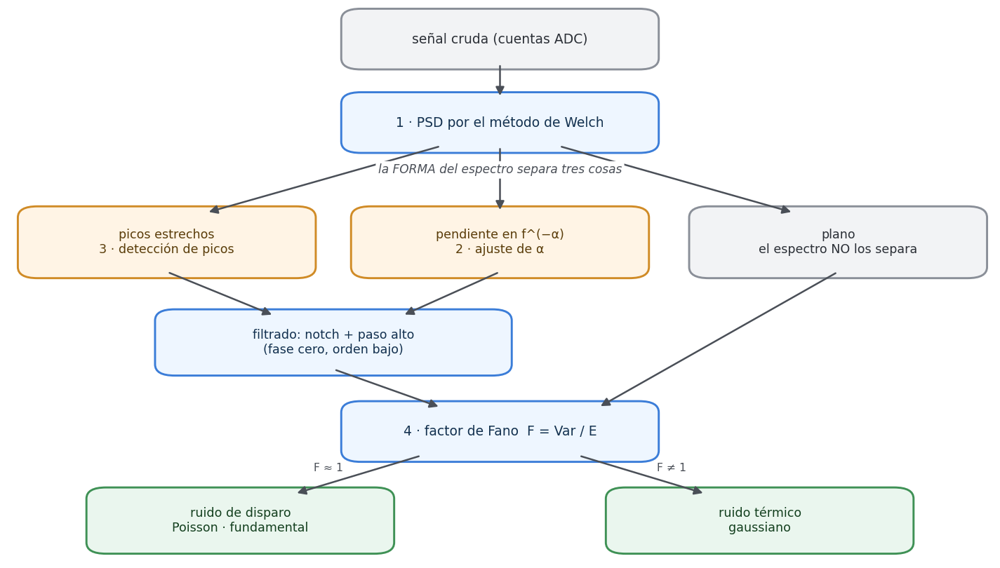

# Fundamentos teóricos del Módulo 4: ruido de detectores y extracción de entropía

> **Tarea 4.10** del proyecto QPCS — Fase 4. Entregable: este fichero (`docs/theory/detector.md`).
> Repartida entre **Gonzalo** (mitad física del ruido) y **Marco** (mitad entropía y honestidad),
> según el capítulo 8 de la guía de la fase. El material de origen son los **capítulos 3 y 4** de esa
> guía.

## Cómo se lee este documento

La **regla de oro** del proyecto —vigente desde la tarea 1.10 y convertida en paso de CI en la tarea
4.11— dice que *toda fórmula que aparezca en un documento de teoría tiene que estar respaldada por un
test o por una figura del repositorio, y hay que enlazarlo*. Por eso cada sección termina con un
bloque **Verificación** que nombra el test o la figura concretos que la sostienen; el mapa completo
está en el [Apéndice A](#apéndice-a--mapa-teoría--verificación).

Convenciones heredadas de los tres documentos anteriores, que se respetan aquí:

- Los identificadores de código, ficheros, constantes y rutas van en `tipo máquina`.
- Notación: `f` para frecuencia, `fs` para frecuencia de muestreo, `S(f)` para la densidad espectral,
  `α` para el exponente de la ley de potencias, `F` para el factor de Fano, `λ` para la media de un
  proceso de Poisson, `H` para la entropía de Shannon, `H∞` para la min-entropía, `n` para el número
  de bits de entrada, `ℓ` para la longitud de salida del extractor.
- Los números con decimales usan coma decimal en el texto (0,25) y punto cuando se citan literales de
  código o salidas de programa (`0.25`).
- **Las constantes del contrato** (`NPERSEG`, `SOLAPAMIENTO`, `VENTANA`, `RANGO_ALFA`, `UMBRAL_PICO`,
  `EPSILON_PA`, `BITS_BAJOS`) viven en `src/detector/types.py` y no son opciones de usuario: cambiarlas
  cambia todas las cifras publicadas. Cuando este documento cita un valor numérico de análisis, es el
  de esa tabla.
- **Nomenclatura estricta**: se escribe siempre *min-entropía* (nunca «entropía» a secas cuando se
  habla de la magnitud criptográfica) y siempre **NIST SP 800-90B** con su número de sección cuando se
  cita un estimador concreto. No es pedantería: la mitad de los errores del campo vienen de confundir
  la min-entropía con la de Shannon, y nombrarlas distinto es la primera defensa.

## Reparto de la tarea 4.10

El capítulo 8 de la guía de la fase declara la partición: Gonzalo lleva la física del ruido (tareas
4.3 a 4.5, con material del capítulo 3) y Marco la entropía (tareas 4.6 y 4.7, con material del
capítulo 4). El reparto de este documento sigue esa línea, de modo que quien enlaza una afirmación con
un test es quien escribió ese test:

| Parte | Responsable | Secciones de origen |
|---|---|---|
| [Parte I — La física del ruido](#parte-i--la-física-del-ruido-gonzalo) | Gonzalo (`gonzaloz-hub`) | §3.1, §3.2, §3.3, §3.4, §3.4.1 (+ §6.5, el filtrado) |
| [Parte II — De ruido físico a bits](#parte-ii--de-ruido-físico-a-bits-utilizables-marco) | Marco (`Marcociber`) | §4.1, §4.2, §4.3, §4.4, §4.4.1, §4.5 |
| [Parte III — Sección compartida](#parte-iii--sección-compartida) | Sin asignar en las fuentes | §4.6 |

---

# Parte I — La física del ruido (Gonzalo)

## 1. Qué mide realmente un detector, y qué es un pedestal

*(§3.1)*

Un detector no «ve» partículas. Mide los efectos que dejan al atravesar materia, y esos efectos acaban
siendo siempre lo mismo: una **carga eléctrica** que hay que amplificar, moldear y digitalizar. La
cadena de lectura es una fila de eslabones, y cada eslabón añade ruido de una naturaleza distinta:



*Esquema 1 — La cadena de lectura. En azul los eslabones; en ámbar, colgando de cada uno, el ruido que
introduce. Regenerable con `python scripts/make_detector_theory_figs.py`.*

Que cada eslabón contribuya con un tipo de ruido *distinto* no es un detalle incidental: **es
exactamente lo que permite separarlos después**. Si todos aportaran la misma clase de fluctuación, el
análisis del capítulo siguiente no tendría por dónde agarrar.

> **El concepto de pedestal, que es la clave práctica.** Un canal de lectura, sin ninguna partícula,
> no marca cero: marca un valor de referencia distinto de cero, llamado **pedestal**, alrededor del
> cual fluctúa. Los experimentos toman rutinariamente *runs de pedestal*: adquisiciones sin haz, cuyo
> único contenido es el ruido de la electrónica.
>
> Para este módulo, eso es exactamente lo que queremos. Un análisis de física normal trata el pedestal
> como algo que restar y tirar; **nosotros tiramos la física y nos quedamos con lo que ellos tiran**.
> Es lo que hace que el módulo sea viable con datos abiertos: no hace falta entender la reconstrucción
> de eventos, ni identificar partículas, ni calcular masas invariantes. Hace falta una señal de ruido.

La consecuencia práctica del pedestal aparece dos secciones más abajo y es de una línea de código: la
señal **no está centrada en cero**, y todo lo que se calcule sin tenerlo en cuenta sale mal. Por eso
la fixture sintética de la tarea 4.1 incluye un pedestal de 1000 cuentas a propósito: para que el
código se enfrente a ello desde el primer test y no el día que llegan los datos reales.

**Verificación.** La fixture `senal_sintetica` de `tests/detector/conftest.py` construye la señal con
pedestal explícito, y su test de cordura comprueba que el espectro tiene un pico donde se puso.

## 2. Ruido de disparo (shot noise), y el factor de Fano

*(§3.2.1)*

Es el más fundamental de los cuatro y **el único que no se puede reducir con mejor electrónica**. La
llegada de partículas o fotones es un proceso de Poisson: si el número medio de sucesos en una ventana
de tiempo es `λ`, la distribución del número real `k` es

&nbsp;&nbsp;&nbsp;&nbsp;**P(k) = λᵏ · e^(−λ) / k!**  &nbsp;&nbsp;con&nbsp;&nbsp; **E[k] = λ**  &nbsp;&nbsp;y&nbsp;&nbsp; **Var[k] = λ**

De ahí la propiedad que lo define: **la varianza es igual a la media**. Por tanto la desviación típica
es `√λ` y la relación señal-ruido crece como `√λ`. Duplicar la señal solo mejora la relación en un
factor `√2`, que es la razón de que en física de partículas se hable siempre de estadística acumulada
y no de una medida mejor.

### 2.1 Cómo se detecta esto con un solo número

El **factor de Fano** compara la varianza con la media:

&nbsp;&nbsp;&nbsp;&nbsp;**F = Var[k] / E[k]**

Para un proceso de Poisson puro, `F = 1` exactamente. Es una prueba barata, directa y muy informativa:

| Valor | Qué significa |
|---|---|
| `F ≈ 1` | Poisson: ruido de disparo dominante. |
| `F ≫ 1` | Hay algo más: correlaciones, deriva, o señal real colándose. |
| `F ≪ 1` | Sub-Poissoniano. En un detector suele indicar que algo recorta o satura. |

El factor de Fano es la única herramienta del módulo que **distingue ruido de disparo de ruido
térmico**, porque los dos tienen espectro plano y solo se diferencian en la distribución: Poisson
tiene varianza igual a la media, la gaussiana no. El espectro, por sí solo, no los separa.

Un detalle de implementación que es fácil equivocar: `F` se calcula sobre la señal **sin restar la
media**, porque la media es justo el denominador. Restar el pedestal antes de medir Fano da una
división por algo cercano a cero y un número sin sentido.

> **Por qué nos interesa este ruido especialmente.** El ruido de disparo es **aleatoriedad
> fundamental, no ignorancia**: los tiempos de llegada son aleatorios por mecánica cuántica, no porque
> no sepamos suficiente sobre el sistema. Es exactamente la misma distinción que la Fase 1 hizo entre
> un PRNG (determinista, parece aleatorio porque no conoces la semilla) y la medida de `|+⟩` (cuyo
> resultado no está determinado por nada, ni siquiera por variables ocultas locales).
>
> Y es lo que da sentido a este módulo como fuente de entropía. El Módulo 1 tuvo que declarar su QRNG
> **pseudoaleatorio** porque corre en `AerSimulator`. Este módulo llena ese hueco por el otro lado: el
> ruido de disparo de un detector sí es aleatoriedad física.

**Verificación.** `test_fano_de_poisson_es_uno` (tolerancia derivada: el error estándar de la varianza
muestral, `√(2/(n−1))`) y su pareja obligatoria `test_fano_de_gaussiana_no_es_uno`.

> **El par de tests que hace que esto valga algo.** El primero, solo, no demuestra nada: una función
> que devolviera `1.0` siempre lo pasaría igual. Es el segundo el que convierte la medida en una
> medida. Es el mismo patrón que la Fase 3 usó con la cuantización ingenua —un test que comprueba que
> la versión mala falla— y es lo que distingue un test que verifica de uno que acompaña.

## 3. Ruido térmico (Johnson–Nyquist)

*(§3.2.2)*

Los portadores de carga de cualquier resistencia se agitan por temperatura y producen una tensión
fluctuante **incluso sin señal**. Su valor cuadrático medio es

&nbsp;&nbsp;&nbsp;&nbsp;**⟨v²⟩ = 4 · k_B · T · R · Δf**

con `k_B = 1,381 × 10⁻²³ J/K`, `T` la temperatura absoluta, `R` la resistencia y `Δf` el ancho de
banda.

> **Un número concreto, para tener la escala en la cabeza.** Con `R = 1 kΩ`, `T = 300 K` y
> `Δf = 1 MHz`:
>
>
> &nbsp;&nbsp;&nbsp;&nbsp;**v_rms = √(4 · 1,381×10⁻²³ · 300 · 10³ · 10⁶) ≈ 4,1 µV**
>
> Cuatro microvoltios. Parece nada, y es exactamente el orden de magnitud contra el que compite la
> señal de un sensor de partículas, que puede ser de unos pocos milivoltios. Por eso los detectores
> buenos trabajan a temperaturas criogénicas: bajar `T` de 300 K a 77 K reduce `v_rms` en un factor
> `√(300/77) ≈ 2`.

Sus dos firmas son que es **blanco** (densidad espectral plana) y **gaussiano**. La primera lo hace
indistinguible del ruido de disparo en el espectro; la segunda es la que el factor de Fano explota.

**Verificación.** `test_ruido_blanco_da_espectro_plano` (la componente blanca, sea térmica o de
disparo, da una PSD plana con la tolerancia derivada del número de tramos `K`) y, para la
distribución, el contraste de `test_fano_de_gaussiana_no_es_uno`.

## 4. Ruido flicker o 1/f

*(§3.2.3)*

Su densidad espectral **crece al bajar la frecuencia**, aproximadamente como una ley de potencias:

&nbsp;&nbsp;&nbsp;&nbsp;**S(f) ∝ 1 / f^α**  &nbsp;&nbsp;con&nbsp;&nbsp; **α ≈ 0,8 – 1,2**

Su origen microscópico es variado (trampas de carga, defectos en la unión) y no hay una única teoría
que lo explique. Aparece en casi todos los dispositivos electrónicos, lo que lo convierte en el ruido
más universal y más molesto de los cuatro.

> **Por qué el 1/f es veneno para una fuente de entropía.** No es blanco, y eso significa que **las
> muestras consecutivas están correlacionadas**. Una fuente de entropía con memoria es una fuente cuya
> salida es parcialmente predecible a partir de la salida anterior, y una estimación de min-entropía
> que asuma independencia —que es lo que hacen la mayoría— daría un valor **demasiado optimista**.
>
> Esta es la razón principal de que exista la tarea 4.5 (el filtrado), y de que la 4.6 tenga que usar
> estimadores que no asuman independencia, en particular el de **Markov** de SP 800-90B. Un módulo que
> midiera la min-entropía sin quitar antes el 1/f publicaría una cifra inflada, que es el error más
> común del campo.

### 4.1 El filtrado, y la trampa que lleva dentro

*(§6.5 de la guía; se documenta aquí porque su justificación es puramente física)*

El módulo aplica dos filtros, **de fase cero** (`filtfilt`: hacia adelante y hacia atrás, de modo que
el desfase que introduce en un sentido se cancela en el otro):

| Filtro | Qué quita | Por qué hace falta |
|---|---|---|
| Notch (rechaza-banda) | Los picos de 50 Hz y armónicos | Son deterministas: entropía cero, y además predecibles por un atacante que conozca la fase de la red. |
| Paso alto | La deriva y el grueso del 1/f | Introduce correlación entre muestras, y una fuente con memoria es parcialmente predecible. |

La fase cero importa porque un desfase dependiente de la frecuencia deformaría la señal de una manera
que el espectro no ve pero el factor de Fano sí.

> **El filtro puede crear el problema que venía a resolver.** Un filtro es, por definición, una
> operación con memoria: la salida en cada instante depende de varias entradas. Eso significa que
> **un filtro introduce correlación por sí mismo**, aunque la entrada no la tuviera.
>
> Es una trampa perfecta para este módulo: se filtra para quitar la correlación del 1/f, el filtro
> mete correlación propia, y la estimación de min-entropía de la tarea siguiente sale mal **sin que
> nada falle ruidosamente**. Por eso el test obligatorio de esta parte es: *filtrar ruido blanco tiene
> que dejarlo blanco*. Si la salida del filtro sobre ruido blanco tiene autocorrelación apreciable, el
> filtro está mal diseñado (orden demasiado alto, banda demasiado estrecha) y hay que suavizarlo.

**Verificación.** `test_el_filtro_no_ensucia_ruido_blanco` (autocorrelación a desplazamiento 1 dentro
de `4/√n`), y sus tres contrapartes, que existen para que el primero no se pueda satisfacer haciendo
trampa: `test_el_pico_desaparece` (la potencia en 50 Hz cae al menos un factor 100),
`test_el_resto_del_espectro_sobrevive` (fuera de la banda del notch no cambia más de un 5 % — sin él,
un filtro que lo borrara todo pasaría el primero con nota) y
`test_la_varianza_baja_pero_no_se_desploma`. Figura 2, *antes y después del filtro*.

## 5. Interferencias y patrones

*(§3.2.4)*

La red eléctrica a 50 Hz y sus armónicos (100, 150, 200 Hz…), el reloj de la electrónica de lectura,
el ciclo del propio acelerador. Son **deterministas o casi**, y aparecen como picos estrechos en el
espectro.

Son los más fáciles de identificar y **los más peligrosos si se cuelan en una fuente de entropía**:
una componente determinista es, por definición, entropía cero, y además es predecible por un atacante
que conozca la frecuencia y la fase de la red. No es un ruido que degrade la calidad: es un ruido que
regala información.

Se detectan comparando la PSD con una versión suavizada de sí misma (una mediana móvil sirve): un pico
es un punto que supera el fondo local por más de `UMBRAL_PICO`. Después se comprueba si las
frecuencias encontradas son armónicos de 50 Hz, que es la firma inconfundible de la red eléctrica.

> **De dónde sale `UMBRAL_PICO = 3.0`.** No es un número elegido a ojo, y ese es el criterio de todo
> el proyecto desde la Fase 1. Con un Welch de `K ≈ 487` tramos el error relativo del fondo es
> ≈ 4,5 %, de modo que 5σ corresponden a un factor ≈ 1,22×. Se usa 3× por margen frente a la
> variabilidad local del fondo suavizado. La derivación va en `types.py`, junto a la constante.

**Verificación.** `test_encuentra_los_50_hz` (el pico que la fixture metió, con su frecuencia) y
`test_el_pico_aparece_donde_se_puso` (el máximo de la PSD, excluida la zona de baja frecuencia, cae en
50 Hz ± la resolución `Δf = fs/nperseg`). Figura 1, *el espectro anotado*.

## 6. Los cuatro tipos, y la estrategia completa del análisis

*(§3.3)*

| Tipo | Espectro | Distribución | Cómo se identifica |
|---|---|---|---|
| Disparo | plano | Poisson | Factor de Fano ≈ 1 |
| Térmico | plano | gaussiana | Fano ≠ 1, test de normalidad |
| Flicker | `∝ f^(−α)` | gaussiana correlacionada | Ajuste lineal en escala log-log |
| Interferencia | picos estrechos | determinista | Detección de picos sobre el fondo |

> **La estrategia, en cuatro pasos.**
>
> 1. Calcular la densidad espectral. La *forma* separa {disparo, térmico} de {1/f} de {interferencias}.
> 2. Ajustar la ley de potencias en la zona de baja frecuencia para extraer `α`.
> 3. Detectar picos sobre el fondo suave: son las interferencias.
> 4. Medir el factor de Fano sobre la señal ya filtrada: separa disparo de térmico, que es lo único
>    que el espectro no distingue.
>
> Cuatro pasos, cuatro tipos de ruido, cada uno con su firma. Eso es todo el Módulo 4 en su mitad de
> física.



*Esquema 2 — La estrategia completa. La forma del espectro separa interferencias, 1/f y fondo plano;
el factor de Fano va el último, sobre la señal ya filtrada, porque es lo único que distingue disparo de
térmico.*

Obsérvese el orden: el Fano va **al final**, sobre la señal filtrada. Medirlo antes daría `F ≫ 1` por
culpa de la deriva y las interferencias, y la lectura sería «hay correlaciones» —cierto, pero
inútil— en lugar de «cuánto de lo que queda es Poisson».

**Verificación.** El conjunto de la tabla se sostiene sobre `test_alfa_de_ruido_blanco_es_cero`,
`test_fano_de_poisson_es_uno`, `test_fano_de_gaussiana_no_es_uno` y `test_encuentra_los_50_hz`, más la
figura 1, que enseña los cuatro tipos en una sola imagen.

## 7. La densidad espectral de potencia y el método de Welch

*(§3.4)*

Para una señal muestreada `x_n` de longitud `N`, el **periodograma** es el módulo al cuadrado de su
transformada discreta de Fourier, normalizado:

&nbsp;&nbsp;&nbsp;&nbsp;**S(f) = (1/N) · | Σₙ xₙ · e^(−2πifn) |²**  &nbsp;&nbsp;con&nbsp;&nbsp; **n = 0 … N−1**

> **Por qué el periodograma a secas no sirve.** Es un estimador **inconsistente**: su varianza *no
> disminuye* al aumentar `N`. Con más datos se gana resolución en frecuencia, pero cada punto del
> espectro sigue siendo igual de ruidoso, y el resultado tiene un aspecto de hierba del que no se
> puede leer nada.
>
> Esto no es un detalle estético: es la diferencia entre una figura de la que se puede extraer un
> exponente `α` y una figura de la que no.

El **método de Welch** lo resuelve: se parte la señal en `K` tramos solapados, se aplica una ventana a
cada uno, se calcula el periodograma de cada tramo y se promedian. La varianza baja por un factor
≈ `K`, a cambio de resolución en frecuencia.

| Parámetro | Qué controla y cómo se elige |
|---|---|
| `nperseg` | Longitud de cada tramo. Resolución `Δf = fs/nperseg`. Más largo, más resolución y menos promediado. |
| `noverlap` | Solapamiento. El estándar es el 50 %: aprovecha los datos que la ventana atenúa en los bordes. |
| `window` | Hann por defecto. Evita el *leakage* espectral que produce cortar la señal en seco. |

> **El compromiso hay que documentarlo, no solo elegirlo.** Con `N` muestras y tramos de longitud `L`
> al 50 % de solapamiento salen `K ≈ 2N/L − 1` tramos, y el error relativo de cada punto del espectro
> es aproximadamente `1/√K`.
>
> Ejemplo concreto, con los valores del contrato: con `N = 2²⁰` muestras y `L = NPERSEG = 4096` salen
> `K ≈ 511` tramos, error relativo ≈ 4,4 %, y resolución `Δf = fs/4096`. Ese cálculo va en el
> docstring de `densidad_espectral`, igual que la Fase 1 documentó el compromiso de la fracción de
> muestra del QBER. Es la misma regla del proyecto: **los parámetros se derivan, no se eligen a ojo**.

### 7.1 Restar la media no es opcional

Un canal con pedestal de 1000 cuentas y ruido de 10 tiene una componente continua **cien veces mayor**
que lo que queremos medir. Sin restarla, el espectro sale dominado por el pico en `f = 0` y la escala
logarítmica aplasta todo lo demás.

Es el equivalente en este módulo al descarte del transitorio de la Fase 3: un paso de una línea sin el
cual todo lo que viene después está mal, y que **no da ningún error**, solo un resultado inútil. Esa
clase de fallo silencioso es la que el proyecto ataca con tests de propiedad en lugar de con
inspección visual.

**Verificación.** `test_ruido_blanco_da_espectro_plano` (con la tolerancia derivada de `K`, no
inventada) y `test_parseval`: la potencia total del espectro tiene que coincidir con la varianza de la
señal. El segundo es una comprobación **independiente del escalado**: si falla, la normalización está
mal, y ningún examen visual del espectro lo habría revelado.

## 8. Cómo se ajusta el exponente α

*(§3.4.1)*

En escala log-log, una ley de potencias es una recta:

&nbsp;&nbsp;&nbsp;&nbsp;**S(f) = A / f^α**  &nbsp;&nbsp;⟹&nbsp;&nbsp; **log S = log A − α · log f**

Así que `α` sale de una **regresión lineal** de `log S` contra `log f`, y su error del error estándar
de la pendiente. La regla del contrato («toda estimación viaja con su error») obliga a devolver los
dos: `alfa` no va nunca sin `alfa_error`.

> **Los dos errores del ajuste.**
>
> **Ajustar sobre todo el rango.** A alta frecuencia domina el suelo blanco, que es plano, así que
> incluirlo tira de `α` hacia abajo. Hay que ajustar solo la década o dos donde el 1/f manda —de ahí
> `RANGO_ALFA = (1e-4, 1e-2)` en fracción de la frecuencia de Nyquist— y **decir cuáles**.
>
> **No excluir los picos.** Un pico de 50 Hz en medio del rango de ajuste mete un punto altísimo que
> desvía la recta. Se detectan primero, se enmascaran, y se ajusta después. El orden de las tareas
> —picos antes que `α`— no es casual.

**Verificación.** `test_alfa_de_ruido_generado_con_alfa_conocido` (se genera 1/f con `α = 1,0` y el
ajuste tiene que devolverlo dentro de 4 veces su propio error estándar: **tolerancia derivada**) y
`test_alfa_de_ruido_blanco_es_cero` (si el ajuste da 0,5 sobre ruido blanco, está cogiendo rango de
más). Figura 1, con la recta del ajuste superpuesta y `α` en la leyenda.

---

# Parte II — De ruido físico a bits utilizables (Marco)

## 9. Por qué una señal de ruido no es un flujo de bits

*(§4.1)*

La tentación es directa: tenemos ruido físico aleatorio, lo digitalizamos y ya tenemos bits
aleatorios. Es **falso**, por tres motivos que se acumulan:

1. **Sesgo.** La distribución no es uniforme. Un ruido gaussiano digitalizado da muchos más valores
   centrales que extremos.
2. **Correlación.** La componente 1/f hace que cada muestra dependa de las anteriores.
3. **Deriva.** El pedestal se mueve con la temperatura a lo largo de una adquisición larga.

Los tres significan lo mismo: **hay menos entropía de la que parece**, y hay que medir cuánta antes de
usarla.

> **Es exactamente el mismo problema que el Módulo 1 ya resolvió.** Tras el sifting, Alice y Bob
> tienen una cadena que no es secreta: Eve sabe algo de ella y no se sabe *qué* bits conoce. La
> solución del Módulo 1 fue medir cuánta información podía tener Eve y comprimir la cadena con una
> función hash 2-universal hasta dejar solo lo que es seguro.
>
> Aquí el planteamiento es idéntico: hay una fuente con menos entropía de la que aparenta, se mide
> cuánta tiene, y se comprime con la misma construcción hasta dejar bits uniformes. Cambia el origen
> de la imperfección —aquí es física del dispositivo, allí era un espía— y **no cambia ni la
> matemática ni el código**.

### 9.1 Digitalizar: los bits de orden bajo

Antes de estimar hay que convertir la señal en símbolos, y aquí se repite exactamente la decisión del
Módulo 3: se conservan los `BITS_BAJOS = 4` bits de **orden bajo** de cada muestra. El motivo es el
mismo que allí: los bits de orden alto llevan la forma de la distribución —aquí, la campana gaussiana
y lo que quede de deriva— y los de orden bajo son, a efectos prácticos, uniformes.

> **El error de confundir bits conservados con bits de entropía.** Quedarse con 4 bits por muestra
> **no da 4 bits de entropía por muestra**. Da *como mucho* 4, y lo normal es que dé entre 1 y 3.
>
> Confundir las dos cosas es el error que produce un extractor que saca más bits de los que la fuente
> sostiene, y produce una salida que *parece* aleatoria y pasa los tests estadísticos básicos. El
> módulo lleva las dos cifras separadas y con nombres distintos a propósito: `BITS_BAJOS` (cuántos se
> conservan) y `h_min` (cuántos valen). El dataclass `EstimacionEntropia` las separa por diseño.

**Verificación.** `test_fuente_uniforme_da_la_entropia_maxima` y, del lado contrario,
`test_fuente_sesgada_da_lo_que_dice_la_teoria`. Figura 3, *el embudo de la entropía*, que enseña de un
vistazo la caída de muestras → bits conservados → bits de min-entropía → bits extraídos.

## 10. Min-entropía, y por qué no vale la de Shannon

*(§4.2)*

La **entropía de Shannon** mide la incertidumbre *media*:

&nbsp;&nbsp;&nbsp;&nbsp;**H = − Σᵢ pᵢ · log₂ pᵢ**

La **min-entropía** mide el *caso peor*, es decir, cuánto acierta un atacante que apueste siempre por
el valor más probable:

&nbsp;&nbsp;&nbsp;&nbsp;**H∞ = − log₂ ( maxᵢ pᵢ )**

Siempre se cumple `H∞ ≤ H`, y para criptografía la que vale es la min-entropía: lo que importa no es
cuánto tendría que adivinar un atacante *de media*, sino cuánto acierta con **su mejor estrategia**.

> **Un ejemplo numérico que deja clara la diferencia.** Fuente de un bit con `p₀ = 0,9` y `p₁ = 0,1`:
>
>
> &nbsp;&nbsp;&nbsp;&nbsp;**H&nbsp; = −0,9·log₂0,9 − 0,1·log₂0,1 = 0,469 bits**
> &nbsp;&nbsp;&nbsp;&nbsp;**H∞ = −log₂ 0,9 = 0,152 bits**
>
> La de Shannon dice que hay casi medio bit por muestra. La min-entropía dice que hay 0,15. **Un
> factor de tres.**
>
> Si el módulo usara Shannon para decidir cuántos bits extraer, produciría tres veces más bits de los
> que la fuente puede sostener, y esos bits no serían uniformes. Es el error más común de los trabajos
> de extracción de entropía, y es un error **silencioso**: la salida parece aleatoria y pasa los tests
> estadísticos básicos.

**Verificación.** `test_min_entropia_es_MENOR_que_shannon`, que comprueba la propiedad matemática
`H∞ ≤ H`. Es un test barato y aparentemente trivial cuyo valor real es de **regresión**: si alguien
sustituye un estimador por otro y se equivoca de fórmula o de base del logaritmo, salta.

## 11. Cómo se estima la min-entropía: NIST SP 800-90B

*(§4.3)*

No se puede calcular exactamente, porque no conocemos la distribución verdadera de la fuente: hay que
**estimarla** a partir de una muestra. El estándar de referencia es **NIST SP 800-90B**, que define
una batería de estimadores. Los tres relevantes aquí:

### 11.1 Estimador del valor más común (SP 800-90B, §6.3.1)

El más simple y el más directo: se cuenta la frecuencia del valor más repetido, `p̂_max`, y se toma la
**cota superior** de su intervalo de confianza al 99 %:

&nbsp;&nbsp;&nbsp;&nbsp;**p_sup = p̂_max + 2,576 · √( p̂_max·(1 − p̂_max) / (n − 1) )**

&nbsp;&nbsp;&nbsp;&nbsp;**Ĥ∞ = − log₂ ( min(1, p_sup) )**

Se usa la cota superior de `p`, y no `p`, porque **sobreestimar `p_max` infraestima la entropía**, y
ese es el error seguro: equivocarse por conservador cuesta bits, equivocarse por optimista produce
una salida insegura. Asume muestras independientes.

### 11.2 Estimador de colisión (SP 800-90B, §6.3.2)

Se basa en cuántas muestras hay que tomar, de media, hasta encontrar una repetición. Detecta sesgos
que el estimador anterior no ve, porque mira la distribución entera y no solo su máximo.

### 11.3 Estimador de Markov (SP 800-90B, §6.3.3)

**Es el que importa aquí**, porque **no asume independencia**: modela la fuente como una cadena de
Markov, estima la matriz de transición entre símbolos consecutivos y calcula la entropía de la cadena.
Es el único de los tres que ve la correlación que deja el 1/f residual, y por eso suele ser el que da
el mínimo en esta fuente.

### 11.4 La regla que hace la estimación honesta: se toma el MÍNIMO

&nbsp;&nbsp;&nbsp;&nbsp;**Ĥ∞ = minⱼ Ĥ∞⁽ʲ⁾**

> **No es «elegir el estimador que mejor sale»: es la regla de SP 800-90B.** El estándar dice que se
> aplican todos los aplicables y se toma **el menor de todos**. El motivo es de diseño conservador:
> cada estimador es ciego a cierto tipo de estructura, y el que da el valor más bajo es el que ha
> encontrado la estructura que los demás no vieron. Quedarse con el máximo, o con la media, es elegir
> el estimador que menos se enteró.
>
> Esta regla es exactamente el mismo espíritu que la **postura paranoica** del Módulo 1: allí se
> atribuye *todo* el QBER a Eve aunque parte sea ruido benigno de la fibra, porque el error
> conservador tira bits de más y el optimista produce una clave insegura. Aquí, igual.

**Verificación.** `test_fuente_sesgada_da_lo_que_dice_la_teoria` (fuente con `p_max = 0,5` conocido:
`H∞ = −log₂0,5 = 1` bit exacto, comparado **contra ese número, no contra otra implementación**),
`test_se_devuelve_el_minimo`, y sobre todo `test_markov_caza_lo_que_los_otros_no`. Figura 4, *los tres
estimadores*, con el mínimo destacado.

> **El test que da sentido a toda la sección.** `test_markov_caza_lo_que_los_otros_no` fabrica una
> fuente cuya distribución **marginal es perfectamente uniforme** —así que el estimador del valor más
> común la declara de entropía máxima— pero cuyas muestras consecutivas están correlacionadas. El
> estimador de Markov la caza.
>
> En una línea justifica por qué el módulo implementa tres estimadores en vez de uno, y por qué se
> toma el mínimo. Es el equivalente en este módulo al `assert r.aborted == (p/4 > 0.11)` de la Fase 1:
> un solo test que contiene la idea central del módulo entero.

## 12. La extracción: el mismo Toeplitz del Módulo 1

*(§4.4)*

Con la min-entropía estimada, la longitud de salida segura sale de **la misma fórmula de la tarea
1.6**, sin el término de la reconciliación (aquí no hay canal público que filtre nada):

&nbsp;&nbsp;&nbsp;&nbsp;**ℓ = ⌊ n · Ĥ∞ − 2·log₂(1/ε) ⌋**

donde `n` es el número de bits de entrada, `Ĥ∞` la min-entropía por bit, y `ε = EPSILON_PA = 1e-9` el
parámetro de seguridad, el mismo de la Fase 1, que cuesta unos **60 bits** de peaje. Comparando las
dos fórmulas se ve exactamente qué es cada término:

| Módulo | Entropía disponible | Fuga por el canal | Peaje del lema | Longitud final |
|---|---|---|---|---|
| 1 · QKD | **n·(1 − h(Q))** | **− leak_ec** | **− 2·log₂(1/ε)** | **ℓ = ⌊ n·(1 − h(Q)) − leak_ec − 2·log₂(1/ε) ⌋** |
| 4 · Detector | **n·Ĥ∞** | — (no hay canal) | **− 2·log₂(1/ε)** | **ℓ = ⌊ n·Ĥ∞ − 2·log₂(1/ε) ⌋** |

El `n·(1 − h(Q))` de BB84 *era* una estimación de min-entropía —la que le quedaba a Eve sobre la
cadena—; aquí la estimación viene de SP 800-90B en lugar de del QBER. El `leak_ec` desaparece porque
no hay Cascade publicando paridades. El peaje del *leftover hash lemma* es idéntico, porque el lema es
el mismo.

Y la función que hace la compresión **ya existe**:

```python
from qkd.privacy import privacy_amplify, secure_key_length
```

> **Por qué esto es lo mejor del módulo.** No hay que implementar nada. `privacy_amplify` está escrita
> desde la tarea 1.6, tiene sus cuatro tests —coincide bit a bit con la matriz de Toeplitz explícita,
> linealidad sobre GF(2), avalancha, longitud de salida— y lleva mergeada desde la Fase 1.
>
> Que el mismo extractor sirva para destilar una clave de BB84 y para destilar entropía de un detector
> **no es una casualidad**: el *leftover hash lemma* no sabe de dónde viene la min-entropía. Solo
> necesita saber cuánta hay. Esa es la idea bonita del módulo, y la razón de que la referencia de
> Bennett–Brassard–Crépeau–Maurer aparezca en la bibliografía de dos módulos distintos: es literalmente
> el mismo código.

### 12.1 Un detalle que hay que respetar: la semilla

La semilla de Toeplitz tiene que ser de `n + ℓ − 1` bits e **independiente de la fuente**. Aquí no se
puede sacar del propio ruido, porque entonces no sería independiente y el lema dejaría de aplicar. Se
genera con el CSPRNG del sistema (`os.urandom`) y **no se siembra**, igual que la Fase 2 genera las
claves de ML-KEM y por el mismo motivo: una semilla reproducible sería una semilla insegura.

Esto convive con la regla de semillas explícitas del proyecto sin contradecirla, y conviene decirlo
porque parece una excepción y no lo es. En este módulo hay azar en dos sitios y son de naturaleza
distinta: la señal sintética de los tests se genera con `np.random.Generator` **sembrado** (es un
dato de entrada, y tiene que ser reproducible); la semilla de Toeplitz **no** (es material
criptográfico).

Y, como en el Módulo 1, la semilla es **pública**: el *leftover hash lemma* vale incluso si el
adversario conoce la función hash. Lo que no puede conocer es la entrada completa.

**Verificación.** `test_usa_el_extractor_del_modulo_1` (que la función de `qkd.privacy` se llama de
verdad, y no se ha reimplementado aquí una copia; se comprueba parcheándola y viendo que el resultado
cambia), `test_la_longitud_sale_de_la_formula` (comprobada a mano con números concretos),
`test_h_min_baja_implica_menos_bits` (con la mitad de min-entropía salen aproximadamente la mitad de
bits: si no, la fórmula está mal cableada) y `test_h_min_cero_no_produce_bits` (una fuente constante
tiene `H∞ = 0` y la extracción devuelve un array vacío, sin fallar ni inventarse bits).

## 13. Validar la salida: qué se puede afirmar y qué no

*(§4.5)*

Los bits extraídos pasan por los mismos tests que el QRNG del Módulo 1:

| Test | Qué comprueba, y su tolerancia derivada |
|---|---|
| Monobit | `z = abs(2·Σbᵢ − n) / √n ~ N(0,1)`. Umbral `abs(z) < 4`, que da una probabilidad de fallo espurio de `6×10⁻⁵`: laxo para que la CI no parpadee, estricto para pillar un sesgo real. |
| `χ²` de bytes | 255 grados de libertad, crítico 293,25 al 5 %. De dos colas, como en el Módulo 3: un valor sospechosamente **bajo** también es alarma. |
| Autocorrelación | Que el desplazamiento de una muestra no esté correlacionado. Tolerancia `4/√n`. |

Ninguna de las tres tolerancias es un número redondo elegido por comodidad, y esa es la regla del
proyecto desde la tarea 1.2: si un revisor ve un umbral sin justificación, lo devuelve.

> **Lo que pasar estos tests NO demuestra.** Es exactamente la misma lección que el Módulo 3 dejó
> escrita con su tabla de tres columnas: estos tests son **condiciones necesarias, no suficientes**.
> Un contador cifrado con AES los pasa perfectamente y no tiene ni un bit de entropía real.
>
> Lo que garantiza que la salida sea buena no son los tests: es la **estimación conservadora de la
> min-entropía** más el **leftover hash lemma**. Los tests solo confirman que no hay un fallo grosero
> en el camino. Si el módulo presentara los tests como prueba de calidad de la fuente, estaría
> cometiendo el error que el Módulo 3 dedica un capítulo entero a denunciar.

**Verificación.** `test_los_bits_extraidos_pasan_el_monobit` y el test de integración del módulo,
`test_la_cadena_completa`, que recorre `cargar → espectro → identificar → filtrar → estimar → extraer`
y comprueba al final que los bits pasan monobit y `χ²` **y que su número coincide con la fórmula de
§12 aplicada a la `Ĥ∞` medida**. Esa última condición es la que impide que las dos mitades del módulo
se desincronicen sin que nadie lo note.

---

# Parte III — Sección compartida

## 14. Lo que este módulo NO puede afirmar

*(§4.6 — sección que las fuentes **no asignan** explícitamente a ninguna de las dos mitades; ver el
punto 1 del [Apéndice B](#apéndice-b--puntos-que-las-fuentes-dejan-sin-decidir))*

Esta sección va aquí, en la teoría, y va **otra vez** en el README y en
[`docs/limitaciones.md`](../limitaciones.md) (sección «Módulo 4», entradas M4.1–M4.6, cada una con su
porqué y con qué haría falta para levantarla). Es la misma advertencia de honestidad intelectual que la
Fase 1 estableció como obligatoria en toda la documentación del proyecto.

> **Los cuatro límites, sin suavizar.**
>
> 1. **No es un QRNG certificado.** Un generador para uso criptográfico real necesita tests de salud
>    *en tiempo real* sobre la fuente (el *repetition count test* y el *adaptive proportion test* de
>    SP 800-90B, ejecutándose continuamente), un modelo explícito del atacante y una certificación.
>    Aquí se hace un **análisis offline sobre datos grabados**.
> 2. **Los datos son de segunda mano.** No controlamos el detector, ni sabemos qué preprocesado le
>    aplicaron antes de publicarlos. Una fuente de entropía de verdad exige **control físico del
>    dispositivo**.
> 3. **La estimación es de una muestra concreta.** La min-entropía medida vale para esos datos, en
>    esas condiciones. Otro run, otra temperatura u otro canal pueden dar otra cifra.
> 4. **No hay modelo de atacante.** No se analiza qué podría hacer alguien capaz de influir en el
>    detector, de conocer la fase de la red eléctrica o de tener acceso a otros canales correlacionados.

La frase exacta que va al README, con estas palabras y sin adornos:

> *«Demostramos la cadena completa de extracción de entropía sobre ruido de detector real y medimos su
> min-entropía con los estimadores de NIST SP 800-90B; no es un generador de números aleatorios
> certificado y no debe usarse como tal.»*

**Real vs. simulación (actualizado tras el cierre de la tarea 4.2 — el plan B nunca se activó).**
Los datos son **reales y públicos** (CMS ZeroBias, CERN Open Data, licencia CC0, registro 31316), no
sintéticos. Pero dos matices, con las mismas palabras que [`docs/limitaciones.md`](../limitaciones.md)
§M4.2–M4.3, para que ambos documentos digan exactamente lo mismo:

- La señal analizada es `nPFCands` (candidatos reconstruidos por Particle Flow), **no una lectura
  directa de un ADC** ni un *run* de pedestal en sentido estricto: es un *proxy* razonado, no el dato
  ideal.
- `fs = 1000.0` es una **convención** para dar escala al eje de Welch, no una frecuencia física medida.
  Un pico detectado en «50» no es la red eléctrica a 50 Hz.

> **Por qué esta advertencia es obligatoria y por qué la escriben los dos.** La tentación en este
> módulo es específica y fuerte: escribir «generador de números aleatorios cuántico» sin más. Es lo que
> suena bien, es lo que haría la mayoría, y es exactamente lo que el proyecto lleva cuatro fases
> evitando. La Fase 1 declaró que su QRNG es pseudoaleatorio; la Fase 2, que Shor no rompe RSA; la
> Fase 3, que las métricas del campo no prueban seguridad; y la Fase 4 declara esto.
>
> Cuatro módulos, cuatro declaraciones de dónde está el borde. Esa es, probablemente, la característica
> que hace este proyecto distinto de la mayoría de repositorios que un revisor va a ver: no es que
> tenga cuatro módulos, es que **sabe exactamente qué no hace cada uno, y lo dice antes de que se lo
> pregunten**.

---

# Apéndice A — Mapa teoría ↔ verificación

La regla de oro exige que toda fórmula enlace a un test o a una figura que **existan**. La tarea 4.11
convierte esa exigencia en un paso de CI (`comm -23` entre los tests citados en `docs/theory/*.md` y
los `def test_` reales de `tests/`), de modo que renombrar un test citado aquí pone la CI en rojo.

| Resultado teórico | Sección origen | Aquí | Test / figura que lo verifica |
|---|---|---|---|
| El pedestal desplaza la señal | 3.1 | §1 | fixture `senal_sintetica` + su test de cordura |
| `F = 1` para Poisson | 3.2.1 | §2.1 | `test_fano_de_poisson_es_uno` |
| `F ≠ 1` para gaussiana | 3.2.1 | §2.1 | `test_fano_de_gaussiana_no_es_uno` |
| El ruido térmico es blanco | 3.2.2 | §3 | `test_ruido_blanco_da_espectro_plano` |
| El filtro no introduce correlación | 6.5 | §4.1 | `test_el_filtro_no_ensucia_ruido_blanco` |
| El notch elimina la interferencia | 6.5 | §4.1 | `test_el_pico_desaparece`; fig. 2 |
| El filtro no se lleva el resto | 6.5 | §4.1 | `test_el_resto_del_espectro_sobrevive` |
| El filtro no desploma la varianza | 6.5 | §4.1 | `test_la_varianza_baja_pero_no_se_desploma` |
| Las interferencias son picos estrechos | 3.2.4 | §5 | `test_encuentra_los_50_hz`; fig. 1 |
| El pico cae en su frecuencia ± `Δf` | 3.4 | §5 | `test_el_pico_aparece_donde_se_puso` |
| Welch reduce la varianza por `K` | 3.4 | §7 | `test_ruido_blanco_da_espectro_plano` |
| La normalización de la PSD es correcta | 3.4 | §7 | `test_parseval` |
| `α` se recupera de una fuente conocida | 3.4.1 | §8 | `test_alfa_de_ruido_generado_con_alfa_conocido`; fig. 1 |
| `α ≈ 0` para ruido blanco | 3.4.1 | §8 | `test_alfa_de_ruido_blanco_es_cero` |
| Digitalizar no basta (menos entropía) | 4.1 | §9 | `test_fuente_uniforme_da_la_entropia_maxima`; fig. 3 |
| `H∞ ≤ H` siempre | 4.2 | §10 | `test_min_entropia_es_MENOR_que_shannon` |
| Fuente sesgada da el valor teórico | 4.3 | §11 | `test_fuente_sesgada_da_lo_que_dice_la_teoria` |
| Markov ve lo que los otros no | 4.3 | §11.4 | `test_markov_caza_lo_que_los_otros_no`; fig. 4 |
| Se toma el mínimo de los tres | 4.3 | §11.4 | `test_se_devuelve_el_minimo`; fig. 4 |
| Se reutiliza el extractor del Módulo 1 | 4.4 | §12 | `test_usa_el_extractor_del_modulo_1` |
| `ℓ = ⌊n·H∞ − 2log₂(1/ε)⌋` | 4.4 | §12 | `test_la_longitud_sale_de_la_formula` |
| Menos `H∞` ⟹ menos bits | 4.4 | §12 | `test_h_min_baja_implica_menos_bits`; fig. 3 |
| `H∞ = 0` no produce bits | 4.4 | §12 | `test_h_min_cero_no_produce_bits` |
| Los bits extraídos no tienen sesgo | 4.5 | §13 | `test_los_bits_extraidos_pasan_el_monobit` |
| La cadena completa es coherente | 4.1–4.5 | §13 | `test_la_cadena_completa` |

Las cuatro figuras citadas, todas regenerables con un comando y con su MD5 comprobado en CI:

| Figura | Qué enseña |
|---|---|
| 1 · el espectro anotado | PSD en log-log con la recta del ajuste y su `α`, el suelo blanco marcado y los picos con su frecuencia. Los cuatro tipos de ruido en una sola imagen. |
| 2 · antes y después del filtro | Dos espectros superpuestos: el pico de 50 Hz desaparece y el resto sobrevive. |
| 3 · el embudo de la entropía | Cascada muestras → bits conservados → bits de min-entropía → bits extraídos. |
| 4 · los tres estimadores | Barras con los tres valores y el mínimo destacado. |

Y los **dos esquemas** de este documento, que no son figuras de resultados —no contienen datos— pero se
regeneran igual con un comando y se versionan en el mismo sitio, para que nadie tenga que editar un
diagrama a mano:

| Esquema | Fichero | Comando |
|---|---|---|
| 1 · cadena de lectura | `docs/img/detector_cadena_lectura.png` | `python scripts/make_detector_theory_figs.py` |
| 2 · estrategia del análisis | `docs/img/detector_estrategia.png` | (el mismo script) |

---

# Apéndice B — Puntos que las fuentes dejan sin decidir

La guía de la Fase 4 no resuelve los puntos siguientes. Se recogen aquí marcados como tales, en lugar
de rellenarlos con suposiciones; **las decisiones tomadas provisionalmente en este borrador se señalan
explícitamente y están pendientes de acuerdo del equipo**.

1. **La sección 4.6 no pertenece a ninguna mitad.** «Lo que este módulo NO puede afirmar» es material
   de honestidad técnica que la guía asigna a Marco como *encargo de fondo* (capítulo 8: revisor
   obligatorio de todo lo que toque afirmaciones de seguridad), pero cuya redacción no está asignada
   dentro de la tarea 4.10, que es de Gonzalo. Aquí figura como
   [Parte III — sección compartida](#parte-iii--sección-compartida); queda pendiente decidir si la
   escribe Gonzalo y la revisa Marco, o al revés.
2. **La sección 6 del guion oficial, resuelta.** La tabla de la tarea 4.10 exige un apartado
   «Real vs. simulación» que diga si se usaron datos del CERN o si se activó el plan B. La tarea 4.2
   cerró con datos reales (plan B no activado); el apartado está ahora al final de §14, con el mismo
   matiz de `nPFCands` como *proxy* y `fs` como convención que usa `docs/limitaciones.md` §M4.2–M4.3.
3. **El filtrado se documenta aquí aunque su material esté en el capítulo 6.** La justificación del
   filtro es puramente física (el 1/f introduce correlación; un filtro con memoria introduce otra), de
   modo que separarla de §4 dejaría la explicación del 1/f a medias. Se ha colocado como §4.1, dentro
   de la mitad de Gonzalo, que es quien hace la tarea 4.5. **Esa colocación es una decisión de este
   borrador, no algo que fijen las fuentes.**
4. **Extensión, formato y figuras.** La guía pide nueve apartados y un lector ajeno que lo entienda en
   quince minutos, pero no fija la extensión, ni la estructura interna, ni si las figuras van
   incrustadas. En este borrador las figuras se **enlazan** por ruta relativa a `docs/img/`, sin
   incrustarlas, y la numeración de secciones es continua en vez de seguir literalmente los nueve
   apartados de la tabla —que se cubren todos, repartidos entre las tres partes—. **Es una decisión
   provisional.**

---

# Apéndice C — Verificación pendiente contra el código

La **regla de precedencia** del proyecto dice: *para todo lo técnico (firmas, nombres, comportamiento)
manda el código real; para el contexto, las decisiones y los porqués, mandan la guía y los ficheros de
contexto*. Este documento se ha redactado a partir de los capítulos 3 y 4 de la guía de la Fase 4,
cuando las tareas 4.3 a 4.7 estaban aún declaradas con `NotImplementedError`.

Por tanto, **antes de dar por cerrada la tarea 4.10, cada firma, nombre de test, constante y valor
numérico citados aquí deben contrastarse contra el código real de `src/detector/` y `tests/detector/`**,
y donde el código haya avanzado respecto de la guía, gana el código. En particular quedan pendientes de
contraste tres cosas concretas:

- Los **valores del contrato** (`NPERSEG`, `RANGO_ALFA`, `UMBRAL_PICO`, `BITS_BAJOS`) tal como quedaron
  en `types.py` tras la tarea 4.1, y el `K` real que sale de la longitud de la señal efectivamente
  cargada en la 4.2 —el ejemplo de §7 usa `N = 2²⁰`, que es el de la fixture, no necesariamente el de
  los datos.
- Los **nombres exactos de los tests** del Apéndice A, que la guía escribe en su forma prevista. El
  paso de CI de la tarea 4.11 los comprobará automáticamente en cuanto exista, pero hasta entonces la
  comprobación es manual.
- El **apartado 6 del guion** («Real vs. simulación») ya está resuelto en §14: la tarea 4.2 cerró
  con datos reales de CERN Open Data, plan B no activado.

## Limitaciones

Lo que este módulo **no** hace —no es un generador de números aleatorios certificado sino un análisis
offline sobre datos grabados, los datos son de segunda mano y la señal (`nPFCands`) es un *proxy* y no
una lectura directa de ADC, `fs = 1000.0` es una convención y no una frecuencia medida, la estimación
de min-entropía vale para esta muestra concreta y no se generaliza sin más, y no hay modelo de
atacante— está recogido, con su porqué y con qué haría falta para levantarlo, en
[`docs/limitaciones.md`](../limitaciones.md), sección «Módulo 4».
