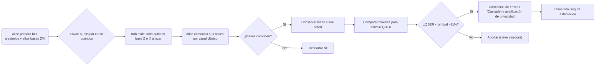

# Fundamentos teóricos del Módulo 1: simulación completa del protocolo BB84 de distribución cuántica de claves

El protocolo BB84 de distribución cuántica de clave (QKD) permite a **Alice** y **Bob** compartir una clave secreta con seguridad incondicional aprovechando propiedades de la mecánica cuántica. Para ello, Alice codifica bits clásicos en **qubits** de un sistema de dos niveles, usando dos bases de medida mutuamente conjugadas (base computacional **Z** y base de Hadamard **X**). Al medir, las probabilidades de resultados están dadas por la **regla de Born**, según la cual Pᵢ = |⟨λᵢ|ψ⟩|². Cualquier intento de duplicar o interceptar qubits afecta el estado cuántico debido al *teorema de no clonación*, que establece que **no es posible copiar un qubit desconocido de forma perfecta**. Así, un ataque de interceptar-reenviar por parte de un espía (*Eve*) introduce errores detectables en la clave (en promedio un **QBER** de 25 %), lo que permite a Alice y Bob estimar la presencia de Eve. Si la tasa de error (QBER) está por debajo de un umbral crítico (~11 %), pueden aplicar corrección de errores (p.ej. con el algoritmo **Cascade**) y amplificación de privacidad (usando hash aleatorios) para extraer finalmente una clave secreta segura.

A continuación se desarrolla detalladamente el formalismo de qubits, la regla de Born, la prueba del no-clonación, el protocolo BB84 paso a paso (con flujo de protocolo esquemático), el cálculo del QBER=25 %, la condición de seguridad (~11 %), y los procesos de reconciliación (Cascade) y amplificación de privacidad (Leftover Hash Lemma). Además se incluye una tabla de parámetros clave y un diagrama Mermaid del flujo del protocolo.

## Formalismo de cúbits y bases de medida

Un **cúbit** es la unidad mínima de información cuántica, análogo al bit clásico pero descrito por la mecánica cuántica. Matemáticamente, un cúbit está representado por un vector de módulo unidad en un espacio de Hilbert de dimensión 2. Los dos **estados base** comúnmente usados son |0⟩ y |1⟩, análogos al 0 y 1 clásicos. Sin embargo, a diferencia de un bit clásico que solo puede estar en 0 o 1, un cúbit puede estar en una **superposición** arbitraria de ambos:

> |ψ⟩ = α|0⟩ + β|1⟩,  con α, β ∈ ℂ,  |α|² + |β|² = 1

En la representación geométrica de la **esfera de Bloch** (figura siguiente), cada estado puro del cúbit corresponde a un punto en la superficie de una esfera unitaria. Los polos Norte y Sur pueden asociarse a |0⟩ y |1⟩, mientras que cualquier otro punto representa una combinación α|0⟩ + β|1⟩. Por ejemplo, la base de Hadamard (diagonal) viene dada por los estados |+⟩ = (|0⟩ + |1⟩)/√2 y |−⟩ = (|0⟩ − |1⟩)/√2, que en la esfera de Bloch se ubican en los puntos del ecuador (ejes X).

*Figura: Esfera de Bloch. Los estados básicos |0⟩ y |1⟩ (puntos blanco arriba y abajo) definen la base computacional (Z), y los estados |+⟩, |−⟩ (no mostrados) corresponden a la base de Hadamard (X). Cada estado general α|0⟩ + β|1⟩ se representa como un punto en la esfera.*

En resumen, **Base Z** (computacional) = {|0⟩, |1⟩}; **Base X** (Hadamard) = {|+⟩, |−⟩}. Cualquier otro estado puede expresarse como combinación lineal. Esta flexibilidad del cúbit se aprovecha en BB84: Alice codifica sus bits aleatorios en |0⟩, |1⟩ o en |+⟩, |−⟩ según una elección de base también aleatoria.

## Medición cuántica y regla de Born

Según la mecánica cuántica, al medir un observable (p.ej. el operador Ẑ cuyas bases propias son |0⟩, |1⟩), el sistema colapsa a uno de los valores propios. La **regla de Born** prescribe la probabilidad de cada resultado: si el estado antes de medir es |ψ⟩, la probabilidad de obtener el eigenvalor λᵢ con vector propio |λᵢ⟩ es

> P(λᵢ) = |⟨λᵢ|ψ⟩|²

De manera equivalente, dado el estado |ψ⟩ = α|0⟩ + β|1⟩ en la base {|0⟩, |1⟩}, las probabilidades de medir 0 o 1 son |α|² y |β|². La regla de Born es fundamental para entender BB84: al medir en la base equivocada, los resultados son esencialmente aleatorios y la amplitud de probabilidad cuadrada manda la probabilidad final.

Además, el **postulado del colapso de la función de onda** dice que, tras la medición, el cúbit queda en el estado propio correspondiente al resultado observado. Por ejemplo, si Alice prepara |+⟩ = (|0⟩ + |1⟩)/√2 y Bob mide en la base Z, obtendrá 0 o 1 con igual probabilidad 50 %, y el estado colapsa a |0⟩ o |1⟩. Esto significa que medir en base equivocada "revierte" la coherencia del estado.

## Teorema de no clonación

El **teorema de no clonación** enunciado por Wootters-Zurek/Dieks establece que *no existe ningún procedimiento físico (unitario) que clone perfectamente un estado cuántico arbitrario desconocido*. En palabras de Wikipedia: "es imposible crear una copia idéntica de un estado cuántico desconocido arbitrario". La demostración clásica es sencilla:

- Supongamos que existiera una máquina de clonación universal U tal que, para cualquier estado normalizado |ψ⟩ₐ del sistema A y un estado vacío |e⟩ᵦ del sistema B,

  > U(|ψ⟩ₐ ⊗ |e⟩ᵦ) = |ψ⟩ₐ ⊗ |ψ⟩ᵦ

- En particular, para los estados base |0⟩, |1⟩ el operador U debería lograr

  > U(|0⟩ₐ|e⟩ᵦ) = |0⟩ₐ|0⟩ᵦ,  U(|1⟩ₐ|e⟩ᵦ) = |1⟩ₐ|1⟩ᵦ

- Por linealidad (principio de superposición), para el estado general |ψ⟩ = α|0⟩ + β|1⟩ se tendría

  > U((α|0⟩ + β|1⟩)ₐ|e⟩ᵦ) = α·U(|0⟩|e⟩) + β·U(|1⟩|e⟩) = α|0⟩ₐ|0⟩ᵦ + β|1⟩ₐ|1⟩ᵦ

  Sin embargo, la copia ideal deseada sería

  > (α|0⟩ + β|1⟩)ₐ ⊗ (α|0⟩ + β|1⟩)ᵦ = α²|0⟩|0⟩ + αβ|0⟩|1⟩ + βα|1⟩|0⟩ + β²|1⟩|1⟩

  que *no coincide* con α|0⟩ₐ|0⟩ᵦ + β|1⟩ₐ|1⟩ᵦ salvo casos triviales (α = 0 o β = 0). Por tanto, no existe tal U.

Este resultado impide a Eve clonar los qubits enviados sin alterar su estado; cualquier intento de medida o clonación introduce inevitablemente perturbación detectable.

## Protocolo BB84 (paso a paso)

El protocolo **BB84** se realiza en fases y canales separados (cuántico y clásico). En esencia:

1. **Generación de qubits:** Alice prepara una larga secuencia aleatoria de bits (0 ó 1). Para cada bit, elige al azar una base Z o X. Codifica el bit como |0⟩, |1⟩ (si la base es Z) o |+⟩, |−⟩ (si la base es X) según la convención deseada.
2. **Transmisión:** Alice envía cada qubit preparado por un **canal cuántico inseguro** a Bob.
3. **Medición:** Bob recibe los qubits uno a uno y, sin saber la base original, mide cada qubit eligiendo aleatoriamente la base Z o X. Obtiene así un resultado (0 o 1) que almacena junto con la base que usó.
4. **Reconciliación de bases:** A través de un canal clásico público autenticado, Alice le comunica a Bob la secuencia de bases que empleó para cada qubit (sin revelar los valores de bit). Bob entonces le indica en qué posiciones sus bases coincidieron con las de Alice.
5. **Sustracción de clave (sifting):** Alice y Bob descartan todos los bits para los cuales usaron bases diferentes. Los bits restantes (medidos en la misma base) forman la **clave sin procesar (sifted key)**. En promedio, coincide sólo la mitad de las veces, reduciendo la clave a ~50 % de la longitud original.
6. **Estimación de QBER:** De los bits retenidos, seleccionan al azar una muestra pequeña (pública) para comparar sus valores. Calculan la tasa de errores (**QBER**) en esa muestra. Si el QBER estimado supera un umbral de seguridad, abortan (Eve puede estar presente). Si no, prosiguen.
7. **Corrección de errores:** Si QBER es bajo, aplican un algoritmo de corrección de errores clásico (como *Cascade*) para alinear exactamente sus claves, revelando cierta paridad de bits mediante el canal clásico.
8. **Amplificación de privacidad:** Finalmente, usando un hash aleatorio universal, comprimen la clave corregida para remover cualquier información residual conocida por Eve. Según el *Lema de residuos del hashing*, la longitud final de la clave segura depende de la entropía min conditional estimada y del factor de seguridad deseado.

A continuación presentamos un diagrama de flujo simplificado del protocolo (pasos principales).

En este diagrama, las casillas Sí/No indican los criterios de coincidencia de bases y umbral de error. Los pasos siguen la descripción detallada de Bennett y Brassard.

## Error de bits cuánticos (QBER = 25%)

Si Eve intenta **interceptar y reenviar** cada qubit (ataque más simple), medirá el qubit de Alice en una base aleatoria (Z o X) y luego enviará a Bob el estado correspondiente (en su base de medición). Analicemos cuán frecuentemente esto introduce errores detectable:

- **Caso 1:** Eve elige la **misma base** que Alice (probabilidad ½). En este caso obtiene el bit correcto sin perturbarlo, y envía a Bob el estado correcto. Bob, si mide en esa base, obtiene el bit sin error.
- **Caso 2:** Eve elige la **base equivocada** (prob. ½). Entonces su medida produce un resultado aleatorio (con amplitudes ½, resultado 0 o 1) sin relación perfecta con el bit original. Ella reenvía a Bob el estado correspondiente a su resultado aleatorio. Ahora:
  - Si Bob mide en la **misma base que Alice** (que en este caso es la base opuesta a la de Eve), obtendrá un resultado *aleatorio* relativo al original, introduciendo error con probabilidad ½.
  - Si Bob mide en la **base de Eve** (errónea respecto a Alice), obtendrá el bit que Eve transmitió (que no necesariamente coincide con el original de Alice), también con un error medio de 50% en el sentido original.

En resumen, cuando Eve mide en la base equivocada (caso 2), Bob detecta una discrepancia con probabilidad 50%. Dado que Eve falla en elegir la base de Alice la mitad de las veces, el error total inducido es

> ½ × 0 + ½ × ½ = ¼ = 0.25

Es decir, **QBER teórico ≈ 25%** bajo ataque interceptar-reenviar. Este resultado coincide con análisis más formales que confirman la cota de 25%. Por ejemplo, diversos estudios reportan que el QBER se acerca al 25% cuando Eve intercepta cada qubit. Matemáticamente puede verse también con las fórmulas de Shannon: la información mutua entre Alice y Bob cae rápidamente al aumentar el QBER, y el punto crítico para ataques simples ronda 25%.

Por tanto, al comparar la muestra revelada de la clave sifted, **Alice y Bob observarán aproximadamente un 25% de bits distintos** si Eve interceptó todos los qubits. Esto les permite detectar la presencia de Eve: una tasa tan alta supera con creces los errores típicos de ruido, de modo que con alta probabilidad abortarán el protocolo si detectan QBER ≈25%.

## Seguridad y umbral de error (≈11%)

Para que la clave sea segura, es necesario que la información compartida entre Alice y Bob sea mayor que la que Eve pueda haber obtenido. Definiendo I(A:B) la información mutua Alice–Bob e I(A:E) la de Alice–Eve, se requiere I(A:B) > I(A:E). En términos de QBER Q, para el caso ideal sin pérdidas se obtiene aproximadamente

> I(A:B) = 1 − H₂(Q),  I(A:E) = 1 − 2·H₂(Q/2)

donde H₂(p) = −p·log₂(p) − (1−p)·log₂(1−p). Igualando I(A:B) = I(A:E) da un **límite de seguridad** en Q. De forma simplificada (visto en pruebas de seguridad como Shor-Preskill), se concluye que si Q supera un umbral cercano a ~11 %, la extracción de clave segura mediante solo corrección de errores de una vía es imposible. En efecto, estudios teóricos indican que *solo es factible obtener clave segura si el QBER observado queda por debajo de unos 11%* (valor citado en la literatura clásica como `threshold` de Shor-Preskill).

En la práctica, el protocolo abortará mucho antes de alcanzar ese umbral. Un QBER del 11% ya indica un nivel de espía elevado. Además, se suele reservar un pequeño margen extra (p.ej. exigir Q < 10 %) para asegurar robustez. Si el QBER de la clave trasverificación queda por debajo de ~11%, Alice y Bob proceden a **corregir los errores** restantes y luego aplicar **amplificación de privacidad**. En cambio, si Q excede ese límite, concluyen que la clave no puede ser segura e interrumpen el proceso.

## Reconciliación de errores y amplificación de privacidad

Tras validar que Q está bajo el umbral, Alice y Bob necesitan alinear sus claves totalmente. Emplean algoritmos clásicos de corrección, típicamente **Cascade**. Cascade funciona así: se divide la clave en bloques iguales; Alice y Bob comparan la paridad binaria (bits XOR) de cada bloque por el canal clásico. Si la paridad coincide, se asume bloque correcto; si difiere, subdividen el bloque a la mitad, comparan paridades de cada mitad, etc., hasta localizar y corregir el bit erróneo. Se repite este proceso iterativamente (con permutaciones aleatorias de la clave) varias veces, reduciendo sistemáticamente los errores hasta nivelar ambas cadenas. Este protocolo revela algo de información (paridades) a Eve, pero lo mínimo necesario para asegurar claves idénticas.

Finalmente, para garantizar que Eve no conserve información residual, se aplica una **función hash aleatoria** (universal hashing) a la clave corregida. Según el *Lema Leftover Hash* (LHH), si la clave tiene entropía condicional H₍ₘᵢₙ₎ significativa dada la información de Eve, se puede extraer una clave final de longitud

> ℓ ≈ H₍ₘᵢₙ₎ − 2·log₂(1/ε)

que es casi uniforme (errores de orden ε). Esto se conoce como **amplificación de privacidad**: reduce al azar la clave a ℓ bits finales seguras. El valor de H₍ₘᵢₙ₎ se estima a partir de Q y de la cantidad de información revelada durante la corrección. En la práctica se suele usar hashing con matrices de Toeplitz u otros constructos criptográficos para realizar esta etapa de forma eficiente.

En resumen, la combinación de corrección de errores (Cascade) y amplificación de privacidad mediante hashing universal permite extraer una clave secreta indistinguible de aleatoria, siempre que el QBER observado sea bajo. Si Eve hubiera obtenido demasiada información (QBER alto), la longitud resultante ℓ sería nula y no se conseguiría clave segura.

## Tabla de parámetros clave

| **Concepto**                  | **Valor/Definición**                                                                               |
|-------------------------------|---------------------------------------------------------------------------------------------------|
| Bases de medida               | Z (computacional) y X (Hadamard)                                                                  |
| Estados base Z                | \|0⟩, \|1⟩ (bit clásico)                                                                          |
| Estados base X                | \|+⟩ = (\|0⟩ + \|1⟩)/√2,  \|−⟩ = (\|0⟩ − \|1⟩)/√2                                                 |
| Regla de Born                 | P = \|⟨φ\|ψ⟩\|² (probabilidad = amplitud al cuadrado)                                             |
| No-clonación                  | **Imposibilidad de clonar un cúbit desconocido**                                                  |
| QBER (interceptar-reenviar)   | ≈ 25% (errores provocados al 50% × prob. de base equivocada)                                      |
| Umbral de seguridad Q         | ~11% (hasta donde se extrae clave segura)                                                         |
| Corrección de errores         | Algoritmo *Cascade*: claves divididas en bloques, comparan paridades, buscan bits erróneos        |
| Amplificación de privacidad   | Hashing universal; extrae clave de longitud ℓ ≈ H₍ₘᵢₙ₎ − 2·log(1/ε) (Lema LHH)                    |

## Conclusiones e implementación práctica

El análisis paso a paso del protocolo BB84 confirma que, bajo los principios cuánticos básicos (superposición, colapso, no-clonación), Alice y Bob pueden detectar intercepciones y limitar la información de Eve. La tasa de error del 25% para un ataque sencillo de interceptar-reenviar coincide con las predicciones formales. El umbral de tolerancia (~11%) proviene de las pruebas de seguridad cuánticas y guía cuándo abortar o proceder con seguridad. Finalmente, con un correcto diseño de los pasos de reconciliación y amplificación (siguiendo el **Definition of Done** de la tarea), se obtiene una clave final limpia y verificable, adecuada para cifrar futuros mensajes con confidencialidad.

**Referencias:** Se han citado fuentes académicas y de divulgación relevantes (p.ej. Wikipedia en español sobre cúbits, Born y teorema de no-clonación, así como trabajos de QKD y manuales recientes) para fundamentar cada afirmación.

## Limitaciones

Lo que este módulo **no** hace —sin *decoy states* ni defensa frente a PNS, cota
de clave segura asintótica en vez de análisis de clave finita, canal clásico
autenticado por hipótesis, un solo ataque implementado (intercept-resend) y un
QRNG que es pseudoaleatorio porque corre en simulador— está recogido, con su
porqué y con qué haría falta para levantarlo, en
[`docs/limitaciones.md`](../limitaciones.md), sección «Módulo 1».
